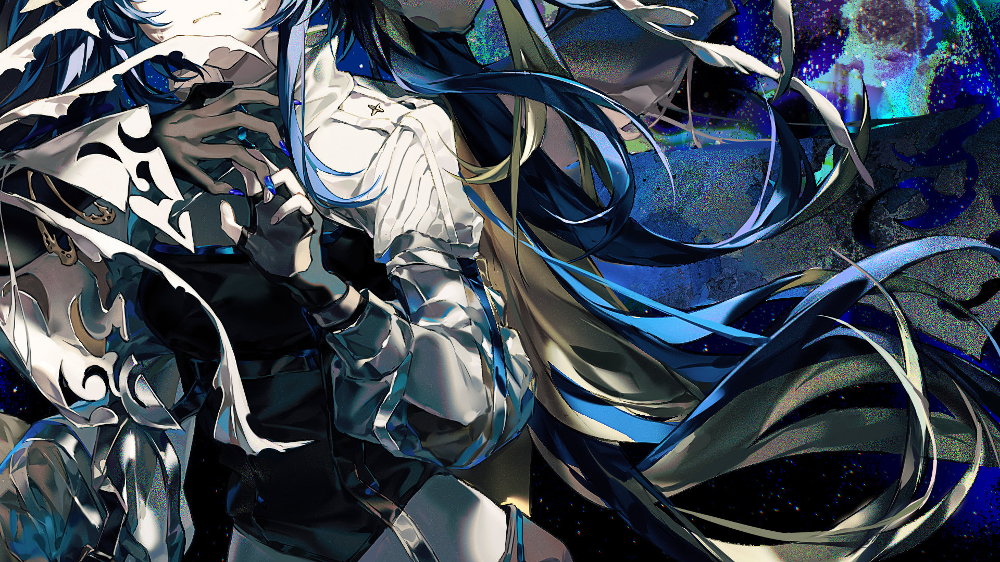
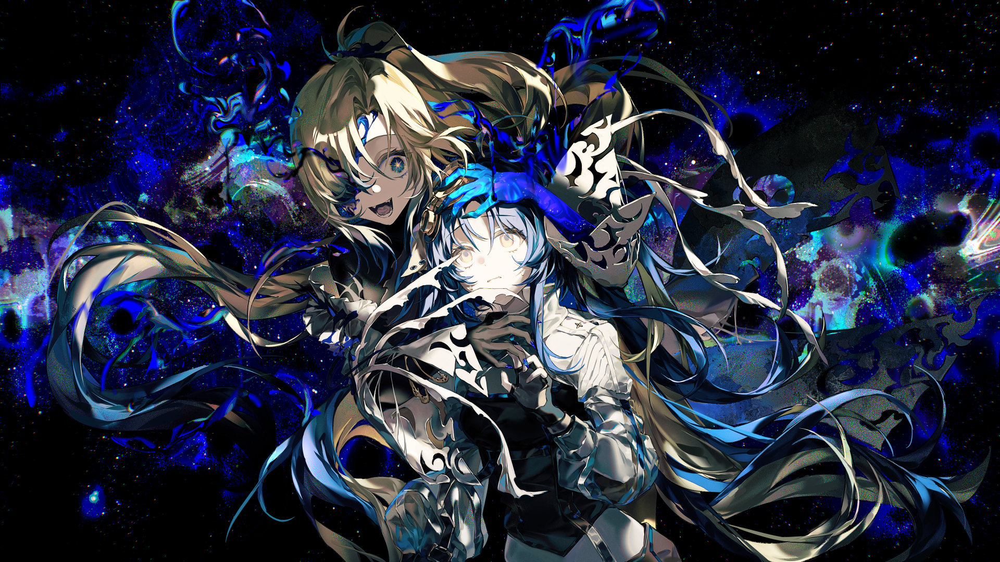

# 22-2

- **解锁条件**：购入Chapter Experientia曲包，完成22-3
- **解锁要求**：采用野乃香，通过Welcome, Queen of Fiction.

“我们现在已经完全丧失理智了，B级驾驶员光子！”她的上级摇晃着她的肩膀大声惊呼，“她只喊了你
的名字，所以赶紧进壳式机里头去她那里看看！”
 
于是现在……
 
她坐在自己的壳式机的驾驶舱内，等待着部署指令。她的科达在控制台的待命位置抬头盯着她，眼神仿
佛充满了同情。
 
毋庸置疑，此时损伤已经十分严重……而那抹奇异的颜色……
 
……在他们已经向后撤退的情况下也已逼近了他们目前所在的区域。万物在那颜色中诞生，又在那光芒
中毁灭，而S级驾驶员野乃香正是它的使徒。

----
“B级驾驶员光子，你一块来吗？”她在基地的气闸舱等待的时候，她朋友问道。她能看见汗水从她的脸
上滴落。“……说不定，她并不会对你真的做什么。”
 
“指挥部……是这么想的……”光子回答道，试图让在控制台上颤抖的双手冷静下来。
 
气闸舱门打开了。
 
广袤宇宙中，一张蓝红相间的画卷徐徐展开。光子和其他五名队友相继出发。

----
时间不断推移，他们早已将基地远远落在身后，另一个联合体的增援也将在已确定的战场区域与她们会合。
 
而她们此次行动的目标仍然孤身一人……没错，野乃香接连突破了一个又一个派系、一支又一支军队、
一个又一个作战单元。她的目标十分明确：直奔光子与其他人逃向的基地。与此同时，她还不断
尝试联络光子，向她发送某种奇怪的请求。
 
终于，当光子望向宇宙深处。
闭上眼睛。
当她再次睁开双眼的时候，她队友驾驶的壳式机全部被尽数歼灭，被奇异颜色沾染的部件分散摊开在宇
宙中。此时，一个声音——拥有同样颜色的声音，逐渐渗入她的科达中。
 
“光……子……你来啦！”
 
“野……乃香……”光子回答道。
 
她已经听闻野乃香的科达已经失去了联系，但莫名其妙地，她仍然能够同她交流。不知道为什么，这一
点比她周遭陨落的所有队友还要让她感到毛骨悚然。

----

----
“它需要打破最后的枷锁，完成孵化……！”野乃香激动地喊道，她的脸出现在朋友驾驶舱的显示屏上。
尽管光子已经在报告中得知……但冷不丁见到野乃香以全新的样貌移动着、说着话……
 
她想要靠近她，真的。她想要她拥抱她，而就在这个想法开始萌发时——她猛烈地摇了摇头，重新让理
智占回上风。报告中也有写到：如果足够接近这个色彩的“使徒”就会感到不明的强烈吸引力。
 
光子让自己冷静下来……并将武器准备就绪。
 
“好的，那你就去帮那束光——”野乃香开口，可光子打断了她。
 
“我会把它熄灭，就是这样，野乃香。”
 
野乃香则笑了笑以示回应。一场激烈的双人角斗之舞就此上演。

----
光子尽力了。
但她仍然失去了壳式机的一只手臂。
 
因为野乃香的存在本身比她的战斗技巧更令人震撼……光子的动作完全跟不上她——出击前发愣过久，
或无缘无故地开始大笑，毫无缘由。
 
老实说，这根本不算是对战，已扭曲的野乃香完全就是在跟她玩过家家，无论她对这个世界崭新的天空
有什么宏伟愿景，她都无法被人理解——完全相反，必须有人要阻止她。

----
于是，她开始朝自己的朋友大声喊话。壳式机与壳式机猛烈冲撞着，她用自己的机甲朝野乃香吼道：“赶紧
停下来吧！你是真的疯了，什么都不记得了吗！？”
 
然而，她得到的回答只有：“我全部都记得……所以我才会……不惜一切，光子。”
 
而当光子正想要开口回击时，支援赶到了现场。
 
……而野乃香为了和他们会面，早已离开了她身旁。