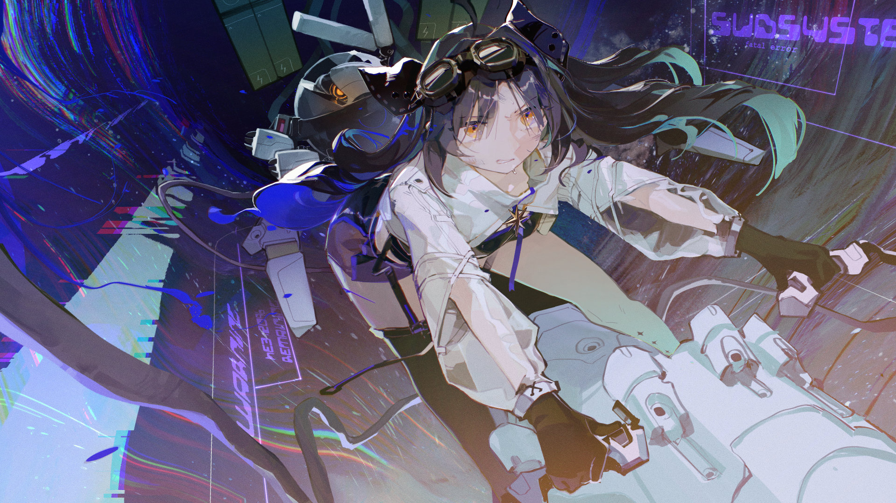

# 22-4

- **解锁条件**：购入Chapter Experientia曲包，完成22-5
- **解锁要求**：采用野乃香，通过incomplete the one

一道道高柱自虚空中冉冉升起——惊艳且华丽的蓝色，美到令人屏息，但蜷缩在人形机甲内的光子却眯
起了眼睛。
 
她朋友则站在崭新的、巍峨如宇宙本身一般的王座前，背部和手臂张开来，延伸到难以想象的远处——
或者说，站在那里的是她的壳式机，而她坐在其中。即便在遥远的此处，光子也能感觉到朋友在彼处的
笑容。
 
她告诉自己要站起来。她紧紧抓着控制台上的手柄，顺畅地驾驶着，将自己的长枪准备好。
 
光子向前推进，恐惧与喜悦的呐喊从坐在控制台中的机器人伙伴的通讯中传来。她的协同机伙伴似乎在
忌惮什么，但光子仍没有停止向前推进。

----
然而，情况并没有朝有利于她的方向发展。身为S级驾驶员，野乃香无疑比光子强很多，更不用说现在她
还得到了恐怖的助力。再一次交手在所难免，而光子将彻底失败。
 
如今，所有兵力已被尽数歼灭——整个共同体的末日已然来临，他们的壳式机和战舰如今已在这片阴森
的战场上化为一块块墓碑，王座的出现更是似乎让这一切变本加厉。
 
但，她仍然选择向前推进，不久后她便来到王座前——为了和自己的朋友再次决斗。

----
可怖的碰撞——
 
全力以赴，她们的武器相互冲撞在一起，她的壳式机开始发出响声。两道影子缠绕着，野乃香挥舞着机
械臂，猛烈射击着，但在光子看来这更像是一种戏耍而非进攻或施压。野乃香的每次躲闪仿佛是一种刻
意的准许，她疯狂的笑声与色彩自光子的科达疯狂涌出。汗水逐渐显现在光子蹙紧的双眉上，她感觉自
己的心脏开始绞缩。

然而，就算是现在——
 
——不知为何，她仍在希望着，希望能够仅凭自己的言语撕裂她面前的这台壳式机。
 
然而，能做到这点的却只有武器。随着时间的推移，野乃香的进攻开始变得致命起来，光子的长枪也终
于找到了着陆点。

----
光子的武器毫不留情地碾过野乃香外层的躯壳及内里的躯体，那具外壳和她本身一并颤抖起来。
 
在扭曲的广袤星辰中，两名少女漂浮在最奇异的光芒之中与天空描绘的地平线下。
 
野乃香最终还是倒在了命运脚下……
 
……光子也终于意识到，她的身躯也已被那束光捕获。她笑着，模糊的视线望向眼前的屏幕，与野乃香
的狞笑相视。她的科达陷入了永寂，不再会发出任何声响，任何呼唤。

----
当光子的壳式机开裂并解体开来，将内里的驾驶舱暴露给了宇宙的真空中时，野乃香最后一次朝她的朋
友倾诉了什么。
 
“谢谢你，”野乃香向她轻声坦白道，“是你打破了这具躯壳。”
 
光子的双眼不自觉瞪大，她的呼吸变得越来越稀薄。在她生命的最后几秒，她再度看了一眼眼前的一切
景象：
 
那抹蓝色自野乃香的壳式机中缓缓溢出……然后以极快的速度开始侵占整个星系。
 
高耸的王座如今空无一人，而其早已失去行动能力的、正在死去的使徒在王座前诡异地笑着，一颗全新
的、漆黑一团的恒星正缓缓升起，其因极乐而发出的尖啸声难以令人忍受。