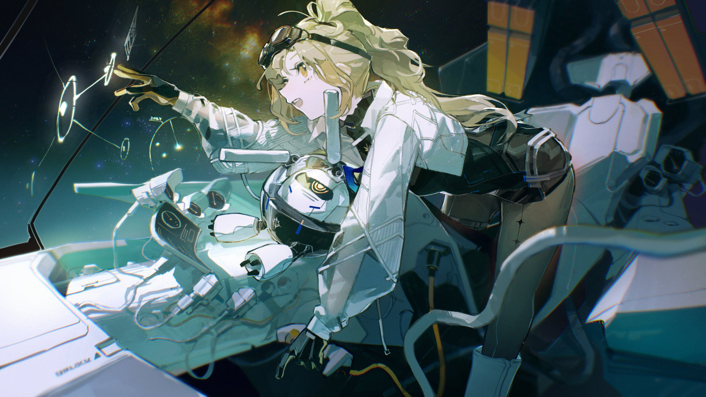

# 21-2

- **Unlock Condition**: 购入Extant Anima曲包，完成21-1
- **Unlock Requirement**: 采用野乃香，通过Scarlet Lunar Empress

A hundred thousand conflicts have led to this moment in time. Wherever humanity has spread, conflict 
has followed. Planets were found for the weak, as Nonoka would say, but Space-farers such as her are 
more, and comfortable without earth beneath their feet.

She flies into Space today to practice simple maneuvers—knowing it is the fundamentals that have 
driven her highest accolades and most noted victories across duels and combats. Moreover, what's 
simple is simple. It is that, "simplicity", which she most deeply desires.

In a short life that has lasted notably under 200 months, the girl has seen very much of what her 
universe has to offer to those that live within it. And, from that, she has known her greatest drive:

----
—what is "beautiful". The gorgeous world around her meets her eyes and compels her forward. Be it the 
sight of a distant diffuse nebula, or the sight of a Runner's shattering and bursting Husk, colorful, after 
they have had the misfortune of crossing her path in battle—beauty has been beauty, and has driven her.

The sound of Space is empty. Sight becomes infinitely more important here. In the black, what you can 
see becomes precious—if not crucial bodies in Space that define where you are...

She sees it all as kind of magical.

"Nonoka," she hears—a communication. Another girl appears in a small window on her cockpit's display. 
"You're flying?"

And she replies brightly: "Mitsuko! What's up?"

----
On the other side of the screen, Mitsuko turns to something—likely her Companion—before turning back 
to the camera. "I'm hearing Thumper mercenaries might be in our part of Space, scouting."

"I haven't heard anything from Command," answers Nonoka as she moves her Husk to turn over itself.

"It's not confirmed, and they're not letting RA-Rs and below out to Run until tomorrow anyway. Only 
Info Class has been told about it."

"So you."

"So me."

"They should warn me anyway...anything can happen out here!"

"To you? Really?"

"I mean not really to me, sure, but—"

"You're so obnoxious."

----
The Rank S-Runner in flight glances at her console, and at Coda sitting there.

"Catch anything sneaking around us, Coda?" she asks.

"Gathering," Coda answers. "Yes. Two Husks near the T51-D asteroid cluster. Tremor 650s—usually 
employed by Thumper. I'm marking them. I can determine their affiliation if we approach."

"I'll let everyone know," says Mitsuko. Then, she groans, "Such a pain the range on Codas is so bad."

"Happy to disappoint, RB-R Mitsuko," replies the little robot in front of Nonoka. Nonoka frowns at it.

"Nonoka, your Companion is so damn rude."

"I know!!"

"Anyway, are you going to engage?"

"Thumpers are EOS protocol. We can't trust them at all."

----
"Alright, stay safe," bids her friend.

She smiles, giving a, "Maybe!" and cutting the call. She flies forward and begins engaging 
systems of her Husk.

Coda chimes in as she flies, her eyes narrowing. "Mirror system operating. Initiating Heat. 
Heat operational. Preparing fuel for Cannister-Arms. Cannister-Arms operational."

"You're yapping," Nonoka mutters.

"Would you rather not know?" Coda replies.

"Yap away, yap away..."

"Identifying the two Husks' affiliations. Identified: Thumper affiliation, both."

"Let's terrorize 'em."

----
"Intercepting their communications," says Coda. A voice is then heard—

"Wait—Royals Military is out here!? Why didn't they tell us!?" says the voice. Another comes—

"...That's—is it her? We've got to go—"

"You're not going anywhere—" Nonoka answers them, and the two voices yelp. "If you've got Codas in 
those Husks, they're not making it out of T51."

The Cannister-Arms of her Husk begin to spread like wings behind the machine, dropping a set of pods 
from each. They each propel forward and begin scattering laser-fire toward the nearby asteroid field.

"Damn it...!" shouts one voice. "Engage!"

"I-I'll start asking our Codas to relay..." mutters the other.

"It's not instant relay? Old Codas?" Nonoka replies with a laugh. "Thumper hasn't changed."

----
Two Husks fly out, weapons raised.
From there, a short dance begins.

Lasers fly out toward her Husk in retaliation, and though they fire with a speed that the cockpit display 
cannot track, they're smoothly avoided. Nonoka shifts her Husk as if in possession of foresight—but truly, 
it is battles and training of the past that run across her eyes.

The palm of her Husk radiates with Heat, and in moments she sweeps across the right side of an enemy, 
that palm outheld. It crashes against the Husk's cockpit, and more Heat flows into the enemy machine. 
Filling with a white glow, the robot shortly cracks and splits before exploding wildly outward. The Runner 
within was not even given the time to gasp.

From there, Nonoka pushes her machine to the remaining enemy, who engages with a palm of Heat of 
his own—extended out like a saber.

A swipe. Arms striking against arms—
Nonoka, laughing, merely dances around her enemy, setting the pods she'd sent out earlier to surround 
the Thumper mercenary in a half-dome shape...

----
Those pods fire.

The Husk before her is pierced and reduced—and all the asteroids around her as well, 
fading into new colors...

All dust. She laughs, and cheers herself on as Coda announces, "All enemies reduced. 
No C.O.D.A. transmissions were detected."

The dust blows across this now-done battlefield. Telling herself, "I'm awesome, I'm so awesome", 
she receives a reply from her friend over comms—"Yes, yes. You are, you are."

And quiet comes back again. Her smile now is that of serenity. With that serene face, she looks out 
into the distance of Space. She sees it. Her heart grows warmer.

That Light...
It's there, blue, and far away...
...and yet, she finds it as beautiful as ever.