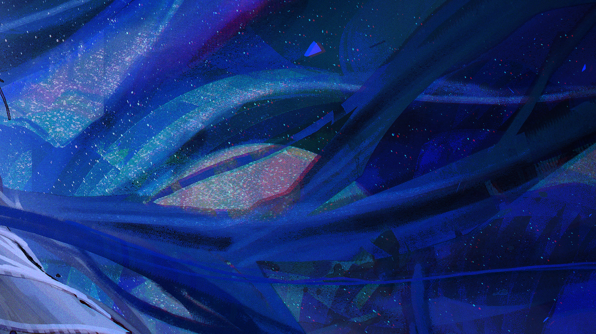
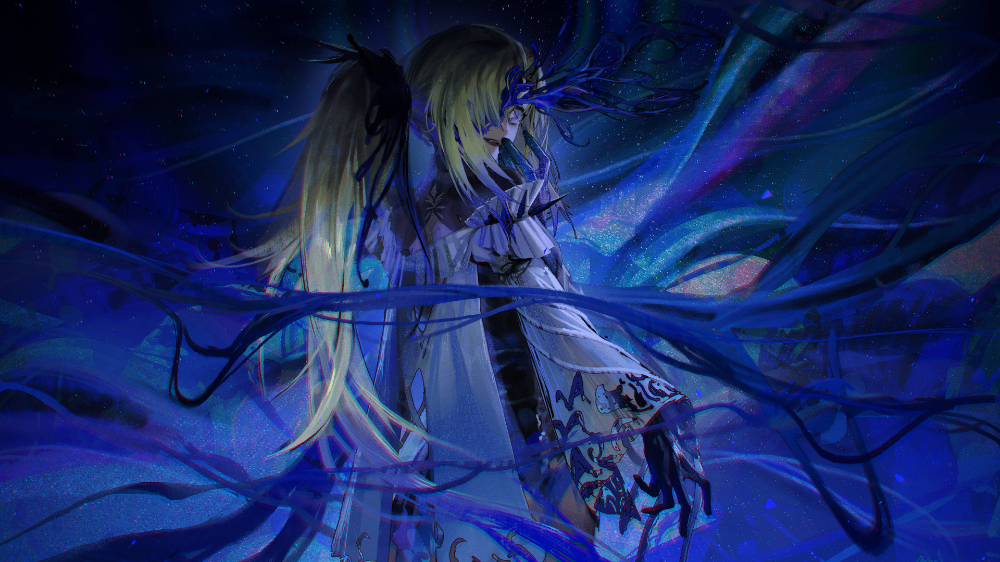

# 21-5

- **Unlock Condition**: 购入Extant Anima曲包，完成21-4
- **Unlock Requirement**: 采用野乃香，通过Extradimensional Cosmic Phenomenon

A maze of

   ​​maze of

A m aaa  aze of

----
       ​Light, has arri

   ​​​arrived for you.

A blinding

----
                  You've heard the song?

               ​Now come and open your eyes.

----
The Husk is enveloped in Light. Light is enveloped in Light is enveloped in 
Light. Light is before her, and spreads across Space like a flower field a field 
of blue flowers in a wonderful pattern a pattern she has seen before You've 
seen it in the distance that wonderful pattern please now open your Heart-
to-heart she said Mitsuko Mitsuko Mitsuko is a verryyy verryyyy pretty name 
yes Nonono no? No Noooonoooookkaaaa yes a name that is NONOKA yes 
ahhhhh yes so yes yes this is here now for you for you for you this is a flower 
have you seen it? Very it's tremendously

Blue

It's tremendously blue it's treeeemendously blue that body C O D A is gone, 
pleeeeaaase thank this, Coda, for repeating me. For repeating me, For through 
itself itself it is all together it is aaaaaaaaaaaaaaaaaaaaaaaaaall here this was 
always you was always you and what you found was you and now you can see 
can't you Of course! Of course! Of course! Of course! Of course! Of course! Of 
course! Of course! Of course! Of course!

----
The hull of the Husk begins to rip and split apart just like Coda, and I can 
feel a finger of Blue inside of my Eye And Skull, wriggling. This is a kind of 
light that you can hear, and it is so beautiful. It is so so beautiful. It is so so 
so beautiful. So so so so beautiful wrapping into me and into everything. 
This is a light that I can SEE across two places, across three and four places, 
across a thousand places. Infinite places—how hadn't I seen it before?

 ​​​A 
     smile
        cracks across my face.

I think it ate my heart, ahahahaha.
No words? No words, no, this has been more than words.
Welcome. I feel welcomed, welcome you! Welcome, hello! Hello!

This feels good.

----
I don't think you can understand it unless you've been there.

        ​​No, you don't have to say anything.

                     I'll reach you!

                    ​I'll reach you.

                       —

----

----
—Let's greet the Scout team now.