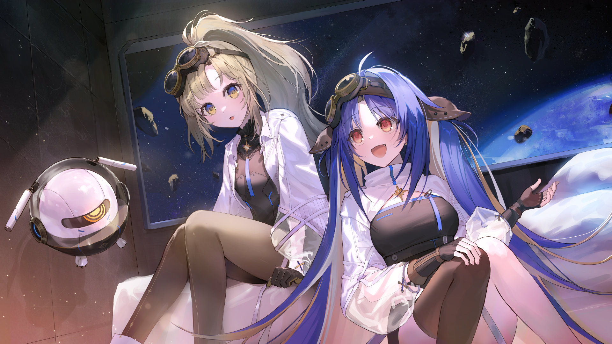

# 21-3

- **解锁条件**：购入Extant Anima曲包，完成21-2
- **解锁要求**：采用野乃香，通过Dual Dependency

时间继续向前。
后一天，又一场作战结束后，她回到基地阅读消遣，但思绪却不断将她带往另一个地方。

她所看见的那束光……科达无法为她识别，军队里也没有任何相关记录。虽然科达见过，但从来没有其
他人能证明这一点。拍照或录像显然无法捕捉到它，也就没办法以图片或视频的形式存储在科达硬盘里。

因此，它就像是宇宙中的一个异常存在般。因为谈论这个，有人觉得她疯了；因为试图去寻找它，人们
都无法理解她。

但既然她的科达都肯定了它的存在的话——那她们也应该选择去相信它的存在。

因此，她完全有理由相信，在宇宙广袤无际的深处一定存在着某束蓝色的光，而那束光也定会像野乃香
描述的那样“绚丽夺目”。

“今天的部署任务完成的很不错啊。”走进野乃香的基地大门时，光子点评到。她们的目光相遇。

“近况如何？”光子问道。期间，她们的目光时不时会被懒洋洋漂浮经过的科达打断，而光子的科达则
一直在一旁倾斜着默默看着。

----
 “我们准备去你说的那束光的那片区域来着。”光子靠着一排柜子，看向朋友基地的窗外，轻描淡写地
来了这么一句。而她的朋友闻声便不禁颤抖了一下，瞬间起了兴致。
 
“啊……真的吗！？难道……情报部要调查它么！？”野乃香激动不已，连珠炮似的问道，“我我我可
以转到情报部门吗！”
 
“我们并不是去调查它，野乃香。”光子回答道，语气里有些许愧疚，“我们又不是什么学者，而是军
人，士兵。”
 
“啊！好烦！我整个人生都在做错误的选择啊！”野乃香故作不满。
 
“你起码还有得选，S级驾驶员野乃香。”科达嘟囔道。
 
“你怎么回事呀！都不知道别人是在跟你开玩笑吗？”

----
“总之，”光子打断了她，“我们还是会比以往更接近那里许多。所以，如果你感兴趣的话……我可以
帮你一把。”

“……怎么帮？”野乃香疑惑道。她顿了顿，瞥了一旁正绕着基地飞的两个机器人一眼。“……喂，话
说我们要不要把它俩关了先……”

“不用，它们只会上报违纪行为。它们只会按照程序行事。”

“……那你的意思是……你有不违纪的方法？？”

“你到底想不想我帮忙吧！”

既然光子是那么了解她的人……

“哎呀，说什么呢，那当然啦！”

她赶忙答应道。

----
 “我们去那里的时候，你可以跟着侦察队一起。”光子走到床边，在野乃香旁坐下，“指挥部应该会很
安心——我说真的，要是可以，他们巴不得S级驾驶员能多干点活，比如同时战斗和侦察之类。”

“‘要是可以’？所以还是不行咯？”野乃香问道。

“你的话，实际上得算是SSS级驾驶员了吧，所以……我觉得他们会非常乐意的。”

“哈，这样。”

“不过……我真的很想问，你为啥就那么执着于那束光啊？”

“你刚才那语气，像是觉得它只是一束光一样。这是‘那束光’，专有名词。它是独一无二的。”科达
听到野乃香这句话，不知为何有些躁动，像是气急败坏一样。

----
“噗，认真起来了这是，还专有名词，”光子悻悻道，“所以你还是没回答我，你到底为什么这么执着呢？”

“因为只有科达和我可以看见它……”野乃香轻描淡写地说道，而后向后一倒，躺在床上，“你不觉得这
很疯狂吗？或许它在呼唤我。哎，光子，你是真不知道我有多么在乎它！”
 
“这也太吓人了，我确实体会不到。”
 
“怎么会！一点都不吓人。”
 
“好吧，那假设它真的在呼唤你，那又如何呢？”
 
“我想跟它聊一聊。”
 
“怎么聊？像跟敌方驾驶员那么‘聊’么？”
 
“不是那样啦。”
 
“交心之谈么，嗯……”光子低声喃喃道，垂下头看向朋友心脏所在的地方，“……好吧，那我希望那束
光，嗯……完全跟你不一样。我希望它是一个圣人般的存在。”

----
“完全跟我不一样？？”
 
“完全跟你不一样。”
 
“你认真的？认认真真的？”野乃香直起身，手臂撑在床上，没好气地笑了笑，“认真希望它完全跟我
不一样？你知不知道我多少次为你两肋插刀，给你擦屁股啊！”
 
“不知道。”
 
“十二次。整整、十二次，光子！”
 
“哇哦，那看来确实有点东西，那这次就算是我还你一个人情吧。”
 
野乃香盯着朋友看了一会儿……
然后尖声大喊大叫着抬起手拥抱了她。
 
她笑了，光子也笑了，然后推开了她，手却根本没使力。
 
就这样，在漫无边际的茫茫宇宙中，属于两位挚友的时光仍在继续。