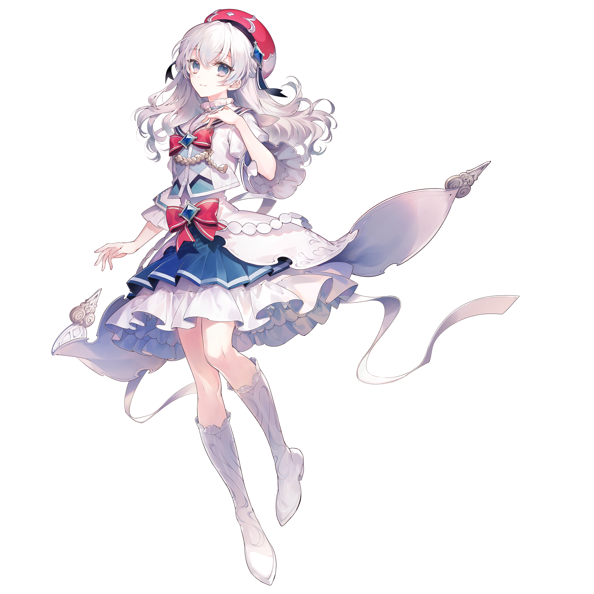
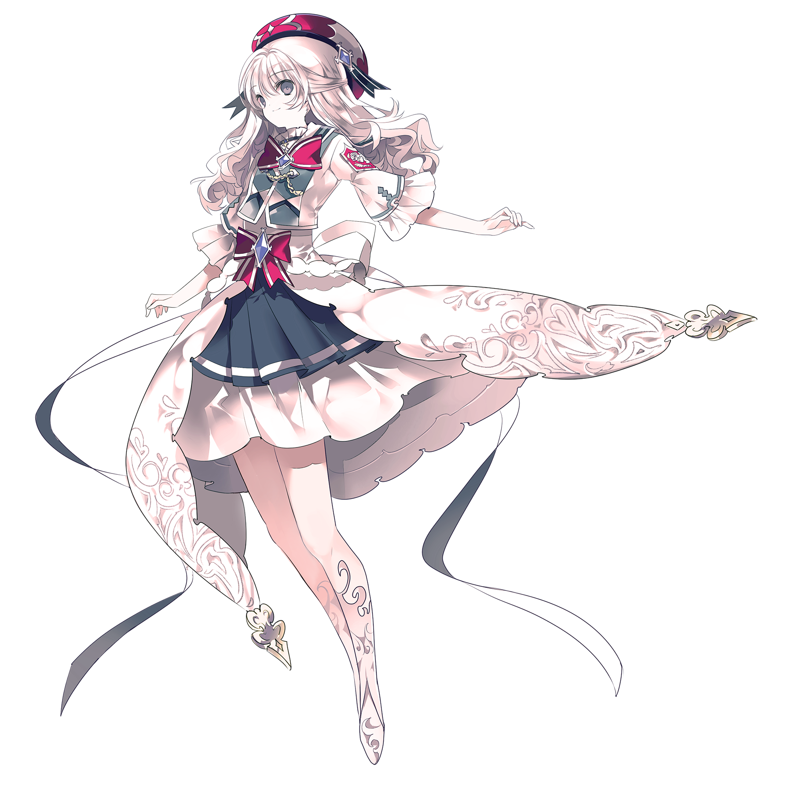
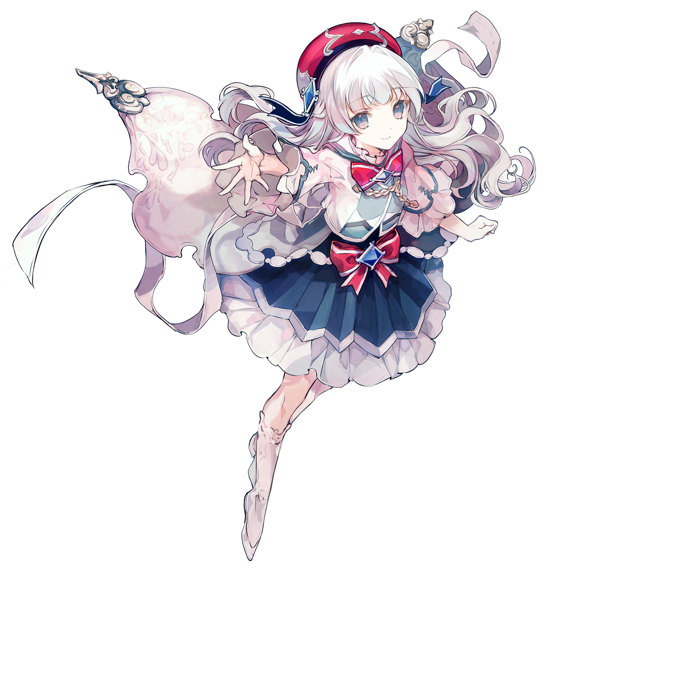

# 光

> 本游戏的初始搭档“光”

💬 "Delightful."
## 搭档信息

**立绘：**

**经典立绘：**

**觉醒立绘：**

- **名称：** 光
- **类型：** 支援型
- **种类：** 常驻/主线
- **觉醒形态：** 有
- **画师：** すずなし
- **经典画师：** シエラ
- **觉醒画师：** シエラ

### 搭档数据（移动版）

| 等级 | Lv1 | Lv20 | Lv30 |
|------|------|------|------|
| Frag | 55 | 78 | 88 |
| Step | 35 | 61 | 71 |
| Over | 35 | 61 | 71 |

### 搭档数据（Nintendo Switch版）

| 等级 | Lv1 | Lv20 | Lv30 |
|------|------|------|------|
| Frag | 45 | 50 | 70 |
| Step | 20 | 35 | 95 |
| Over | - | - | - |

- **技能：** 简单 - 音符流失后的回忆率丢失程度减小
- **更新时间：** v1.0.5(2017/03/09)
- **觉醒更新时间：** v2.0.0(2019/03/21)
- **更新时间（NS）：** v1.0.0c(2021/05/18)

## 解禁方法
### 搭档
*初始搭档，无需额外获取*
### 觉醒形态
#### 移动版
搭档等级升至20级，并使用中空核心×25和荒芜核心×5唤醒
#### Nintendo Switch版
搭档等级升至20级，并使用中空核心×30唤醒
## 技能
> **技能：** 简单 - 音符流失后的回忆率丢失程度减小
- 本技能是目前移动版中唯一一个可以于离线状态下触发的技能。
## 搭档相关
- 光是本游戏的主线故事第一幕的两位主角之一。关于主线故事，详见故事模式。
- 在主界面「段位挑战」入口的UI上出现的该搭档立绘是其觉醒形态。
- 该搭档的觉醒形态被Arcaea官方用作日文X（之前为Twitter）上的头像。
- 在移动端v6.3.0版本中，该搭档的初始立绘迎来了更新。
  - 默认使用新版本初始立绘，新、旧版本的初始立绘可使用搭档资料卡左侧的按钮进行切换。
    - 新版本立绘初上线时，其右侧丝带的一部分出现了异常缺失的情况。
    - v6.3.1版本中修复了以上问题，并对头发、阴影和色彩等细节进行了微调。
- 本搭档参与组成了多个双人搭档，包括光 & 菲希卡、光 & 赛依娜和光 & 克莱尔。
- 以下曲目的曲绘中出现了该搭档的形象：[^1]
- PRAGMATISM
- PRAGMATISM -RESURRECTION- [BYD]
- inkar-usi
- inkar-usi [BYD]
- Maze No.9
- Shades of Light in a Transcendent Realm
- Shades of Light in a Transcendent Realm [BYD]
- Ringed Genesis
- Yosakura Fubuki
- [一般]Solitary Dream
- [日语]Solitary Dream
- Haze of Autumn
- Innocence
## 注释

[^1]: 其中Yosakura Fubuki和Solitary Dream曲绘上的光不符合任意形态，故归到初始形态下