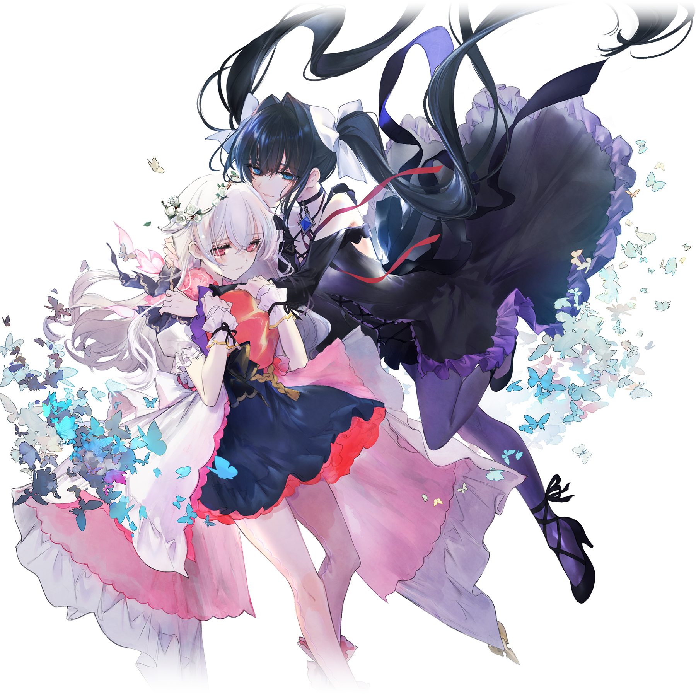

# 光_&_对立（Reunion）

> 隶属于曲包Final Verdict的主线搭档“光 & 对立（Reunion）”

💬 ~~光和对立的重逢导致大量光芒侧曲目难度降低~~
## 搭档信息

**立绘：**

- **名称：** 光 & 对立（Reunion）
- **类型：** 平衡型
- **种类：** 常驻/主线
- **觉醒形态：** 有
- **画师：** シエラ
- **所属曲包：** Final Verdict

### 搭档数据（移动版）

| 等级 | Lv1 | Lv20 | Lv30 |
|------|------|------|------|
| Frag | 不存在 | 79 | 89 |
| Step | 不存在 | 70 | 80 |
| Over | 不存在 | 70 | 80 |

- **技能：** 纷争 - 逆转光芒与纷争的规则
- **觉醒技能：** 光芒 - 改写光芒与纷争的规则
- **更新时间：** v4.0.255 (2022/07/13)

## 解禁方法
购入曲包Final Verdict后，解锁剧情“最终之梦”获得
- 注：获得该搭档后，先前解锁Testify时遭到隐藏的非联动搭档的对立搭档均会恢复
## 技能

1. > **技能：** 光芒 - 改写光芒与纷争的规则

1. > **技能：** 纷争 - 逆转光芒与纷争的规则
- 这两个技能实质上是同一效果：令光芒之侧/纷争之侧曲目在游玩过程中显示为另外一侧的样式，背景也切换为对应的另外一侧的版本。
  - 尽管技能的文字说明是“光芒”和“纷争”，但也仅仅是文字说明不同而已，游玩之前无需切换对应技能(除Last的Beyond难度以外)。
  - Vicious Labyrinth的默认背景和Luminous Sky的默认背景被互相视为对方的另外一侧的版本。
  - 教程中无法触发任何技能，因此对教程曲目不生效。
  - 消色侧（Achromic Side）及Lephon侧不属于光芒侧也不属于纷争侧，因此对消色侧和Lephon侧的曲目不生效。
  - 部分曲目因各种原因（如剧情地位等），其背景不存在对应的另外一侧的版本，因此对这些曲目不生效。
  - 在游玩失落章或陷落章时，即使游玩背景已经被强制替换为了存在其另外一侧的版本的Beyond背景，只要曲目本身不满足上述条件，此技能就不会生效。
- 该搭档的技能将会影响Last的Beyond难度，显示不同的曲目版本以及其谱面。
  - 选中该搭档并切换技能为*“光芒 - 改写光芒与纷争的规则”*的情况下，将显示Last | Eternity。
  - 其他情况下，将显示Last | Moment。
- 对于Memory Archive的曲目、东方Project相关曲目、UNDERTALE Collaboration中的曲目及MEGALOVANIA (Camellia Remix)，使用此技能也会对应切换谱面两侧的流动装饰。
- 对于曲目Infinite Strife,，使用此技能会改变谱面特殊天键的颜色。
- 此技能在游玩段位挑战时不生效。
- 此技能本质上是视觉技能。
- 此技能不生效的曲目详情可查阅下方列表或:分类:光 & 对立（Reunion）技能无效的曲目。
{{搭档/hikari_&_tairitsu_reunion/技能无效曲目}}
## 搭档相关
- 光与对立是本游戏的主线故事的两位主角。关于主线故事，详见故事模式。
- 该搭档的属性值恰好为相应等级光和对立属性的平均值。
- “Reunion”意为“重逢、团圆”。
- 该搭档是迄今为止Arcaea中唯一一个获得时即为20级觉醒形态，且觉醒前后立绘相同的搭档。
- 以下曲目的曲绘中出现了该搭档两人或其中之一的形象：
- Last
- Last | Moment [BYD]
- Last | Eternity [BYD]
- To the Furthest Dream
- To the Furthest Dream
- To the Furthest Dream
- Rain of Conflict in a Radiant Abyss