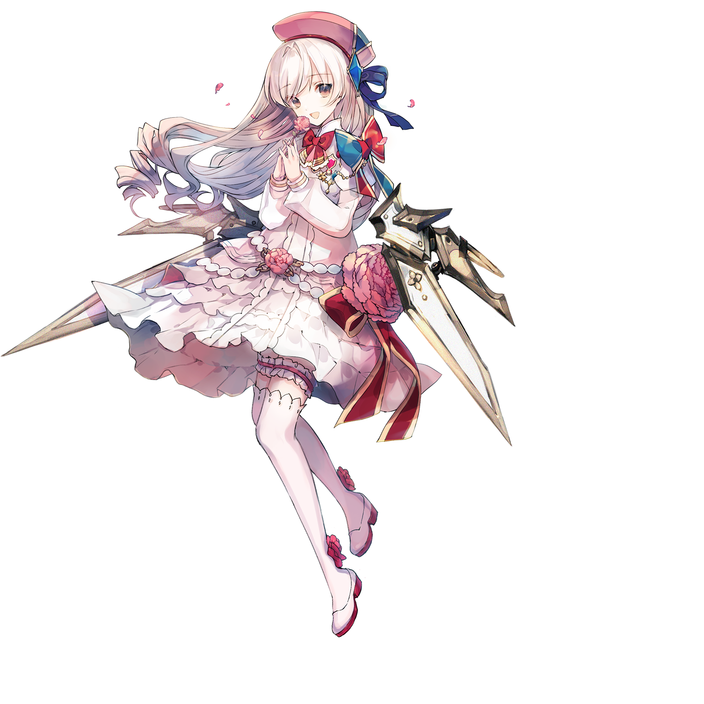

# 光（Fracture）

> 隶属于主线曲包Luminous Sky的搭档“光（Fracture）”

💬 无论是好是坏，她将找寻到一切的谜底。
她如此发誓，矢志不渝。
## 搭档信息

**立绘：**

- **名称：** 光（Fracture）
- **类型：** ???/创世型
- **种类：** 常驻/主线
- **觉醒形态：** 无
- **画师：** シエラ
- **所属曲包：** Luminous Sky

### 搭档数据（移动版）

| 等级 | Lv1 | Lv20 |
|------|------|------|
| Frag | 42 | 61 |
| Step | 67 | 99 |
| Over | 53 | 78 |

### 搭档数据（Nintendo Switch版）

| 等级 | Lv1 | Lv20 |
|------|------|------|
| Frag | 55 | 70 |
| Step | 90 | 140 |
| Over | - | - |

- **技能：** 溢出 - 简单模式回忆率 但当回忆率到达100%后转变为困难
- **更新时间：** v1.7.0(2018/07/16)
- **更新时间（NS）：** v1.0.0c(2021/05/18)

## 解禁方法
获取曲包Luminous Sky，通过Fracture Ray的异象后，在世界模式地图3-4/地图NS3-2获得
## 技能
> **技能：** 溢出 - 简单模式回忆率 但当回忆率到达100%后转变为困难
- 无论在歌曲结算时回忆收集条是否已转为困难模式，使用此技能达成的Clear均属于Easy Clear
  - 因此转为困难模式之后Track Lost，可能导致潜力值降低。
## 搭档相关
- 光是本游戏的主线故事的主角之一，关于主线故事，详见故事模式。
- 该搭档的分类显示最初为“???”，完成剧情“完美之愿”后将显示为“创世型”。
  - 另一个具有上述特点的搭档为光（Fatalis）。
- 该搭档为解锁Tempestissimo的Beyond难度的先决条件之一，详见Tempestissimo#解禁方法。
- 该搭档在v3.12.0前为解锁Arcahv的先决条件之一，详见Arcahv#解禁方法。
- 本搭档参与组成了双人搭档光 & 赛润妮·雪儿（Fracture & MIR-203）和Hikari & Vanessa。
- 以下曲目的曲绘中出现了该搭档的形象：
- Fracture Ray
- Vindication
- Equilibrium
- Lost Desire
- ＃1f1e33
- Arcahv
- Defection
- World Ender
- Pentiment
- Arcana Eden