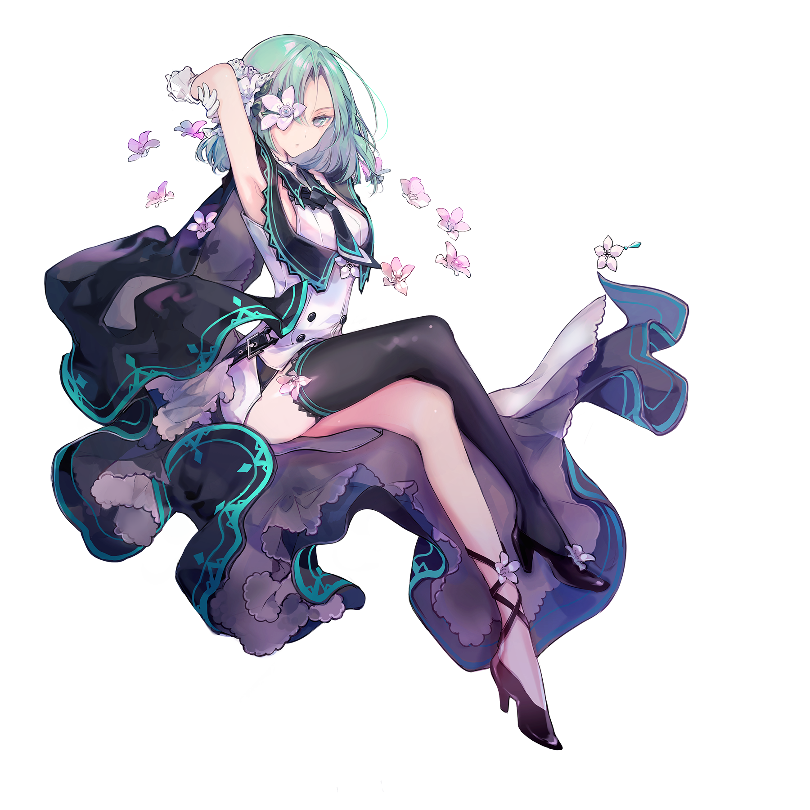
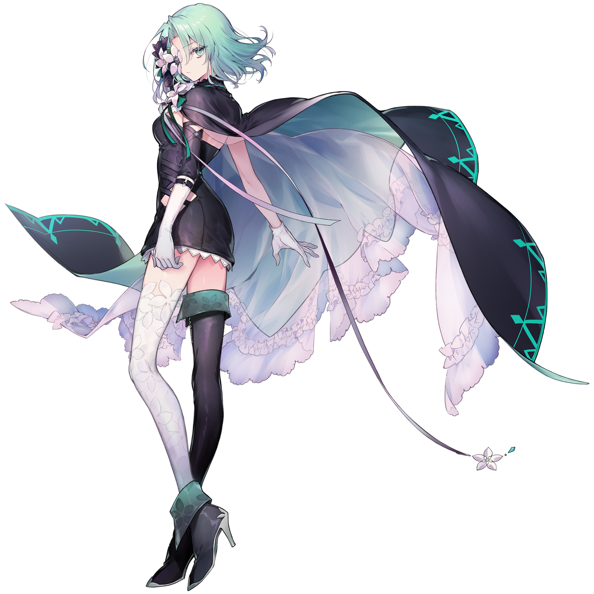

# 咲弥

> 隶属于支线曲包Absolute Reason和主线曲包Absolute Nihil的搭档“咲弥”，存在同名的Arcaea原声专辑特典搭档

💬 “在那些地方，人类可以成为上帝。”
## 搭档信息

**立绘：**

**觉醒立绘：**

- **名称：** 咲弥
- **类型：** 平衡型
- **种类：** 常驻/支线/主线
- **觉醒形态：** 有
- **画师：** シエラ
- **觉醒画师：** すずなし
- **所属曲包：** Absolute Reason 或 Absolute Nihil

### 搭档数据（移动版）

| 等级 | Lv1 | Lv20 | Lv30 |
|------|------|------|------|
| Frag | 55 | 85 | 95 |
| Step | 59 | 90 | 100 |
| Over | 65 | 95 | 105 |

### 搭档数据（Nintendo Switch版）

| 等级 | Lv1 | Lv20 | Lv30 |
|------|------|------|------|
| Frag | 60 | 80 | 无 |
| Step | 110 | 170 | 无 |
| Over | - | - | - |

- **技能：** 击中音符后回忆率的变化增加
但判定为模糊（Far）时不会获取任何回忆率
- **觉醒技能：** 显示判定详情
- **更新时间：** v2.0.0(2019/03/23)
- **觉醒更新时间：** v5.9.0(2024/07/30)
- **更新时间（NS）：** v1.0.0c(2021/05/18)

## 解禁方法
### 搭档
#### 移动版
购入曲包Absolute Reason或Absolute Nihil后，在世界模式地图4-1获得
#### Nintendo Switch版
解锁曲包Adverse Prelude后，在世界模式地图NS4-2获得
### （移动版限定·觉醒形态）
搭档等级升至20级，并使用荒芜核心×5和静谧之核×25唤醒
## 技能

### 普通形态
> **技能：** 击中音符后回忆率的变化增加
但判定为模糊（Far）时不会获取任何回忆率
Pure获得2倍回忆率，Far不获得回忆率，Lost丢失3倍回忆率。
- 此技能在8级解锁。
### （移动版限定·觉醒形态）
> **技能：** 显示判定详情
任意选择一首曲目开始游玩后，游戏会在屏幕右侧显示实时更新的判定统计板。
- 统计范围包括得分判定（Pure、Far、Lost）与过早/过晚（Early/Late）判定。其中：
  - Pure不区分大小Pure。
  - 开启“纯粹【过早/过晚】”时，Early/Late统计小Pure和Far的总数，若关闭则只统计Far。
- 此技能本质上是视觉技能。
- v5.9.0更新后，使用该搭档(觉醒)游玩ALTER EGO触发异象时，此技能会失效。
  - 此bug已于v5.9.3修复。
## 搭档相关
- 咲(xiào)弥(mí)
- 该搭档在游戏中拥有自己的故事，详见故事模式。
- 该搭档是第一个拥有自己的故事的常驻支线搭档。
- 该搭档和WACCA侧角色伊莉莎白组成了双人联动搭档咲弥 & 伊莉莎白。
- 在v6.0.0更新后，该搭档所属曲包之一Absolute NIhil成为主线剧情曲包，同时在故事模式的角色剧情界面中，该搭档被同时归入主线搭档和支线搭档，对应不同的剧情。
  - 因此该搭档也成为了除了光与对立之外的第一个具有觉醒形态的主线搭档。
- 以下曲目中出现了该搭档的形象：
- Alexandrite
- Vicious Heroism
- Vicious Heroism [BYD]
- Cyaegha
- In Vain
- Hypnotize
- Ashen 6oundary
- Judgement
- ALTER EGO
## 注释