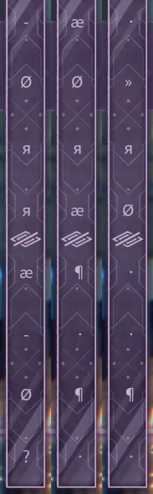

# 哀寂（至高：第六探索者）

> 此条目内容为**移动版**独有。

💬 「至高：第八探索者」——
「慈悲」。
## 搭档信息

**立绘：**

- **名称：** 哀寂（至高：第六探索者）
- **第二名称：** 尼尔（至高：第六探索者）
- **类型：** 挑战型
- **种类：** 常驻/主线
- **觉醒形态：** 无
- **画师：** Enji
- **所属曲包：** Lucent Historia

### 搭档数据（移动版）

| 等级 | Lv1 | Lv20 |
|------|------|------|
| Frag | 63 | 90 |
| Step | 72 | 103 |
| Over | 38 | 55 |

- **技能：** 困难 - 哀寂收集条
- **更新时间：** v6.0.0(2024/11/21)

## 解禁方法
购买曲包Lucent Historia，通过Designant.异象并且解锁Astral Quantization后，在世界模式地图9-3获得
## 技能

> **技能：** 困难 - 哀寂收集条
哀寂收集条回忆率计算与普通困难回忆率收集条机制相同，而回忆条被图案遮挡，回忆率水平和示数不可见。
- 回忆率低时无红光警告。
- 遮挡图案中间有眼睛标志，代表此收集条的不可见性质。
- 遮挡图案中会随机、动态地出现乱码样的符号，并且在暂停时仍会维持乱码形态随机变动。
- 该收集条可以触发Beyond挑战。
- 在结算界面时会正常显示回忆率数值，而不会被隐藏。
配图展示了此技能下的遮挡图案及不断变化的乱码符号。
## 搭档相关

- 该搭档在游戏中拥有自己的故事，详见故事模式。
- 该搭档的名称随洞烛（至高：第八探索者）技能激活情况而变化，在 洞烛（至高：第八探索者）显示其真名“*拉可弥拉（至高：第八探索者）*”或处于离线状态下时，该搭档亦显示其真名“*尼尔（至高：第六探索者）*”。否则显示*“哀寂（至高：第六探索者）”*
- 在官方早期宣传以及刚购入Lucent Historia时，该搭档的立绘只有主体人物而不具有周边场景要素，需进入故事模式中长按该搭档的立绘后才会变为现有的样式，如配图所示；该行为与本曲包的解谜有关，详细流程请参见Designant.#解禁方法。
- 在v6.0.0更新前的宣传中，本搭档名称为*慈悲（至高：第八探索者）*，实际游玩中除剧情外均不会显示该名称。
- 该搭档在世界模式中的搭档奖励边框与正常的搭档奖励边框不同，其奖励边框会出现裂痕，呈现出“破碎”的效果。
- 该搭档的STEP值超越了对立（Grievous Lady）(102)，成为世界模式获得的常驻搭档中20级基础STEP值最高的搭档。
- 以下曲目的曲绘出现了该搭档的形象:
- Swan Song
- Rays of Remnant
- Lament Rain
- Astral Quantization