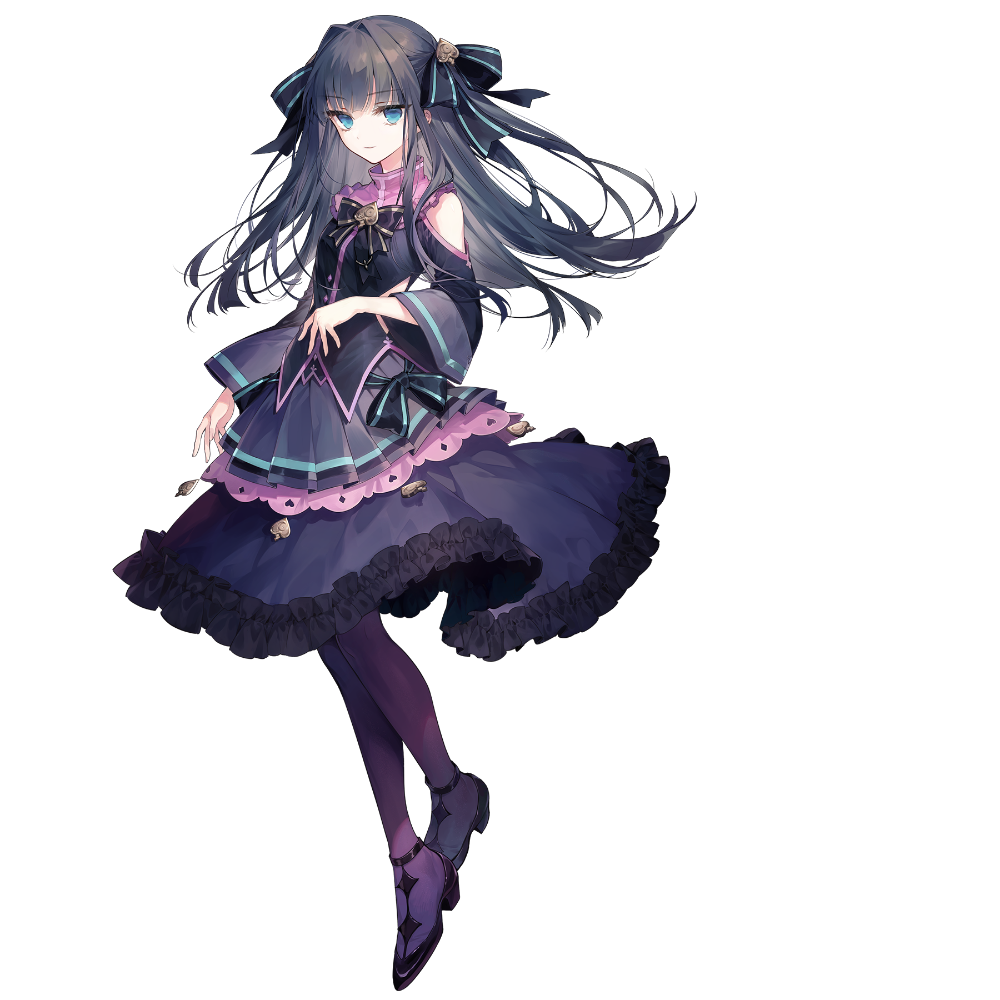
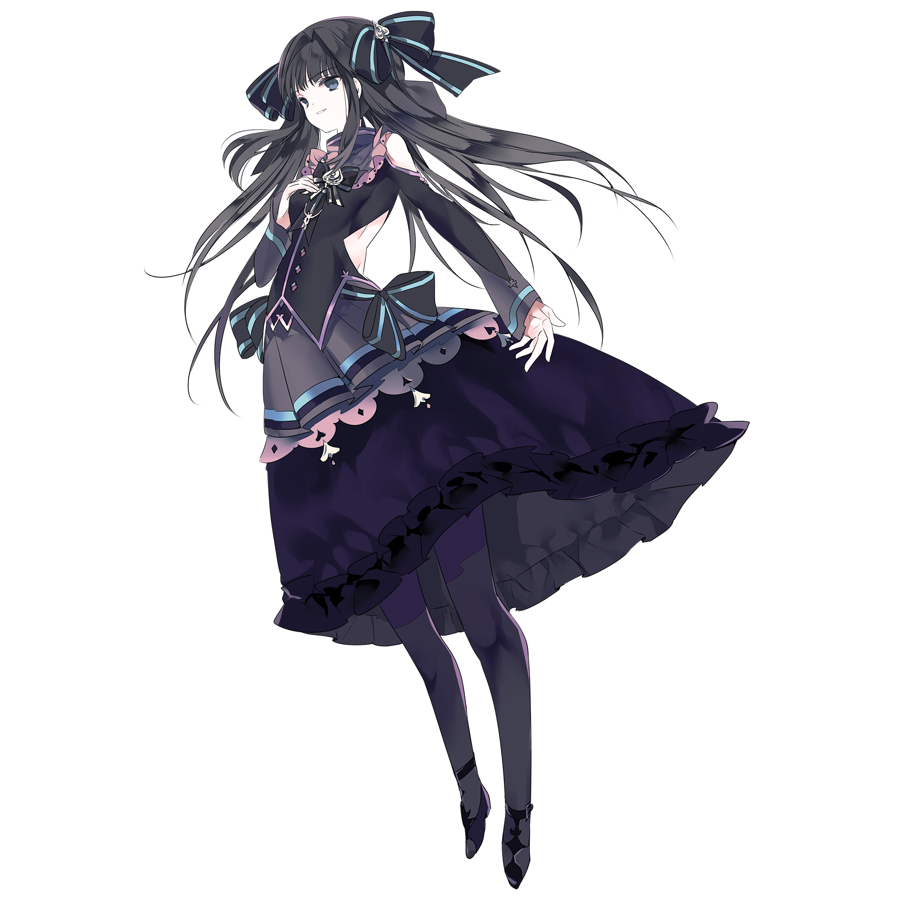
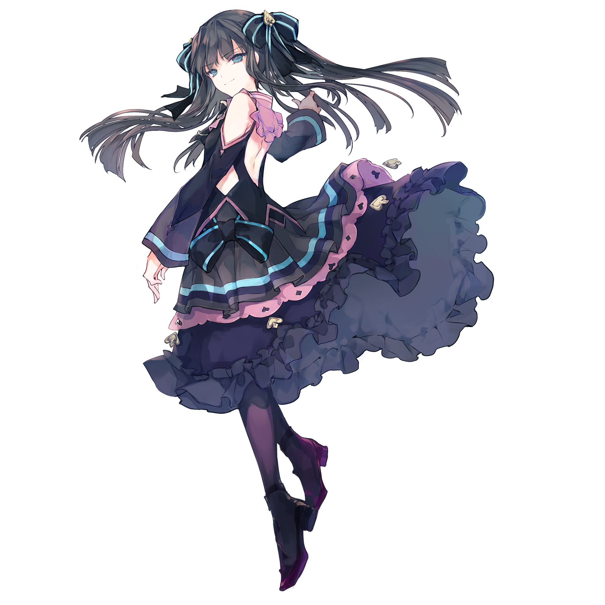

# 对立

> 本游戏的初始搭档“对立”

💬 “而属于我的结局，便是一场悲惨的死亡。”
## 搭档信息

**立绘：**

**经典立绘：**

**觉醒立绘：**

- **名称：** 对立
- **类型：** 平衡型
- **种类：** 常驻/主线
- **觉醒形态：** 有
- **画师：** すずなし
- **经典画师：** シエラ
- **觉醒画师：** シエラ

### 搭档数据（移动版）

| 等级 | Lv1 | Lv20 | Lv30 |
|------|------|------|------|
| Frag | 55 | 80 | 90 |
| Step | 55 | 80 | 90 |
| Over | 55 | 80 | 90 |

### 搭档数据（Nintendo Switch版）

| 等级 | Lv1 | Lv20 | Lv30 |
|------|------|------|------|
| Frag | 50 | 60 | 75 |
| Step | 40 | 65 | 110 |
| Over | - | - | - |

- **更新时间：** v1.0.5(2017/03/09)
- **觉醒更新时间：** v2.0.0(2019/03/21)
- **更新时间（NS）：** v1.0.0c(2021/05/18)

## 解禁方法
### 搭档
*初始搭档，无需额外获取*
### 觉醒形态
#### 移动版
搭档等级升至20级，并使用中空核心×5和荒芜核心×25唤醒
#### Nintendo Switch版
搭档等级升至20级，并使用荒芜核心×30唤醒
## 搭档相关
- 对立是本游戏的主线故事第一幕的两位主角之一，详见故事模式。
- 该搭档为解锁Grievous Lady的先决条件之一，详见Grievous Lady#解禁方法。
- v4.0.0后，解锁Testify后该搭档将被暂时隐藏，进入不可用状态。完成剧情“最终之梦”，获得搭档光 & 对立（Reunion）之后将重新恢复至可用状态。
- 在主界面「开始游戏」入口的UI上出现的该搭档立绘是其觉醒形态。
- 该搭档的觉醒形态被Arcaea官方用作英文X（之前为Twitter）和Facebook上的头像。
- 在移动端v6.3.0版本中，该搭档的初始立绘迎来了更新。
  - 默认使用新版本初始立绘，新、旧版本初始立绘可使用搭档资料卡左侧的按钮进行切换。
    - v6.3.1版本中对新版本立绘的头发、裙摆和整体阴影、色彩上的细节进行了进一步调整。
- 该搭档参与组成了多个双人搭档，包括对立 & 托凛、对立 & 中二企鹅（Grievous Lady）和对立 & 菲尔。
- 以下曲目的曲绘中出现了该搭档的形象[^1]：
- Essence of Twilight
- Sheriruth
- Iconoclast
- BLRINK
- Ringed Genesis
- [一般]Solitary Dream
- [日语]Solitary Dream
- Haze of Autumn
- san skia
- Innocence
## 注释

[^1]: 其中Solitary Dream曲绘上的对立不符合任何形态，故归至最初形态下