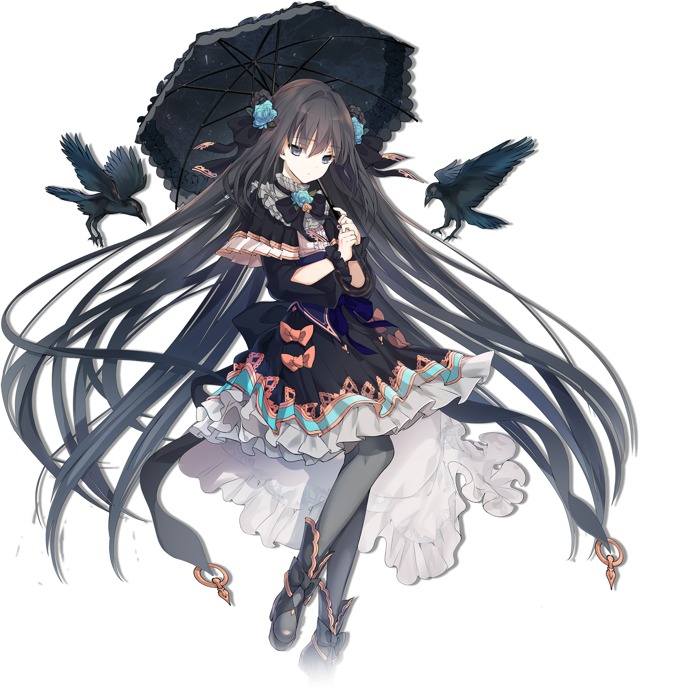

# 对立（Grievous Lady）

> 隶属于主线曲包Vicious Labyrinth的搭档“对立（Grievous Lady）”

💬 她想把所有的挫败感都发泄到一个活物上。
她想要找到一个人来供她摧残。
## 搭档信息

**立绘：**

- **名称：** 对立（Grievous Lady）
- **类型：** 挑战型
- **种类：** 常驻/主线
- **觉醒形态：** 无
- **画师：** シエラ
- **所属曲包：** Vicious Labyrinth

### 搭档数据（移动版）

| 等级 | Lv1 | Lv20 |
|------|------|------|
| Frag | 57 | 79 |
| Step | 70 | 102 |
| Over | 57 | 79 |

### 搭档数据（Nintendo Switch版）

| 等级 | Lv1 | Lv20 |
|------|------|------|
| Frag | 52 | 65 |
| Step | 80 | 125 |
| Over | - | - |

- **技能：** 困难 - 回忆率归零后直接判定为乐曲失败
- **更新时间：** v1.5.0(2017/11/03)
- **更新时间（NS）：** v1.0.0c(2021/05/18)

## 解禁方法
### 移动版
解锁任意难度的Grievous Lady后，在世界模式地图1-7获得
### Nintendo Switch版
解锁任意难度的Grievous Lady后，在世界模式地图NS2-2获得
## 技能
> **技能：** 困难 - 回忆率归零后直接判定为乐曲失败
- 参见困难回忆收集条机制。
## 搭档相关
- 对立是本游戏的主线故事的主角之一，关于主线故事，详见故事模式。
- v4.0.0后，解锁Testify后该搭档将被暂时隐藏，进入不可用状态。完成剧情“最终之梦”，获得搭档光 & 对立（Reunion）之后将重新恢复至可用状态。
- 该搭档和中二企鹅组成了双人搭档对立 & 中二企鹅（Grievous Lady）。
- 该搭档拥有全Arcaea首个超界立绘，仅虚化了一只鞋。
- 以下曲目的曲绘中出现了该搭档的形象：
- Grievous Lady
- Heavensdoor [BYD]
- Antagonism
- Dantalion
- Lost Desire
- ＃1f1e33