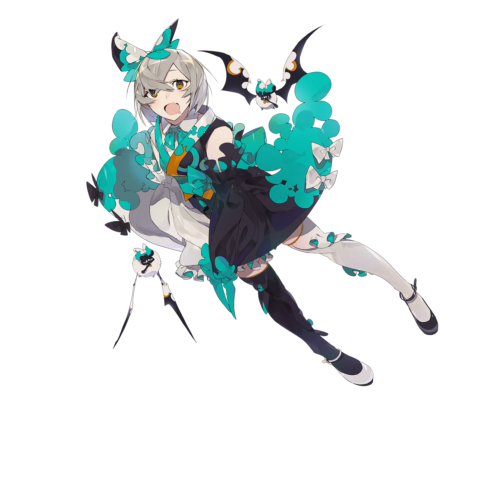

# 彩梦

💬 （°﹃°）
## 搭档信息

**立绘：**

**觉醒立绘：**

- **名称：** 彩梦
- **类型：** 平衡型
- **种类：** 常驻/档案
- **觉醒形态：** 有
- **画师：** そゐち
- **所属单曲：** Phantasia

### 搭档数据（移动版）

| 等级 | Lv1 | Lv20 | Lv30 |
|------|------|------|------|
| Frag | 50 | 50 | 50 |
| Step | 45 | 83 | 93 |
| Over | 12 | 49 | 59 |

### 搭档数据（Nintendo Switch版）

| 等级 | Lv1 | Lv20 | Lv30 |
|------|------|------|------|
| Frag | 50 | 50 | 50 |
| Step | 50 | 80 | 185 |
| Over | - | - | - |

- **技能：** 歌曲游玩结束时奖励随机数量的残片
- **觉醒技能：** 世界进度在 +5 和 -5 之间随机增减
- **更新时间：** v1.8.2(2018/11/29)
- **觉醒更新时间：** v3.11.2(2022/01/20)
- **更新时间（NS）：** v1.0.0c(2021/05/18)
- **觉醒更新时间（NS）：** v2.0.1(2023/03/16)

## 解禁方法
### 搭档
#### 移动版
购买单曲Phantasia，并在世界模式地图9-1获得
- 在v6.0.0(2024/11/21)改为常驻前，需参加限时活动获得
  - 限时活动时间：2018年11月29日~2018年12月06日
::2019年10月20日~2019年10月27日
::2020年8月7日~2020年8月14日
::2022年1月20日~2022年2月10日
::2023年5月11日~2023年5月25日
::2024年4月26日~2024年5月17日
#### Nintendo Switch版
在第二章完成70格地图后，在世界模式地图NS2-6获得
### 觉醒形态
搭档等级升至20级，并使用缤纷核心×30唤醒
## 技能
### 普通形态
]
> **技能：** 歌曲游玩结束时奖励随机数量的残片
- 奖励残片可能为负数，若因此导致最终获得残片的值为负数，会**扣除残片**。
- 奖励残片为0残片时，不会显示在奖励中。
- 分数在5'500'000分及以下时，无论是否通关都不获得奖励残片。
残片加成算法：[https://gist.github.com/esterTion/b6f4c6b5631f06b9c9c180b7ddc1c3db 算法参考]

 0.00005% 概率：直接获得9999残片。

 0.00095% 概率：直接获得616残片。[^2]

 89.999%概率：随机获得-10 ~ 20残片

 10.00% 概率：随机获得 10 ~ 100残片（残片数为10的整数倍）
- 平均每局奖励的残片数量约为10。
当FR或PM完成曲目，且按上述过程得到的随机值小于或等于0时，随机获得1 ~ 20残片。
- 此时平均每局奖励的残片数量约为15。
### 觉醒形态
> **技能：** 世界进度在 +5 和 -5 之间随机增减
- 技能效果为最终加算，即世界进度在`单曲潜力值→STEP值→残片→体力`计算完毕后在此结果上额外进行加算或减算。
- 世界进度随机增减的值为整数。
- 若因此导致最终步数的值小于等于0，会改为0值，显示为0.0，并且本次游玩不会使世界进度产生变化。
- 此技能的触发与结算成绩或通关类型无关。
- 此技能无法在失落章和陷落章地图生效。
## 搭档相关
- 该搭档在游戏中拥有自己的故事，详见故事模式。
- 本搭档为第四个从限时变为常驻的支线搭档。
- 该搭档的形象源自于[吸血鬼或]蝙蝠。
- 根据画师给出的设定图，彩梦的手实际上藏在没有开口的袖子里面。
- 以下曲目的曲绘中出现了该搭档的形象：
- MAHOROBA
- Phantasia
- init()
- Floating World
- Chromafill
- Désive
## 注释

[^1]: [https://weibo.com/5880184708/LBegc2UWE 微博原帖链接]
[^2]: “616”的日语读音与“lowiro”读音相近。