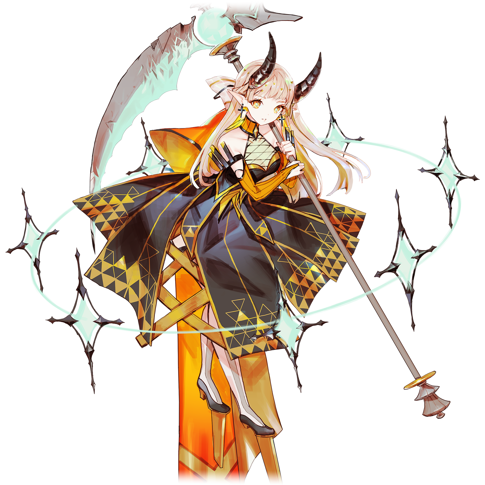
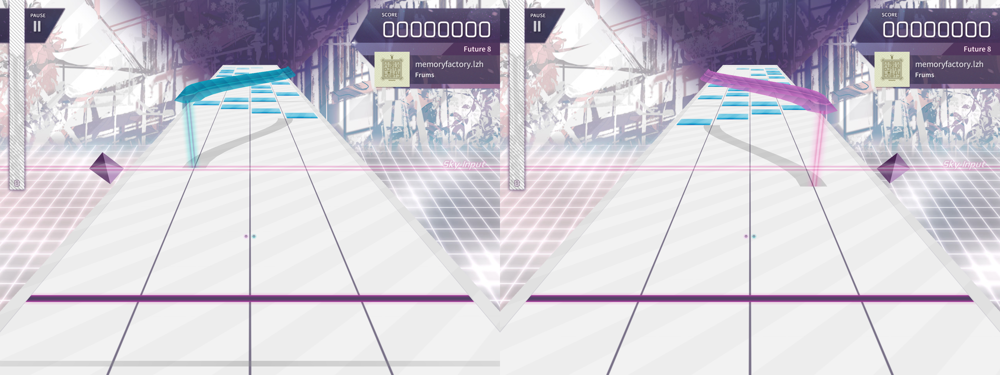
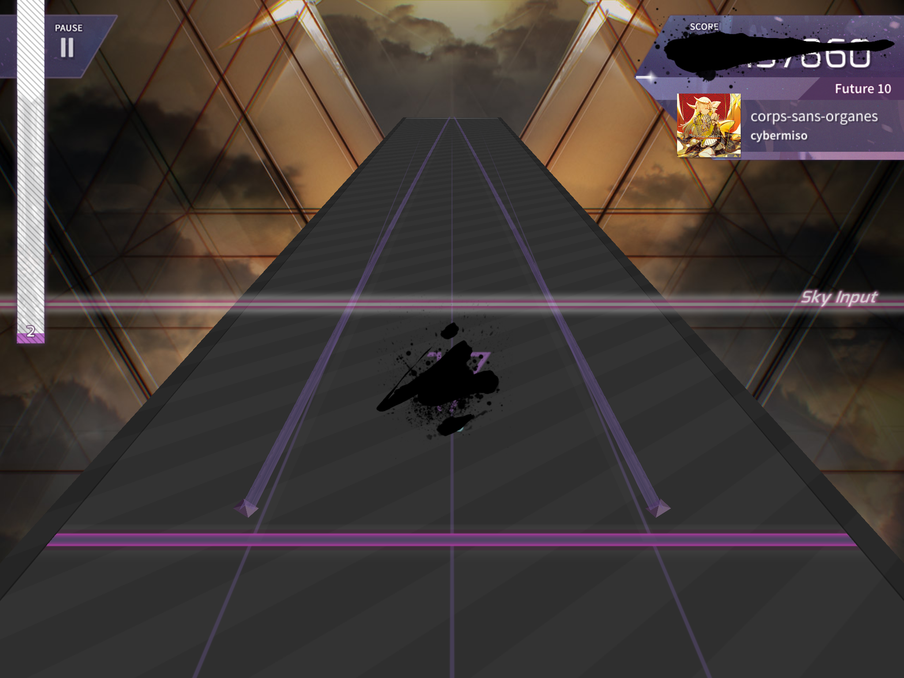

# 忘却

> 隶属于支线曲包Ambivalent Vision的搭档“忘却”，存在同名的常驻搭档

💬 “将那一点永远铭记于心，你就不会再迷茫。”
## 搭档信息

**立绘：**

**觉醒立绘：**

- **名称：** 忘却
- **类型：** 平衡型
- **种类：** 常驻/支线
- **觉醒形态：** 有
- **画师：** softmode
- **所属曲包：** Ambivalent Vision

### 搭档数据（移动版）

| 等级 | Lv1 | Lv20 | Lv30 |
|------|------|------|------|
| Frag | 47 | 70 | 80 |
| Step | 60 | 90 | 100 |
| Over | 47 | 70 | 80 |

### 搭档数据（Nintendo Switch版）

| 等级 | Lv1 | Lv20 | Lv30 |
|------|------|------|------|
| Frag | 50 | 60 | 85 |
| Step | 70 | 110 | 185 |
| Over | - | - | - |

- **技能：** 镜像 - 所有的音符与音弧反转
- **觉醒技能：** 遗缺的感知
- **更新时间：** v1.1.4(2017/08/10)
- **觉醒更新时间：** v2.6.0(2020/03/25)
- **更新时间（NS）：** v1.0.0c(2021/05/21)

## 解禁方法
### 搭档
#### 移动版
购入曲包Ambivalent Vision后，直接获得
#### Nintendo Switch版
在世界模式第二章，地图NS2-4，第二个奖励获得
### 觉醒形态
#### 移动版
搭档等级升至20级，并使用荒芜核心×5和悖异核心×25唤醒
#### Nintendo Switch版
搭档等级升至20级，并使用悖异核心×30唤醒
## 技能
### 普通形态

> **技能：** 镜像 - 所有的音符与音弧反转
谱面会以画面中心为中轴线镜面反转，同时音弧的颜色也会随着位置变化而变化。
- 此技能于8级解锁。
- 蓝色与红色音弧镜像变换位置的同时互换颜色，绿色音弧只会镜像变换位置，不会变换颜色。
### 觉醒形态

> **技能：** 遗缺的感知
游玩曲目时，会有黑色墨迹遮挡住分数、连击数、FR/PM指示灯的大部分。
- 由于这几项信息指示的位置问题，该墨迹也会遮挡部分轨道和note。
- 若调整了“FR/PM指示灯”设定项而导致FR/PM指示灯位置发生改变，则对应墨迹的位置也将改变。
- 于v4.0.0前后，该技能的中文名称从原先的“视觉 - 探悉遗缺的感知”被修改为“视觉 - 遗缺的感知”；且于v4.3.2 ~ 4.4.6之间的某版本其被再次修改为现名称。

## 搭档相关
- 该搭档在游戏中拥有自己的故事，详见故事模式。
- 以下曲目的曲绘中出现了该搭档的形象：
- Genesis
- Lethaeus
- corps-sans-organes
- Oblivia
- Oblivia [BYD]
## 注释