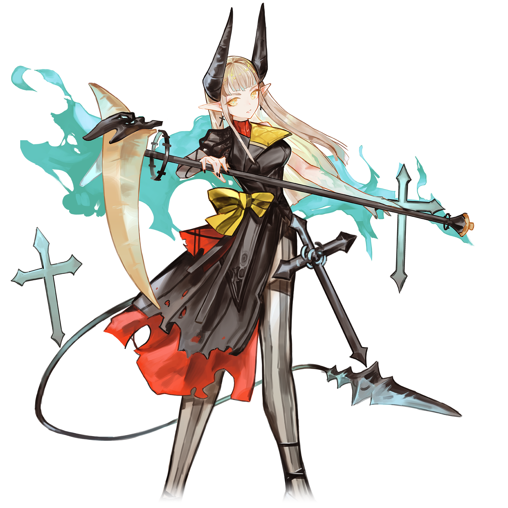

# 忘却（Apophenia）

> 隶属于支线曲包Ambivalent Vision和单曲NULL APOPHENIA的常驻支线搭档“忘却（Apophenia）”，存在同名的另一位常驻支线搭档
> 此条目内容为**移动版**独有。

💬 “她想让我放弃我守护的这些魂灵？”
## 搭档信息

**立绘：**

- **名称：** 忘却（Apophenia）
- **类型：** 挑战型
- **种类：** 常驻/支线/档案
- **觉醒形态：** 无
- **画师：** softmode

### 搭档数据（移动版）

| 等级 | Lv1 | Lv20 |
|------|------|------|
| Frag | 57 | 80 |
| Step | 70 | 100 |
| Over | 57 | 80 |

- **技能：** 困难 + 镜像 - 回忆率归零后直接判定为乐曲失败
- **更新时间：** v4.2.0(2023/1/26)

## 解禁方法
购入曲包Ambivalent Vision并购入曲目NULL APOPHENIA后，在世界模式地图7-9获得
## 技能
 > **技能：** 困难 + 镜像 - 回忆率归零后直接判定为乐曲失败
- 镜像效果详见忘却。
- 收集条机制详见困难回忆收集条。
## 搭档相关
- 该搭档在游戏中拥有自己的故事，详见故事模式。
- 该搭档20级时的各项数值与忘却的30级数值相同。
- 以下曲目的曲绘中出现了该搭档的形象：
- NULL APOPHENIA
- ALTER EGO