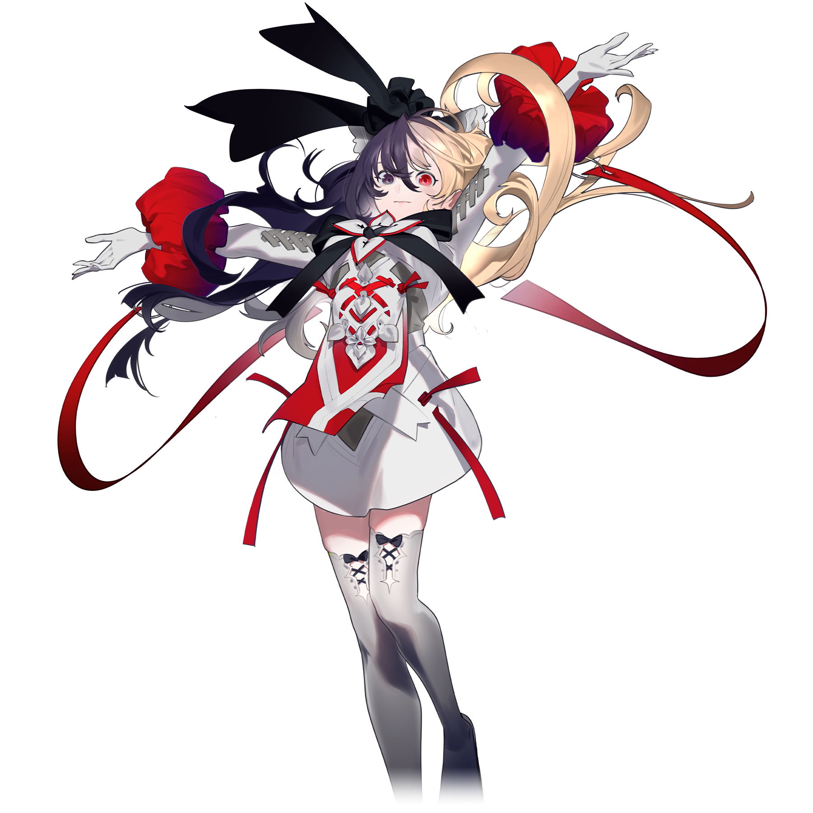
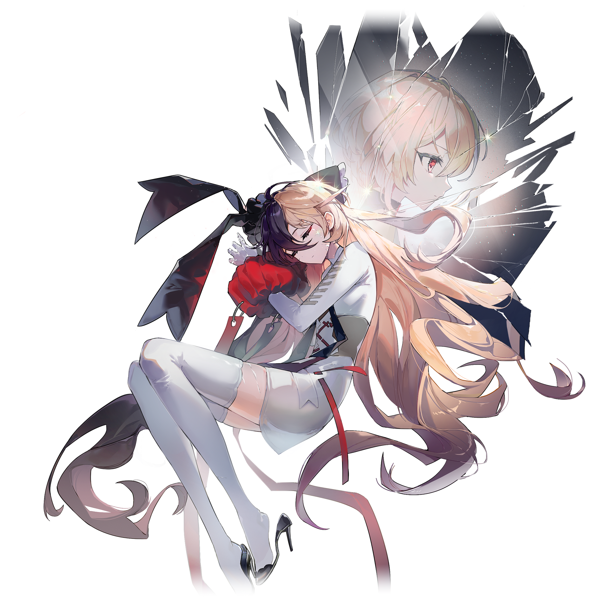
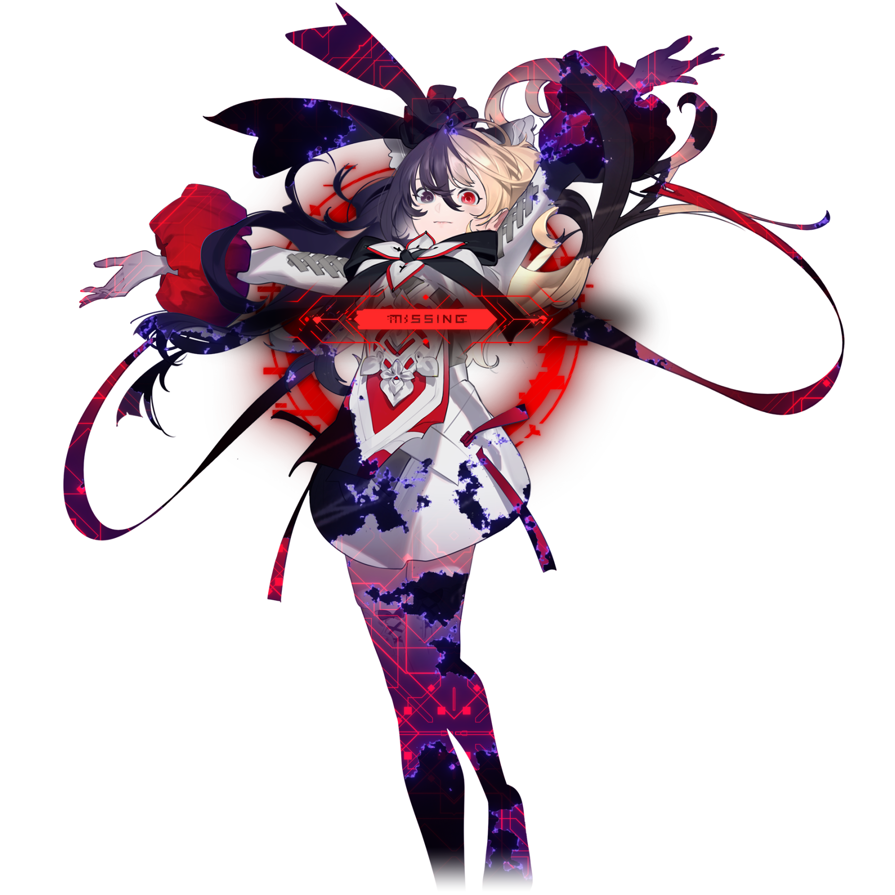

# 摩耶

> 此条目内容为**移动版**独有。

💬 「“无所不有”的你，又想要什么呢？」
——直视你的心，直面现实，然后做出选择，这样就好。
## 搭档信息

**立绘：**

**觉醒立绘：**

- **名称：** 摩耶
- **类型：** 平衡型
- **种类：** 常驻/主线
- **觉醒形态：** 有
- **画师：** おぐち
- **觉醒画师：** U0
- **所属曲包：** Lasting Eden

### 搭档数据（移动版）

| 等级 | Lv1 | Lv20 | Lv30 |
|------|------|------|------|
| Frag | 27 | 40 | 50 |
| Step | 31 | 47 | 57 |
| Over | 31 | 47 | 57 |

- **技能：** 不会触发随机限制格
世界模式下技能将在曲目结算后改变
- **第二技能：** 限制 – 随机曲目 + 世界进度翻倍
世界模式下技能将在曲目结算后改变
- **觉醒技能：** 歌曲游玩抵达全曲1/4进度时
回忆率将全部转化为角色能力加成
- **更新时间：** v4.7.0(2023/08/18)
- **觉醒更新时间：** v6.9.0(2025/10/02)

## 解禁方法
### 搭档
购入曲包Lasting Eden后，在世界模式地图8-1获得。
### 觉醒形态
获得洞烛（至高：第八探索者）并解锁Undying Macula后，该搭档将自动觉醒。
## 技能
### 普通形态
> **第一技能：** 不会触发随机限制格 世界模式下技能将在曲目结算后改变
> **第二技能：** 限制 – 随机曲目 + 世界进度翻倍 世界模式下技能将在曲目结算后改变
- 初始技能为第一技能。
:当玩家在世界模式使用该搭档游玩一次并成功结算后，就会变化为另一个技能。
- 此技能仅影响是否随机。当台阶存在其它类型的限制时，这些限制仍然生效。
- 使用觉醒形态的该搭档在世界模式游玩一次并成功结算后，该搭档普通形态下的技能并不会切换。
- 在World Parallel模式中第一技能的随机曲目效果无效，但仍然会变化为另一个技能。
### 觉醒形态
> **技能：** 歌曲游玩抵达全曲1/4进度时 回忆率将全部转化为角色能力加成
- 歌曲进度达到1/4时，回忆率将被清零。结算时，搭档的每项能力数值将加上清零时的回忆率（上限为70）的值。
- 极端条件下，可能会因为回忆率不足70导致在全连的情况下Track Lost。
## 搭档相关

- 该搭档在游戏中拥有自己的故事，详见故事模式。
- 无论通过何种方式，只要玩家获得了洞烛（至高：第八探索者），该搭档的立绘上都将出现红黑色`MISSING`字样并出现崩坏效果。
  - 如果玩家在获得该搭档之前已经获得了洞烛（至高：第八探索者），该搭档在获得时将直接以崩坏效果出现。
  - 解锁Undying Macula后，该搭档的初始立绘将变为无`MISSING`字样的立绘，且觉醒形态下搭档名称上方会出现“Eclipse”的小字。
    - 先前，在解锁Undying Macula后，若切换到离线模式，则立绘会切换到有`MISSING`字样的立绘。在不晚于v6.10.5前的某个版本更新后，已满级的洞烛（至高：第八探索者）变为在离线状态下也可使用后，这一特性被修复了。
- 该搭档是目前唯一无需达到20级即可觉醒的搭档。
- 以下曲目的曲绘出现了摩耶的形象:
- Rise of the World
- Abstruse Dilemma
- Arghena
- Nameless Passion
- Viola Illyria
- Vainspire
- No Way Back
- ANDORXOR
- Undying Macula
## 注释

[^1]: 例如dropdead {{PST}}，在歌曲进度达到1/4，回忆率清零后，将所有的Tap（共5个）判定成FAR，即可达成全连Track Lost({{Bilibili|BV1pmHKzcEbZ|参考录像|nologo=1}})。