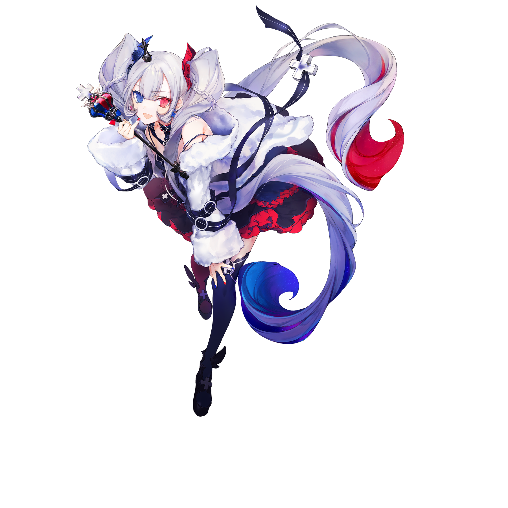

# 白姬

💬 ~~NS娘~~
## 搭档信息

**立绘：**

- **名称：** 白姬
- **类型：** 平衡型
- **种类：** 常驻/支线
- **画师：** シエラ
- **所属曲包：** Divided Heart

### 搭档数据（移动版）

| 等级 | Lv1 | Lv20 |
|------|------|------|
| Frag | 38 | 66 |
| Step | 33 | 58 |
| Over | 28 | 50 |

### 搭档数据（Nintendo Switch版）

| 等级 | Lv1 | Lv20 |
|------|------|------|
| Frag | 50 | 60 |
| Step | 30 | 50 |
| Over | - | - |

- **技能：** 通关一首「精选曲目」时
获得 10 额外残片
- **更新时间：** v3.10.0(2021/12/09)
- **更新时间（NS）：** v1.0.0c(2021/05/18)

## 解禁方法
### 移动版
购入曲包Divided Heart，然后在世界模式地图6-5获得
### Nintendo Switch版
在世界模式地图NS1-1获得
## 技能
> **技能：** 通关一首“精选曲目”时获得10额外残片
- 技能于8级解锁。
- 游戏会随机一部分曲目作为“精选曲目”，它们左侧会出现上箭头标记，通关这些曲目时获得10额外残片。
  - 精选曲目的随机方式为：每首曲目有5%的概率成为“精选曲目”，除此之外再随机一首已解锁曲目作为“精选曲目”[^1]。
    - 因此，未购买或者未解锁的曲目也可能被选择为“精选曲目”，同时本次随机到的曲目可能会在下一次随机时再次选中。
  - 使用该搭档完成一次“精选曲目”游玩后（无论通关与否），“精选曲目”会重新随机。退出并重新启动游戏也会重新随机“精选曲目”。
    - 更换为其他搭档再换回该搭档不会重新随机。使用其他搭档完成曲目或者游玩“精选曲目”时中途退出或者完成其他曲目，不会重新随机。
  - 即使未解锁技能也会出现标记，但是不会获得额外残片。
- 在移动端，此技能在世界模式有效。
## 搭档相关
- 该搭档在游戏中拥有自己的故事，详见故事模式。
- 该搭档的属性在NS v1.1.0被削弱，20级能力值由100/100下调至60/50，1级能力值由50/50下调至50/30。
  - 降低该搭档的属性值疑似为平衡性调整：可能是因为作为NS版世界模式初期最容易获得的搭档，该搭档的搭档数据远高于光和对立，有破坏游戏初期平衡之嫌。
  - 同时搭档技能也由初始解锁调整为8级解锁。
- 以下曲目的曲绘出现了白姬的形象:
- First Snow
- nέο κόsmo
- Lightning Screw
## 备注

## 注释

[^1]: 尚不清楚是否排除前一种已经随机到的；尚不清楚是判断解锁歌曲还是解锁至少一个谱面还是解锁当前难度的谱面