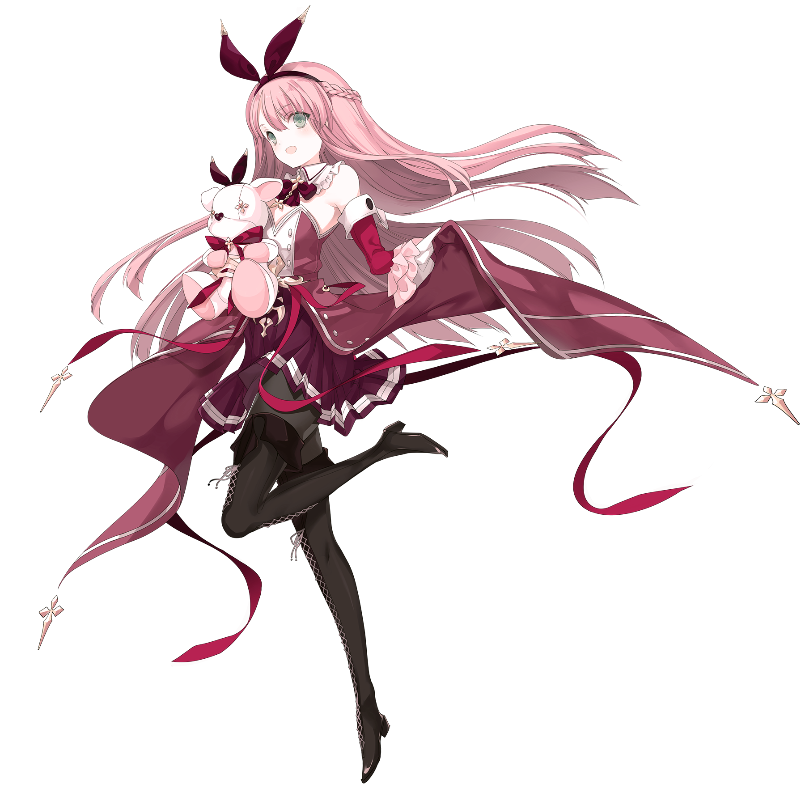
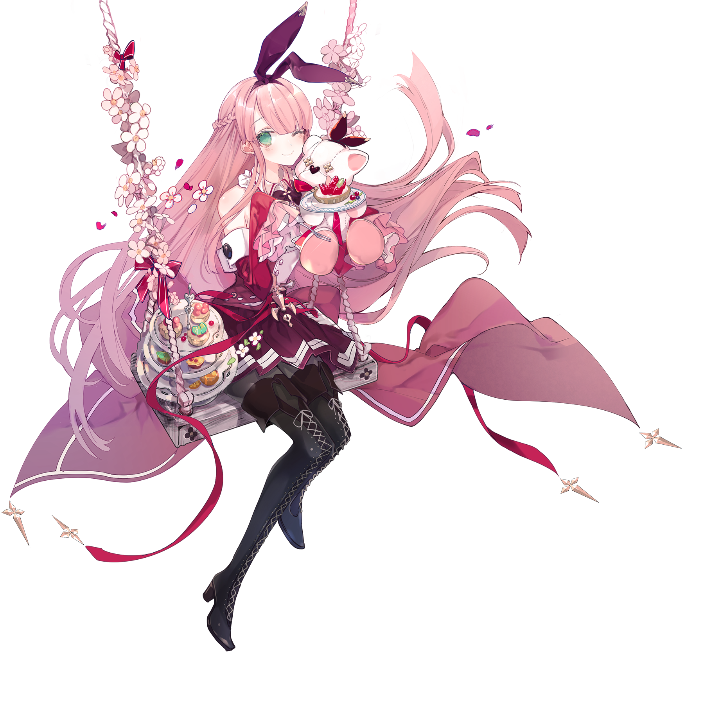

# 红

> 隶属于支线曲包Crimson Solace的搭档“红”，存在同名的限时活动搭档

💬 直到这一刻，她才终于发现，自己早已是这个世界上最幸福的人。
## 搭档信息

**立绘：**

**觉醒立绘：**

- **名称：** 红
- **类型：** 平衡型
- **种类：** 常驻/支线
- **觉醒形态：** 有
- **画师：** シエラ
- **所属曲包：** Crimson Solace

### 搭档数据（移动版）

| 等级 | Lv1 | Lv20 | Lv30 |
|------|------|------|------|
| Frag | 60 | 90 | 100 |
| Step | 47 | 70 | 80 |
| Over | 25 | 47 | 57 |

### 搭档数据（Nintendo Switch版）

| 等级 | Lv1 | Lv20 | Lv30 |
|------|------|------|------|
| Frag | 55 | 70 | 95 |
| Step | 50 | 80 | 155 |
| Over | - | - | - |

- **技能：** -
- **觉醒技能：** 以歌曲结算成绩为基准值
获得最高 +20% 的残片奖励
- **更新时间：** v1.0.11(2017/05/11)
- **觉醒更新时间：** v2.4.0(2019/10/08)
- **更新时间（NS）：** v1.0.0c(2021/05/18)

## 解禁方法
### 搭档
#### 移动版
购入曲包Crimson Solace后，直接获得
#### Nintendo Switch版
在世界模式第二章，地图NS2-3，第二个奖励获得
### 觉醒形态
#### 移动版
搭档等级升至20级，并使用中空核心×5和深红核心×25唤醒
#### Nintendo Switch版
搭档等级升至20级，并使用深红核心×30唤醒
## 技能
### 觉醒形态
> **技能：** 以歌曲结算成绩为基准值获得最高 +20% 的残片奖励
- 奖励残片奖励最低为10%，最高为20%，当分数位于 9,000,000 至 10,000,000之间时，将按照分数所在相对百分比线性计算奖励加成。
如 9,800,000 分将得到18%的奖励加成
- 奖励将会继续进行角色frag数值的加成计算。
## 搭档相关
- 该搭档在游戏中拥有自己的故事，详见故事模式。
- 该搭档是Arcaea中唯一一个仅有觉醒技能的搭档。
- 以下曲目的封面出现了该搭档的形象：
- Paradise
- Nirv lucE
- GLORY：ROAD
- Diode
- blue comet