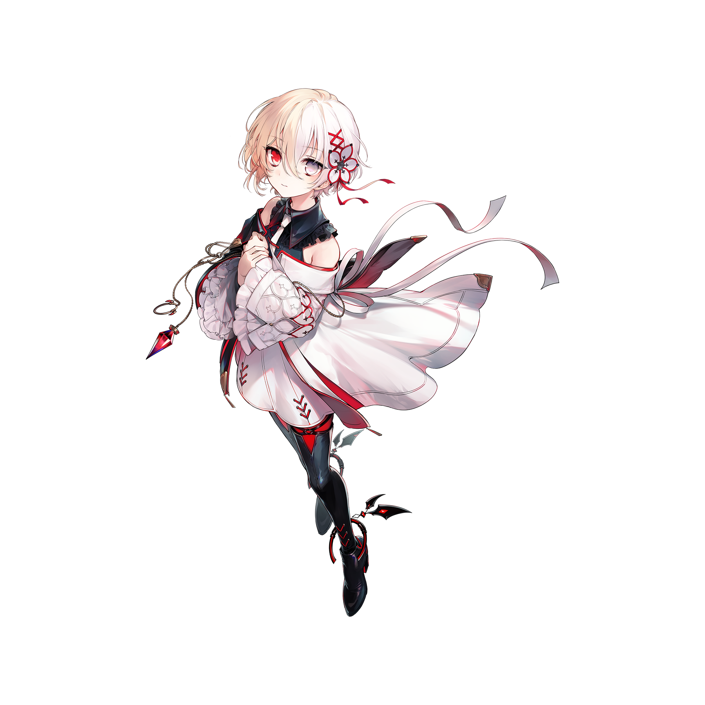

# 维塔（Wanderer）

> 隶属于主线曲包Absolute Nihil的搭档“维塔（Wanderer）”，关于与“**维塔**”名称相近或相同的条目
> 此条目内容为**移动版**独有。

💬 算了，还是别耽误太久。我们继续吧，毕竟，时间在这里，也几乎从不等人。
## 搭档信息

**立绘：**

- **名称：** 维塔（Wanderer）
- **类型：** 平衡型
- **种类：** 常驻/主线
- **觉醒形态：** 无
- **画师：** すずなし
- **所属曲包：** Absolute Nihil

### 搭档数据（移动版）

| 等级 | Lv1 | Lv20 |
|------|------|------|
| Frag | 34 | 52 |
| Step | 43 | 64 |
| Over | 73 | 110 |

- **技能：** 每两个模糊（FAR）判定发生时
回忆率及超量（OVER）均减少1点
- **更新时间：** v6.8.2(2025/09/04)

## 解禁方法
购入曲包Absolute Nihil后，在世界模式地图9-11获得
- 该地图需要特殊方式解锁，具体解锁方式详见Acheron#解禁方法。
## 技能
> **技能：** 每两个模糊（FAR）判定发生时 回忆率及超量（OVER）均减少1点
- lost判定不会减少OVER值。
## 搭档相关
- 解锁本搭档之后，搭档维塔的名称上方会出现“Recall”的小字。
  - 在v6.8.2和v6.8.4两版本时为中文的“追忆”，且彼时该搭档的名称也为“维塔（漂泊）”。
- 该搭档的20级Over基础值超越了对立 & 菲尔，成为了当前除光（Fatalis）外20级Over基础值最高的搭档。
- 该搭档更新之初并未要求强制更新至v6.8.2，若有玩家（好友）将头像设置为该搭档，此时未更新玩家的排行榜和好友列表中该玩家的头像会以一个未知搭档的头像占位。
  - 已更新的玩家会正常显示该搭档的头像，无论是否解锁该搭档。
- 以下曲目的曲绘中出现了该搭档的形象：
- HYPER VISION
- Ashen 6oundary
- Acheron
- ANDORXOR