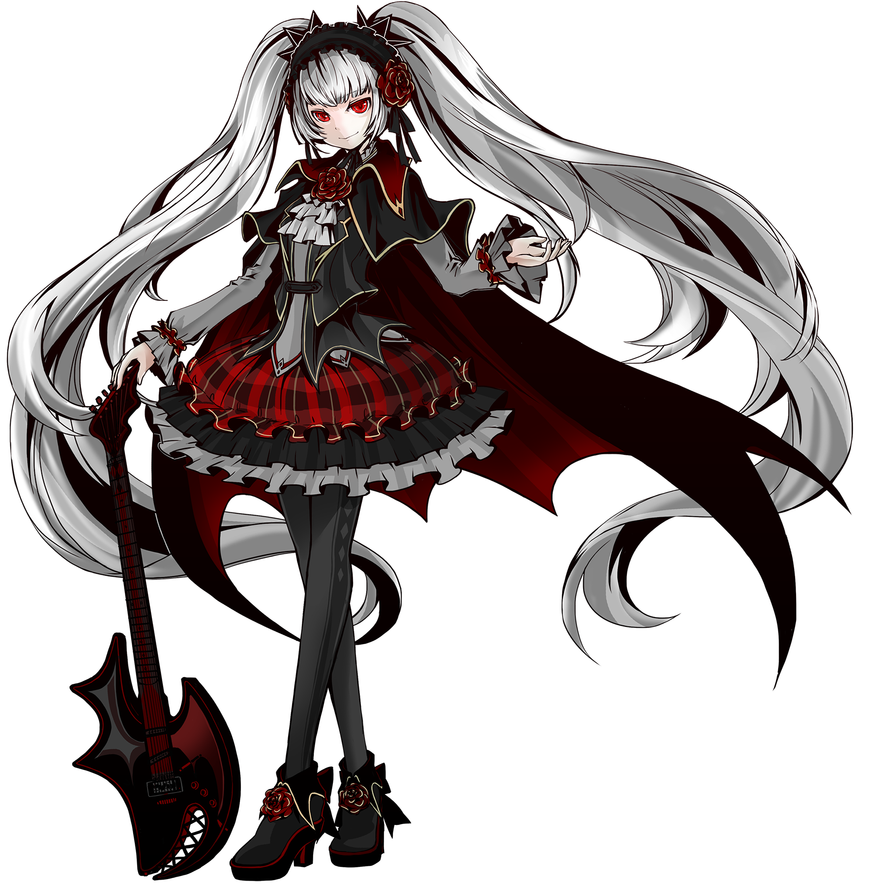
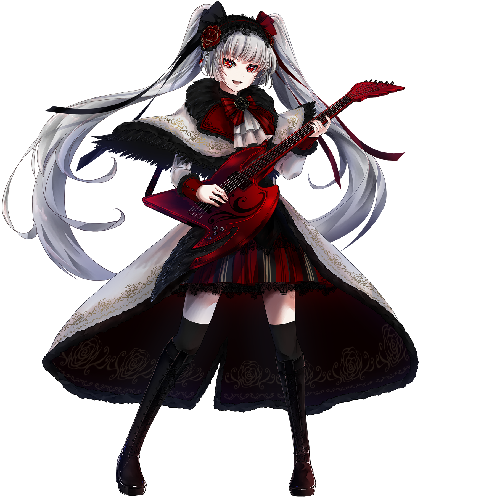

# 调

## 搭档信息

**立绘：**

**觉醒立绘：**

- **名称：** 调
- **类型：** 平衡型
- **种类：** 常驻/档案
- **觉醒形态：** 有
- **画师：** 未早
- **所属单曲：** carmine:scythe

### 搭档数据（移动版）

| 等级 | Lv1 | Lv20 | Lv30 |
|------|------|------|------|
| Frag | 56 | 82 | 92 |
| Step | 46 | 68 | 78 |
| Over | 31 | 58 | 68 |

### 搭档数据（Nintendo Switch版）

| 等级 | Lv1 | Lv20 | Lv30 |
|------|------|------|------|
| Frag | 50 | 56 | 95 |
| Step | 30 | 43 | 155 |
| Over | - | - | - |

- **技能：** 在游玩 纷争之侧 的歌曲时
获得 5 额外残片
- **更新时间：** v1.6.2(2018/04/29)
- **觉醒更新时间：** v3.0.3(2020/07/08)
- **更新时间（NS）：** v1.0.0c(2021/05/18)

## 解禁方法
### 搭档
#### 移动版
购入曲目carmine:scythe，并在世界模式地图6-7获得
- 在v3.11.2（2022/1/20）改为常驻前，需参加限时活动获得
  - 限时活动时间：2018年4月29日～2018年5月6日
::2018年12月9日～2018年12月16日
::2019年12月16日～2019年12月23日
::2020年7月1日～2020年7月15日
#### Nintendo Switch版
在世界模式第一章完成75格地图后，在世界模式地图NS1-5获得
### 觉醒形态
搭档等级升至20级，并使用绯红核心×30觉醒
## 技能
### 普通形态
> **技能：** 在游玩纷争之侧的歌曲时获得 5 额外残片
- 此技能于8级解锁。
- 此技能在“消色”之侧与Lephon侧的曲目不生效，因为这些曲目既不属于“光芒”之侧，也不属于“纷争”之侧。
### 觉醒形态
> **技能：** 在游玩歌曲时先支付等同于歌曲难度值的残片 获得「EX」或更高成绩时额外奖励10残片
- 算上FRAG值加成，EX时额外残片奖励为(16.4~18.4) - (1~12) = (4.4~17.4)，极端情况下可能会小于觉醒前的5残片。
- 进入歌曲时扣除的残片数量取决于该谱面的标级而非定数。
  - 因此，dropdead FTR(标级为8+，定数为9.1)在进入时只会扣除8残片，而非9残片。
- 此技能经过一系列修改后，现在登录状态下无论如何进入歌曲都会按照谱面标级扣除残片。
  - v3.1.0后，残片只有在第一次进入歌曲时才会被扣除，点击重试按钮可以在不被扣除残片的情况下获得加成。
  - 现在在歌曲成绩结算界面点击重试也会扣除残片。
  - v4.0.0后，残片在世界模式进入歌曲时也会被扣除（在此之前不会被扣除）。
  - 某个版本后，在Link Play模式下进入歌曲时也会扣除相应的残片。
## 搭档相关
- 该搭档在游戏中拥有自己的故事，详见故事模式。
- 该搭档是Arcaea中第二个由限时活动转为常驻的搭档。
- 以下曲目的曲绘中出现了该搭档的形象:
- carmine:scythe
- Scarlet Cage
- Dies irae