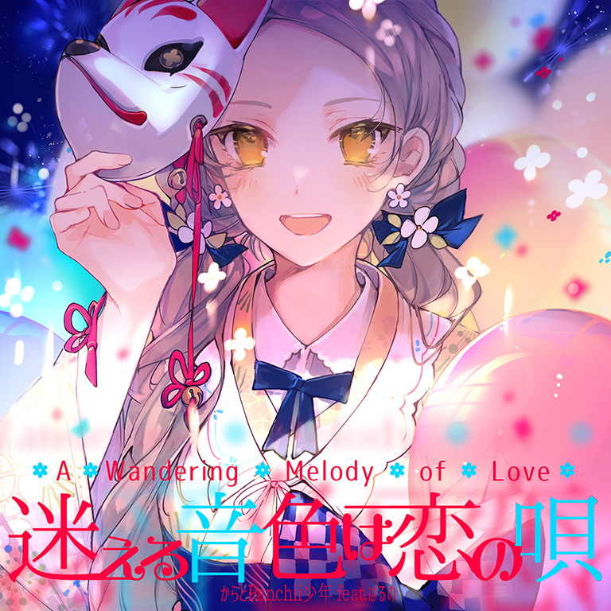

# A Wandering Melody of Love / 迷える音色は恋の唄

> *恋歌花呗*

- **白昼曲绘：**

- **黑夜曲绘：**

- **曲师**：からとPαnchii少年 feat.はるの
- **时长**：02:13
- **曲包**：Sunset Radiance
- **BPM**：165

### 谱面信息

| 难度 | Past | Present | Future |
| ------ | ------ | ------ | ------ |
| 等级 | 3 | 7 | 9 |
| Note 数量 | 422 | 670 | 931 |
| 谱面设计 | 恋のToaster | 恋のToaster | 恋のToaster |

- **背景**：omatsuri_light
- **更新时间**：移动版v2.3.0(2019/08/22)

---

## 解禁方法

### 移动版
• **Present**：25 残片
• **Future**：游玩 AI［UE］OON FTR；75 残片

### Nintendo Switch版
• **Past**：游玩 Chelsea PST；游玩 AI［UE］OON PST；游玩 Tie me down gently PST；10 残片
• **Present**：游玩 Chelsea PRS；游玩 AI［UE］OON PRS；游玩 Tie me down gently PRS；20 残片
• **Future**：以「AA」或以上成绩通关 Chelsea FTR；以「AA」或以上成绩通关 AI［UE］OON FTR；以「AA」或以上成绩通关 Tie me down gently FTR；30 残片

---

## 曲目定数

| 难度 | 定数 |
| ------ | ------ |
| Past | 3.5 |
| Present | 7.5 |
| Future | 9.6 |

• 本曲PRS难度谱面初出时的定数为7.3，在v3.0.0更新后改为7.5(+0.2)。
• 本曲FTR难度谱面初出时的定数为9.6，在v3.0.0更新后改为9.7(+0.1)，又在v4.0.0更新后改为9.6(-0.1)。

---

## 游戏相关

- 本曲是Arcaea第1届公募大赛Arcaea Song Contest 2019的**冠军曲目**。
- 本曲FTR难度谱面中出现了由红蓝音弧组成的八分音符图案以及黑线画出的爱心。
- 游戏中，本曲在本地系统时间6:00\~19:59时显示白昼版曲绘，20:00~次日5:59时显示黑夜版曲绘。
  - 该变化与选用搭档无关。
- 因联动收录至O.N.G.E.K.I.、CHUNITHM和maimai。

---

## 歌词

### 原文

- 来源：曲师在推特发布的公式歌词

咲き乱れる花火、下駄を鳴らし
澄んだ夜空見上げ袖振った
今日はきっと、そう言えるかな？
迷える音色は恋の唄

結った髪、浴衣着付けて
鏡の前では晴れ姿
あっぱれ！あっぱれ！
貴方に一日千秋、一心不乱に
無我夢中

道に待ってた夏祭り
歩く度、鼻緒を気にして
やっぱり？やっぱり？
私は七転八倒、艱難辛苦で
四苦八苦

夕暮れに頬が染まって
色付いた町が心煽る
特別な夜に言葉を紡ぐ

咲き乱れる花火、下駄を鳴らし
澄んだ夜空見上げ袖振った
今日はきっと、そう言えるかな？
迷える音色は恋の唄
すれ違う会話と踊る心
歩幅合わせ君の手を取った
今日はきっと、そう言えるかな？
迷える音色は恋の唄

言葉にならない想いをまとめ
伝えてみせましょ声出して
今日はきっと、そう言えるから
震える音色は恋の唄
咲き乱れる花火、下駄を鳴らし
澄んだ夜空見上げ袖振った
君にそっと、そう近付いて
囁いた音色は恋の唄

### 参考翻译

此章节所记录的歌词/翻译的来源不具有官方性质，仅供参考。
- 译者：岸田夏海 (有改动)

烟花绚烂绽放 木屐咯吱作响
仰望澄澈夜空 挥舞衣袖分别
今天能这样说出口吗？
迷失的音色是恋之歌

梳好头发 穿上浴衣
在镜子前焕然一新
好漂亮！好体面！
让我对你望眼欲穿、心如秋水
无法自拔

走在路上等待去往夏日祭典
一步一步目光紧紧不离足尖
果然啊 果然啊
让我心中波澜起伏、无法自已
小鹿乱撞

黄昏将脸颊染上了红霞
五光十色的街道让人满心雀跃
为这特别的夜晚仔细组织语言

烟花绚烂绽放 木屐咯吱作响
仰望澄澈夜空 挥舞衣袖分别
今天能这样说出口吗？
茫然的音色是恋之歌
漫不经心的交流与悸动的心
脚步赶上节奏牵住了你的手
今天能这样说出口吗？
踌躇的音色是恋之歌

汇集我难以启齿的缭绕思绪
为传达这份爱意而终于出声
今天一定要这样说出口
颤抖的音色是恋之歌
烟花绚烂绽放 木屐咯吱作响
仰望澄澈夜空 挥舞衣袖分别
就这样轻轻地依靠着你
细语的音色是恋之歌

---

## 攻略

此章节可能包含主观内容。

**Future 9**

- 除了517-573combo的一段天地交互外基本没有什么难点，可以在Pentiment PRS中找到相应的下位配置进行练习
- 该谱面容易手癖，在有足够的实力之前不建议尝试

---

## 试听

- · (QQ音乐) 试听

---

## 相关视频

- https://www.bilibili.com/video/BV12b4y1r7g2
- https://www.bilibili.com/video/BV1M4411R7NH
- https://www.bilibili.com/video/BV1Z4411r7UU
