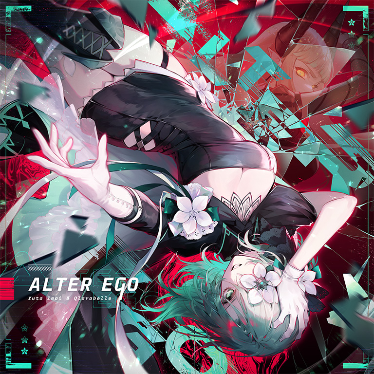

# ALTER EGO

> *鹬蚌之争*

- **ALTER EGO 曲绘：**

- **曲师**：Yuta Imai vs Qlarabelle
- **时长**：02:40
- **曲包**：Absolute Nihil
- **BPM**：195

### 谱面信息

| 难度 | Past | Present | Future | Eternal |
| ------ | ------ | ------ | ------ | ------ |
| 等级 | 6 | 9 | 10 | 11 |
| Note 数量 | 865 | 1213 | 1466 | 1644 |
| 谱面设计 | Article V《Observation》 | Article VI《Hypothesis》 | Article VII《Analysis》 | Article 0x8《Enmity》 |

- **背景**：alterego
- **更新时间**：移动版v5.9.0(2024/07/30)

---

## 解禁方法

### 移动版
• **Past**：阅读剧情【18-6】；得到你所渴求的
• **Present**：通关 Judgement [PRS]；阅读剧情【18-6】；得到你所渴求的
• **Future**：通关 Judgement [FTR]；阅读剧情【18-6】；得到你所渴求的
• **Eternal**：通关 Judgement [FTR]；阅读剧情【18-6】；得到你所渴求的
- 当前两条内容未完成时，第三条内容将显示为“???”。

### 磨难挑战
> 本挑战推荐准备好纸笔或适时截屏以记录信息。
完成除“得到你所渴求的”外所有的解禁条件后，点击曲目**ALTER EGO**，将弹出解锁界面。点击下方“开始挑战”字样，将进入“磨难挑战”。
- 世界模式和Link Play状态下将无法进入。

**挑战开始**后，选曲界面所有UI将被隐藏，并出现如下提示。

系统介绍

- 磨难已然降临**

所有东西都要讲究「先后次序」，而你对此了如指掌，对不对？

那便来吧，使出你最大的能耐，记住每首歌曲的价码，以及它们真正的价值！

  - 将它们牢记于心**。

将它们拿上前来，用行动告诉我它们真正的价值。

  - 尽你所能吧，你还有X秒的时间。**

系统介绍（英文）

- Challenge[ALTEREGO]**

Apply yourself. You understand "value" best, don't you?

Each song you remember has been assigned a value. Remember their worth.

  - Memorize them.**

Bring them here and with their values, answer.

Do not delay.

  - You have X seconds.**

**挑战**共分为四条。每条挑战都有X秒的限制时间，X初始值为99。在限制时间剩余5秒时，会出现提醒音效。
- 无法通过切换至其他应用来暂停倒计时。
每条挑战的界面从上至下为
- 标题
- 谜面，选定曲目后，点击方框槽位的“+”号，即可放置曲目以解答谜题
- 剩余时间
- “搜寻”按钮，点击后将会隐藏挑战界面，进入解谜专用的特殊选曲界面
系统会选取数首曲目组成特殊选曲界面，点击曲目项可以选定曲目并回到挑战界面。
- 左下方原“主界面”位置改为显示剩余时间
- 正下方原“link play”位置改为花形按钮，点击可以回到挑战界面查看谜面
- 左上方曲目难度被限制为与欲解锁的**ALTER EGO**难度相同；如欲解锁Eternal难度，则限制Future难度
每条挑战所有谜题解答完成后，“搜寻”按钮将变为“锁定”字样。在限制时间归零前，须正确解答所有谜题，并点击“锁定”以提交。

曲目列表的组成

系统将会优先从Ambivalent Vision、Absolute Reason、Absolute Nihil所含曲目和Oblivia、NEO WINGS、HYPER VISION、Kissing Lucifer、NULL APOPHENIA中随机选择曲目。[^1]
- 列表内至少会随机到一首Absolute Reason或Absolute Nihil中的曲目。
- 曲目列表内不会随机到玩家没有购买或没有解锁的曲目，以保证本曲可以正常解锁。
  - 如果随机到的优先曲目无法填满曲目列表，游戏会从Memory Archive、World Extend、Arcaea中的曲目、主线剧情曲目等其他相关度很小的已购买曲目中随机挑选占位曲目。

**前三条挑战**中，选曲界面中的曲目项旁将会显示一朵带有数字的花（称为每首曲目的“**价码**”），这些曲目及其价码不会在挑战中途变更。谜题共两道，谜面以下三种形式出现：
- 与A同频：放置一首价码等于A的曲目。
- Y度胜于"B"：放置一首比曲目"B"的价码高Y的曲目。
- Z度次于"C"：放置一首比曲目"C"的价码低Z的曲目。
  - Y、Z分别为一个随机的正整数。
提交后，玩家须从两道谜题对应的曲目中选择一首，在困难模式下进行游玩。Track Complete后即可进入下一条挑战。
- 第二条挑战会隐藏部分曲目的价码，并再次随机选择几首(一般为1首)不重复的曲目加入选曲界面；第三条挑战会隐藏所有价码。二者会在挑战界面提示“切勿被幻象蒙蔽”[^2]
- 第三条挑战中，上述B、C曲目为“首度游玩之曲”，这里指的是第一条挑战所游玩的曲目
- **建议**：记录前两条挑战出现的各曲目及价码，以及第一条挑战所游玩的曲目
若因挑战失败而退出界面(包括进入后中途退出)，再次进入时，曲目和价码将会重置并另外随机选取/生成。
- 第二条挑战中，可能会出现与幻象曲目相关的要求(疑似bug)。此时无论如何选择，必定导致解答错误而结束挑战，并提示“颠倒是非”。

**第四条挑战**有一道谜题，谜面为“这段回忆……一直都在吗？”。此时选曲界面将会大量重复出现本曲包的各曲目，需要找到**唯一**出现的**ALTER EGO**作为谜底。若解答正确，将显示对应难度的**ALTER EGO**。点击进入后将以普通模式游玩，游玩结束即可解锁对应难度的谱面，无论是否通关。
- 低难度的谱面会一并解锁。
- 若以Future或Eternal难度进入磨难挑战，Future和Eternal难度均会显示，游玩结束后也会一并解锁。
  - 也就是说，Future和Eternal难度的解锁是同时进行的，二者实际上被视为同一“难度”下的双谱面。

**若玩家挑战失败**，挑战将立即结束，并显示不同的结语：
- 谜题解答错误，选择的曲目不合要求：显示“颠倒是非”。
- 谜题解答超时：显示“时间到了”。
- 游玩期间，在困难模式下Track Lost：显示“不堪一击”。
玩家需要重新开始挑战。

除了在第一条挑战中“颠倒是非”或“时间到了”，其他情况均记为一次“有效失败”（以下简称为失败）。随着失败次数的增多，磨难挑战的难度也会随之降低。

- 每次失败后磨难挑战的详细变更

| 失败次数 | 限制时间 | 磨难挑战的详细变更 |
| ------ | ------ | ------ |
| 0 | 99秒 | 开始时，系统选取的曲目为 8 首 |
| 1 | 105秒 | - |
| 2 | 110秒 | - |
| 3 | 115秒 | 开始时，系统选取的曲目减少为 7 首 |
| 4 | 120秒 | - |
| 5 | 125秒 | 开始时，系统选取的曲目减少为 6 首 第三条挑战中，有概率不再出现与“首度游玩之曲”相关的谜面 |
| 6 | 130秒 | - |
| 7 | 135秒 | 第二、三条挑战中，作为干扰项新添加的曲目旁会提示“幻像” |
| 8 | 140秒 | - |
| 9 | 145秒 | 开始时，系统选取的曲目减少为 5 首 |
| 10 | 150秒 | - |
| 11 | 155秒 | 每一次“锁定”后，变为以普通模式进行游玩（仍须Track Complete以继续） 第二、三条挑战中，不会添加新的曲目<ref>由于“幻像”提示只会出现于第二阶段出现的新曲目旁，所以“幻像”提示也会随之消失</ref> 第三条挑战中，必定不再出现与“首度游玩之曲”相关的谜面 |
| 12 | 160秒 | - |
| 13 | 165秒 | 开始时，系统选取的曲目减少为 4 首 |
| 14 | 170秒 | - |
| 15 | 175秒 | 开始时，系统选取的曲目减少为 3 首 |
| 16 | 180秒 | - |
| 17 | 185秒 | 前三条挑战中，只会出现“与A同频”相关的谜面 |
| 18 | 190秒 | - |
| 19 | 195秒 | - |
| 20+ | 999秒 | 倒计时停止 |

---

## 曲目定数

| 难度 | 定数 |
| ------ | ------ |
| Past | 6.5 |
| Present | 9.2 |
| Future | 10.5 |
| Eternal | 11.3 |

• 本曲ETR难度谱面初出时的定数为11.2，在v6.0.0更新后改为11.3(+0.1)。

---

## 游玩效果

第四条挑战中，置入**ALTER EGO**并锁定后，将以普通回忆收集条开始本曲的首次游玩，此时游戏会产生如下一系列游玩效果：
- 与Arghena类似，会播放https://www.bilibili.com/video/BV1TGvCe7Eoi。
- 初次游玩开始时，回忆收集条和暂停键将会隐藏。
  - 仍可以通过切换程序来强行暂停。
  - 回忆收集条为普通模式，且曲目成绩在本地和服务器保存。

当玩家购买了Final Verdict曲包，完成了Axiom of the End的全部挑战并解锁Testify后，选择咲弥游玩本曲，就可以重现上述游玩效果。
- 没有等级或状态限制，封印、离线状态下仍可正常触发。
- 在世界模式中游玩仍能触发，游玩结束后将正常结算。
- 游玩开始时，回忆收集条和暂停键不再隐藏。
- 于v5.9.0刚更新时，触发该游玩效果时咲弥技能会失效，普通形态下回忆率变化不增加，觉醒形态下不会显示判定详情。
  - 已于v5.9.3修复。

---

## 游戏相关

- 本曲是首个ETR 11级曲目，创下了Eternal难度新高(于v6.2.6被Aether Crest: Astral打破)，同时本曲ETR难度谱面也是首个出现音弧头部附着arctap配置的ETR谱面。
- Qlarabelle实际上是Yuta Imai的马甲名义。
- 本曲各难度谱师的名义顺承了四条磨难挑战的标题，其中ETR“第八条”为十六进制形式“0x8”；书名号中的词语分别是“观察”、“假设”、“分析”与“敌意”。
- 磨难挑战中，选择歌曲时不会播放歌曲的预览片段，而是播放陷落章的背景音乐。
- 本曲是首个在预览中截取四段展示的曲目。
- 本曲ETR难度出现了致敬CyaeghaFTR、[[Vicious ［ANTi］ Heroism|Vicious [ANTi] Heroism]]BYD、NULL APOPHENIAFTR的配置。
- 在本曲包预览图中，本曲的曲绘框使用了UNKNOWN LEVELS的曲绘为背景。
- 该曲目在刚更新时，部分系统若解锁后再次进行游玩(不论是否Track Complete，只要进入结算页面就会触发，离线模式也会)会出现强制进入磨难挑战的bug。
  - 特别地，通过该bug进入的磨难挑战会被默认设定为有效失败次数达到20+的难度。
  - 如果在世界模式中进行结算的话，下一次会变为限制三个“随机曲目”且其左边附带着曲目的价值，但此时点击则会直接进入曲目而非跳转到挑战界面。
- 本曲在实装后约4小时(7月30日中午12:04分)即被玩家SkisK49达成首个理论值。
- 本曲ETR难度谱面在v6.0.0进行了调整，其原先的谱面中330、1135combo两处天地双押的判定区域出现了重叠，由于判定优先级的机制导致游玩时较易出现Lost的情况，此次改谱调整了这部分天键双押的间距。
- 因联动收录至CHUNITHM。

---

## 攻略

此章节可能包含主观内容。

**Present 9**

- 本谱面中下放了其他9级谱面中几乎未出现过的大幅度直角蛇，同时大量195BPM下的八分单双押对底力有较高的要求，部分16分2连（436-466combo）和24分跳拍（474-506combo）等节奏也具有一定难度，整体难度已达9级中上位
- 1036-1113combo的八分单双押对底力考验已达9级上位水平，可参考The Message FTR、Let's Rock (Arcaea mix) FTR进行参考练习

**Future 10**

- 类Cyaegha单双注意运手
- 二连16分考验协调和发力

**Eternal 11**

- 定位力、底力和手法的集大成者
- 几处24分四连吃爆发力
- 15\~16和32\~33的二连可拆可抗
- 50combo开始的天键逐渐减速，建议目押，可在Lost Civilization BYD中练习
- (209·210)和(256·257)的天地双押，为防止吃音可略提前击打天键
- 401\~499combo弓形蛇可在结尾直段放置，防止位移过早导致最后一段折线Lost
- 500\~511combo为三个一组的出张交互
- 525combo起进入反手交互段，所有交互均为5个或3个一组，其配置类似于TeraVolt FTR
  - 注意581和597两处地键出张
- 741 combo有隐形蛇，切勿松手
- 987\~1007combo这一段全是**双押**
- 1292combo的蛇可以反接
- 1305combo起节奏为16分单单双接24分四连
- 1399combo起进入叠键交互段，半高天键挡视线注意
  - 1436处左侧天键需出张
  - 1459\~1506为本段的镜像配置
- 1523combo起出现半高起手直角蛇，可在[[Vicious_Heroism|Vicious [ANTi] Heroism]] BYD中练习位移
- 1573combo开始直角蛇之间位移幅度极大，同时伴有类似NULL APOPHENIA FTR中的闪电蛇，不建议过早松手

---

## 试听

- · (YouTube) 官方音源

---

## 相关视频

- https://www.bilibili.com/video/BV15i421a7kc
- https://www.bilibili.com/video/BV1fezhYtE9r

---

## 注释

[^1]: 第四条挑战仅会出现Absolute Nihil所含曲目，而前三条挑战中不会出现定级大于等于10的谱面（例如NULL APOPHENIA {{FTR}}，Judgement {{FTR}}等）
[^2]: 随着挑战失败次数的增多，部分特殊效果会失效，故这里介绍的是没有任何失败记录的表现。
[^3]: 由于“幻像”提示只会出现于第二阶段出现的新曲目旁，所以“幻像”提示也会随之消失
