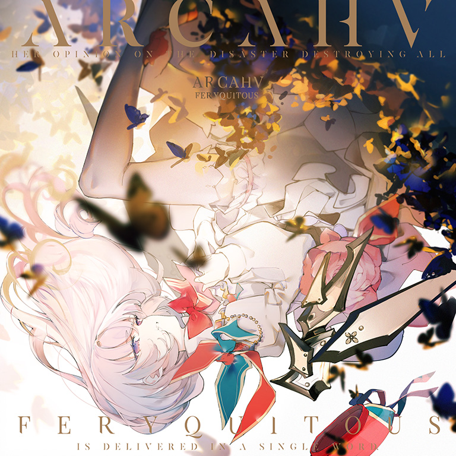

# Arcahv

> *空集*

- **Arcahv 曲绘：**

- **曲师**：Feryquitous
- **时长**：02:45
- **曲包**：Black Fate
- **BPM**：191

### 谱面信息

| 难度 | Past | Present | Future |
| ------ | ------ | ------ | ------ |
| 等级 | 4 | 7+ | 9+ |
| Note 数量 | 818 | 884 | 1065 |
| 谱面设计 | ∅ | ∅ | ∅ |

- **背景**：arcahv
- **更新时间**：移动版v3.0.0(2020/05/27)

---

## 解禁方法

本曲所在地图**在解锁前完全不可见**，具体解锁方式请见Tempestissimo的异象触发流程。

### 移动版
- 前置条件：在世界模式第五章，地图5-7，第一个奖励获得。

本曲各难度无需额外解禁

### Nintendo Switch版
- 前置条件：在世界模式第五章，地图NS5-2，第二个奖励获得。

本曲各难度无需额外解禁

---

## 曲目定数

| 难度 | 定数 |
| ------ | ------ |
| Past | 4.5 |
| Present | 7.8 |
| Future | 9.9 |

---

## 异象触发

在世界模式获得本曲并点击确认曲目获得的画面后，游戏会进入故事VS-8[^1]的剧情演出[^2]，剧情演出结束后游戏会立即开始本曲的游玩[^3]。

初次游玩本曲时将会触发一系列的特殊游玩效果，具体如下。
- 游戏会根据玩家在世界模式游玩的最后一首曲目的难度确定本次游玩的谱面；
若难度为PST，游玩的谱面会被设定为PRS难度；
若为其他难度，游玩的谱面会被设定为FTR难度。
- 演出时，谱面难度等级标记会显示为“?”，背景会跟随谱面演出显示红线、碎片、闪动特效，并且暂停键会被隐藏[^4]。
- 游玩结束后，游戏会瞬间黑屏[^5]，在大约15秒后跳转至故事模式中VS-8所在处，回到主页面后进入Black Fate中即可找到本曲的全难度谱面。
- 本次游玩的对应谱面成绩只会计入本地游玩记录，不会被上传至服务器。
玩家解锁了Testify后，可以使用至少10级且技能未封印的光（Fracture）或光（Fatalis）游玩本曲再次触发游玩效果。[^6]
- 玩家必须要先完成整个Axiom of the End挑战，如因回档等行为使得挑战内容恢复为未解锁状态，则无法触发该游玩效果。
- 游玩过程中的回忆收集条为所选用搭档的收集条，但是游玩过程中即使回忆率归零也不会出现Track Lost，谱面继续流动直至曲目结束，且回忆率上限将会设定为-1，当处于使用光（Fatalis）触发时在未击打任何note时最低可达到-5247。
- 黑屏之后，游戏会切换到故事模式中主线故事的Black Fate章节。
- 通过此方法触发游玩效果后，结算后的成绩只会计入本地游玩记录，不会被上传至服务器。
- 在世界模式中游玩本曲时将不会触发游玩效果，会正常进行成绩结算。

过去版本的情况

**移动版v4.0.255之前**
- 第一次游玩本曲之后，游戏会完全重启，而不是在大约15秒后跳转至故事模式中VS-8所在处。
- 除光（Fracture）外，使用其他角色通过世界模式第一次游玩本曲时，回忆收集条将会锁定为「普通(Normal)」。

**移动版v3.12 / NS版v2.0之前的解锁方式**
在已解锁故事VS-7[^7]的情况下，使用搭档光（Fracture）依照顺序**连续游玩**PRAGMATISM、Fracture Ray、Ringed Genesis三首曲目的**同一难度**，中途不可重试，在完成第三首曲目后将会进入故事VS-???的剧情演出，阅读完毕时将会立即开始本曲的游玩。
- 三首前置曲目的游玩不做任何成绩要求，亦可选择放置解锁。
- 在前两首曲目结算界面时屏幕下方会规律性泛白，完成第三首曲目时成绩不会结算，直接进入VS-???的剧情演出[^2]。
- 游戏会根据玩家游玩三首前置曲目时选择的难度确定本次游玩的谱面：
:若难度为PST，游玩的谱面会被设定为PRS难度谱面。
:若为其他难度，游玩的谱面会被设定为FTR难度谱面。
- 演出时，游玩谱面难度等级标记为“?”，背景会显示红线、碎片、闪动特效，并且暂停键会被隐藏[^4]。
- 回忆条收集仍为Overflow模式，进入Hard模式后回忆率降至0以下不会中途Track Lost，将继续向下累积回忆率。
  - 但曲目结束时，若回忆率仍然处于0以下，游戏仍会将其判定为Track Lost。
- 完成谱面的瞬间会黑屏，约20秒后游戏重启，进入游戏后即可在Black Fate中找到该曲的全难度谱面。
- 本次游玩的对应谱面成绩只会计入本地游玩记录[^8]，不会被上传至服务器。

---

## 游戏相关

- 在v5.4.0大幅改标7级及8级的等级之前，本曲PRS难度的定级为7级。
- 本曲为Black Fate曲包的第二首隐藏曲，同时也是第一首被定义为终末曲的曲目[^9]。
- 曲绘上写有英文：**Her opinion of the disaster destroying all
is delivered in a single word.**对于这场即将毁灭万物的灾难，她只传达出了单单一个词语。
  - 这句话摘自VS-8，而这个单词即为"**Delightful**"(“太美妙了”)。
- 本曲及其对应故事VS-8在解锁前完全不可见，不计入游戏内显示的资料卡和曲包的曲目总数。
- 本曲曲名Arcahv可看做游戏名Arcaea与曲师Feryquitous常用的自造语后缀hv拼缀而成，因此本曲被认为是最接近游戏名的曲目。
  - Feryquitous曾在这篇推文中称本曲的曲风为“Arcaea”，不过按照通常的标准，本曲也属于一首Artcore。
- 本曲谱师名义中的符号“∅”意为“空集”(Empty Set)，指不含任何元素的集合。
- 本曲FTR难度谱面曾为全游变速最多且最频繁的谱面，在v3.1.2更新后被Malicious Mischance超越[^10]。
- 本曲FTR难度谱面的部分配置与同为Feryquitous供曲的Quon的FTR难度谱面较为类似。
- 本曲PRS难度谱面于中段的谱面回流时，如果此前为全连状态，可以看到此时combo数为616。
- 自v2.0.0起安装包中移除付费曲包曲目的资源文件后，本曲是第一首也是目前为止唯一一首不需要下载的付费曲包曲目。
- v3.12更新前，由于解锁条件的限制，如果想游玩本曲需要购买当时除Vicious Labyrinth以外的所有主线曲包，至少需要1900记忆源点(约117元人民币[^11])。
  - 但是和SAIKYO STRONGER相似，本曲可通过下载已经解锁过该曲目的存档来解锁，即仅需要购入Black Fate曲包即可(即500记忆源点，约31元人民币)。
  - 即使是更改解锁方法后，如果不下载存档，也需要额外购入Luminous Sky曲包来使用光（Fracture）解锁Tempestissimo的异象(需要1000记忆源点，约62元人民币)。
- v4.0.255版本中，使用任意角色在游玩本曲时重新开始会导致其技能失效(包括视觉类技能，如对立 & 中二企鹅（Grievous Lady）的技能也会失效)，这疑似是一个bug。
  - 但对于改变了回忆率收集条的技能(例如对立（Tempest）)而言不会有影响(但是不会显示)。
- 因联动收录至CHUNITHM和WACCA Reverse。
  - 本曲在CHUNITHM中的MASTER难度谱面还原了本家谱面中段的谱面回流。
  - 本曲作为主线曲包Black Fate的隐藏曲，并未在Black Fate的PV中出现；但本曲在WACCA联动中被供出，且官方的PV中也展示了Arcaea侧的供曲，因而本曲得以在此次联动中首次拥有了属于自己的PV。

---

## 歌词

### 原文

EH
KELEPZO IGAH
KALLA THERA
AKARIZA

EH
KELEPZO IGAH
KALLA THERA
AKARIZA

selra iza ganhi elev
ad gkazalli corsines
vella pordzhine
le la e gurima velleza
sheriduth
EH
Arcahv

### 日文歌词

EH
光へ沈め
空列満たす
逆鱗

EH
光へ沈め
空列満たす
逆鱗

音を鎮める儀式
背後からは群蝶
起点を逃すな

線で構成された海を縫い繋ぎ
拒絶せよ

聚まれ

### 参考翻译

EH
沉入光芒
布满空集
触怒天意

EH
沉入光芒
布满空集
触怒天意

仪式平息乱音
身后舞来群蝶
勿远离你起点

缝合起那丝线编织的海
下令以拒绝

聚合吧！

---

## 攻略

此章节可能包含主观内容。

**Future 9+**

- 本谱以极其频繁的变速演出而著称，但实际上除去中间的纵连外整体配置难度仅有9+中下位，主要难点仍在于变速导致的目押读谱困难，并且大量天键在光侧和白色倒三角的背景下读谱也有一定压力
  - 变速段落集中出现在：开头长条，315-439combo，503-504combo的倒退双押，691-782combo的长条段，1026combo后的尾杀
  - 很多变速段通过目押读谱极易造成失分，尤以尾杀最难，因而建议熟悉本曲及谱面节奏型后通过**音押处理变速段落**
  - **观察小节线、适度补拍**对于应对部分变速段的配置也有较大帮助，补拍技巧建议多参考相关理论值或者PM手元
- 最开始谱面倒退后的两根长条都只有1物量，可以预先在地面2轨和3轨打交互或双押蹭长条判定
- 开头的半高度反手交叉蛇注意换手处蛇的走向
- 222-238combo的节奏略复杂，后段为2处左起的24分二连（但可当做双押处理），具体可参考节奏谱
- 366combo处的变速可通过观察小节线辅助判断变速时机，读谱重点可侧重于目押地键上
- 432combo后的地面天键受卡顿变速影响，实际为恒16分的右起手交互
- 503-504combo的倒退双押可通过补拍辅助通过
- 656-691combo的慢速段音押即可，可适度通过地面投影位置判断节奏
- 697-709combo的变速六连长条双押均为八分附点节奏
- 731-743combo的变形16分纵连为全谱最难配置，起手为右手，**两个地键都用右手打**，整体为右手地键+左起手5连+右手地键+左起手5连
  - 尤其注意第二个地键较为反直觉，位于左侧但需要用右手击打
  - 可在Nhelv FTR中找到对应类似的变形纵连配置进行练习
- 899-915combo处的蛇起手位置较反直觉，略有骗手，谨记左蓝右红
- 1026combo后的尾杀是16分五连(最后一个note为天键)×2+12分三连×3，共两组以上配置，第二组不同的点在于末尾为12分交互接双押
  - 该处配置实际难度并不高，但读谱受到谱面倒退演出和卡顿变速影响极大，正常开始下落时已到轨道的一半，若目押则大概率会崩盘
  - **减少或避免目押**是处理本段的关键，建议**仅观察交互起手**后通过音押打交互，也可背谱处理，第一组为右手起，第二组为左手起
  - 许多理论值手元在此处有比较明显的**补拍**，可以适度参考并运用类似的补拍方式

**Present 7+**

- 本谱出现了绝大部分旧7级谱(即现7和7+)中不会出现的会影响读谱的变速演出，且节奏较为复杂，在7+等级中难度较高
- 中段低速纯天键部分由于视线遮挡和采音舍音，难度甚至超过了FTR难度谱面对应部分，第一条黑线上的天键因流速变慢很容易点快，注意刹车
- 尾杀的Hold交互判定时间较短因而极易Lost，可仿照FTR难度谱面的开头部分通过多指对拍或打交互以蹭判定

**Past 4**

- 本谱同样出现了其他Past谱面中几乎不会出现的会影响读谱的变速演出，尽管变速段中基本没有点击类音符（即判定命中一定为Pure判定），但对新人的读谱仍有不小考验
- 256-292combo出现了Past难度中少见的反手配置，注意定位

---

## 试听

- · (YouTube) 官方音源
- · (QQ音乐) 试听

---

## 相关视频

- https://www.bilibili.com/video/BV1xQ4y1y7Bg
- https://www.bilibili.com/video/BV1uBfYYAEfL

---

## 注释

[^1]: 移动版v4.0.0（移动版）/NS版v2.0.1（NS版）更新前为VS-???。
[^2]: 当剧情演出接近末尾时，游戏会播放一小段该曲的音频，音频会与剧情演出一并结束。
[^3]: *v3.12更新后，故事VS-8在解锁剧情VS-7时会被错误地解锁，若在解锁本曲前阅读了此故事，则会略过演出直接获得全难度谱面。
**此问题在v4.0更新中被修复。
[^4]: 玩家仍可通过切屏等方式强制暂停，但是暂停界面没有“重试”选项。
[^5]: 黑屏的过渡效果类似过去的电子枪式电视机关闭时的样子，先是瞬间的全屏白光，然后白光逐渐收缩为由中心出发的径向渐变，以很快的速度收缩为黑屏。
[^6]: 在此情况下游玩PST难度谱面是目前唯一能见到PST难度谱面下游玩效果的方法。
[^7]: 即已解锁Tempestissimo。
[^8]: 由于使用了光（Fracture），Track Complete会被标记为Easy Clear。
[^9]: 可参见官方B站动态。
[^10]: Malicious Mischance存在类似corps-sans-organes的频繁变速产生的glitch效果，体感上变速可能没有本曲频繁。
[^11]: 事实上，由于官网提供的充值档位中没有100记忆源点的档位，价格会更高。
