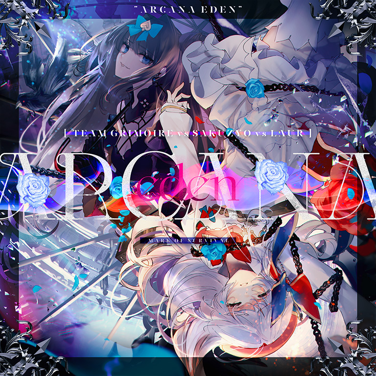

# Arcana Eden

> *两  千  物  量*

- **Arcana Eden 曲绘：**

- **曲师**：Team Grimoire vs Sakuzyo vs Laur
- **时长**：03:00
- **曲包**：Final Verdict
- **BPM**：211

### 谱面信息

| 难度 | Past | Present | Future | Beyond |
| ------ | ------ | ------ | ------ | ------ |
| 等级 | 5 | 8+ | 10 | 11 |
| Note 数量 | 1097 | 1310 | 1792 | 2134 |
| 谱面设计 | Eye of the Storm | Eye of the Storm | Eye of the Storm | Eye of the Storm |

- **背景**：arcanaeden
- **更新时间**：移动版v4.0.0(2022/07/07)

---

## 解禁方法

- 前置条件：解锁任意难度的Infinite Strife,和World Ender
- 进入Axiom of the End右下角的位置，共3项任务需解锁：
  - I - 玻璃相聚，却无法成对：残片数的每一位数均为奇数时游玩并通关一首曲目
    - 在**显示的**残片数中[^1]每一位均为奇数的情况下游玩任意曲目达成任意难度。
  - II - 局势愈发紧张：连续通关三首曲目，难度递增
    - 连续通关三首曲目，三首曲目处于同一难度（PST/PRS/FTR/BYD），且难度等级（定级）按顺序（1、2、3、4、5、6、7、7+、8、8+、9、9+、10、10+、11、11+、12）依次上升。
  - III - 下定决心，不会失去任何东西：曲目结算时共有0个LOST
    - 游玩任意曲目并达成Full Recall或Pure Memory。

---

## 曲目定数

| 难度 | 定数 |
| ------ | ------ |
| Past | 5.5 |
| Present | 8.7 |
| Future | 10.5 |
| Beyond | 11.6 |

• 本曲BYD难度谱面初出时的定数为11.4，在v6.0.0更新后改为11.6(+0.2)。

---

## 游戏相关

- 在v5.4.0大幅改标7级及8级的等级之前，本曲PRS难度的定级为8级。
- 本曲与其他通过Axiom of the End解锁的曲目一样，在完成其解锁任务后点击曲绘，即会播放本曲的PV，并在曲绘再次出现时可以选择即将挑战的曲目难度。
  - 6.0.0版本更新后，使用封印的光（Fatalis）游玩本曲，在正式开始游玩前会再次触发该游玩效果。
    - 该游玩效果在世界模式中不会触发。
- 本曲带有一个与Infinite Strife,相同的特殊天键，打击声为很重的一声kick，位于Past难度的842、Present难度的997、Future难度的1327与Beyond难度的1674物量处，但在不同难度下该键的流速却不同，在更换难度游玩时需注意。
- 本曲的Beyond难度谱面出现了纵向超界音弧，其高度最高几乎快要超出屏幕以外。
- 本曲是唯一在Final Verdict曲包的预览中被使用一部分的曲目。
- 本曲的各难度谱面出现了与Pentiment和Testify相同的事件：曲目进行到某一时刻时，镜头会慢慢拉远，并在面板最左侧和最右侧生成两条透明的轨道。
- 本曲的Beyond难度于2022年8月6日21:39被日本玩家sosuke0930**使用手机（60Hz刷新率）**达成首个理论值，寿命为30天13小时39分钟（含解谜时间），而最难曲Testify在10天前便被TnG24005saikou达成理论值，因此本曲被称为“4.0最终赢家”。
- 本曲除PRS以外难度的谱面都分别为对应难度等级(5级、10级和11级)物量最高的谱面，同时其Future难度谱面也是所有Future难度谱面物量最高。
  - 于v4.0.0到v6.10.7版本期间，本曲的PRS难度也曾是8+物量最高的谱面，在v6.10.8版本被INCARNATOR₀₀ FTR（1565）超越。
- 曲绘上注有英文：MARK OF SURVIVAL(生的印记)。

---

## 攻略

此章节可能包含主观内容。

**Future 10**

- 177开始的先快后慢的螺旋蛇可以用Snow White的方式糊但是不建议。建议在蛇快速旋转的时候再按在判定区中央。
- 881处为防反手蛇定位不准，可以考虑地面五连交互的最后一个长条只单点并右手顺手滑到天空判定线上形成反接
- 924之后一段的蛇密度极大，注意滑准

**Beyond 11**

- 500以前的所有蛇都可以放置，不用跟着上下划。由于天空判定线之上是垂直判定，可以将手指按在稍往上的位置上
- 130、150的蛇要记得向下滑
- 501\~654的蛇可参考Dantalion的配置
- 608\~875出现的“地+3连天键”配置均为地键所在位置起手，不会出现单手需连点两下的情形
- 887开始的大出张弓形蛇建议音押，在鼓点位置划蛇
- 973的蛇里塞note配置可以用一手糊蛇、一手点note的打法
- 1061开始的天地交互的**前2个**天键反手打会较为顺手
- 1082开始为7个连续天地双押+Hold+最后一个双押
- 1296、1301的蛇里塞note则为一手先按住，另一手点后面的note
- 1362、1388开始的天地交互均为地键起手，可参考Aegleseeker
  - （注意1388的地键前面还有一个1物量hold，若考虑此hold则为右手起手）
- 注意1661的双押后的停顿
- 1709的蛇后面的天地配置为3个双押、1721后面则是地键起手的8连天地交互
- 1820\~1845的弓形蛇可参考Kissing Lucifer
- 1900\~1921的蛇可尝试反接

---

## 试听

- · (YouTube) Team Grimoire vs Sakuzyo vs Laur - Arcana Eden &lsqb;from Arcaea&rsqb;

---

## 相关视频

- https://www.bilibili.com/video/BV1ny4y1d7sD

---

## 注释

[^1]: 不计算残片超过9999后“累积”的部分。
