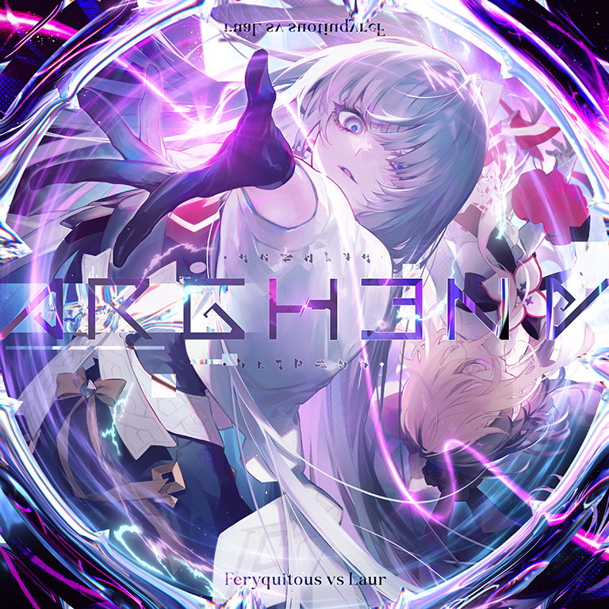

# Arghena

> *由色彩组成的漩涡压缩交互倾泻而下*

- **Arghena 曲绘：**

- **曲师**：Feryquitous vs Laur
- **时长**：02:33
- **曲包**：Lasting Eden Chapter 2
- **BPM**：185

### 谱面信息

| 难度 | Past | Present | Future |
| ------ | ------ | ------ | ------ |
| 等级 | 7 | 9 | 11 |
| Note 数量 | 883 | 1082 | 1444 |
| 谱面设计 | 第一識 "Reality" | 第二識 "Causality" | 第三識 "Pluriversality" |

- **背景**：arghena
- **更新时间**：移动版v5.0.0(2023/09/27)

---

## 解禁方法

• **Past**：连接她们的故事（15-6 &verbar; 16-6）；于&lsqb;T&rsqb;ec&lsqb;h&rsqb;nicolour上刻下真名；于UNKNOW&lsqb;N&rsqb; LEVEL&lsqb;S&rsqb;上刻下真名；于E&lsqb;g&rsqb;o E&lsqb;i&rsqb;m&lsqb;i&rsqb;上刻下真名；选择搭档「摩耶」
• **Present**：连接她们的故事（15-6 &verbar; 16-6）；于&lsqb;T&rsqb;ec&lsqb;h&rsqb;nicolour上刻下真名；于UNKNOW&lsqb;N&rsqb; LEVEL&lsqb;S&rsqb;上刻下真名；于E&lsqb;g&rsqb;o E&lsqb;i&rsqb;m&lsqb;i&rsqb;上刻下真名；选择搭档「摩耶」
• **Future**：连接她们的故事（15-6 &verbar; 16-6）；于&lsqb;T&rsqb;ec&lsqb;h&rsqb;nicolour上刻下真名；于UNKNOW&lsqb;N&rsqb; LEVEL&lsqb;S&rsqb;上刻下真名；于E&lsqb;g&rsqb;o E&lsqb;i&rsqb;m&lsqb;i&rsqb;上刻下真名；选择搭档「摩耶」
- 在阅读故事15-6与16-6前，第二至四项解锁条件显示为“???”。

### 第一部分：曲名填空
在阅读故事后，解锁条件界面的第二至四项将显现，分别对应着三个缺失部分字母的曲名。

解锁条件左侧有形如“T 20”的符号，代表着尝试填入曲名的字母（A-Z分别与1-26对应，0或超过26的数字则显示问号），有六种不同的字母空缺，玩家需要通过游玩以及调整设置等操作来更改待填入曲名的字母。

| 曲目 | 影响因素 | 空缺字母与对应操作 | 备注 |
| ------ | ------ | ------ | ------ |
| 2 Technicolour | 退出谱面的连击数 | T — 退出谱面时连击数为20；h — 退出谱面时连击数为8 | 可选任意谱面游玩；注意退出前不能Lost。 |
| 3 UNKNOWN LEVELS | 设定的音符流速 | N — 音符流速设置为1.4；S — 音符流速设置为1.9 | 无须进行游玩，可调整后就返回解锁界面。 |
| 4 Ego Eimi | 游历谱面的等级 | g — 进入任意一个7级的谱面；i — 进入任意一个9级的谱面 | 无须结算，可开始游玩后随时暂停退出。 |

- 每完成一次操作，退出后都需要返回到本曲的解锁条件界面确认。
  - 如果字母正确，正确的字母将被填入曲名中，对应的解锁条件左侧替换为对应的字母、数字，并高亮闪烁一次。
  - 同一曲目每次只能填入一种字母(以最后一次游玩为准)，因此不要游玩多次后一并确认。
- 完成任一难度的填空后，其余两个难度的解锁条件对应的空缺也会自动填入。
- 完成一项条件的所有填空后，还需要有条件中曲目对应难度的游玩记录(无论是否通关)，才能达成条件。
最简方法|第一局流速设置1.4，选择任意一个7级的谱面，打到20combo直接退出，进入解锁界面即填入对应字母
第二局流速设置1.9，游玩任意一个9级的谱面，打到8combo直接退出，再次进入解锁界面填入对应字母即可完成挑战

### 第二部分：组曲挑战
达成所有解锁条件后，解锁条件下方将显现“挑战”按钮，点击开始组曲挑战，玩家将在欲解锁的难度下使用段位收集条连续游玩Technicolour、UNKNOWN LEVELS、Ego Eimi。
- 请不要忘记选择摩耶，并调回适合的流速。
- 和段位挑战不同，玩家可以暂停，可以离线解锁；但重试键隐藏，无法重试，退出后须从第一首重新挑战。
- 如果组曲挑战中途失败，在结算界面会显示“Irruption Lost”(侵入失败)的字样。
  - **不具有**常规Hard收集条中途Track Lost时的潜力值保护。
  - 此时下一次游玩的生命值上限会根据游玩的进度提高。该上限将显示在选曲卡片的右侧，初始状态为100%，最高为999%。
    - 生命值上限提升公式为： 33.33% * (通过谱面数 + (未通过谱面判定数 / 未通过谱面物量)) （向上取整，最小值1%）
    - 达到最高值999%时，即使出现Lost判定，回忆率也不会减少。
    - 各个难度的生命值上限相互独立，分别计算。
若通过上述曲目，则第四曲以普通收集条进入Arghena的曲目游历，游玩结束后即可解锁对应难度的谱面(无论是否通关)，并显示“Irruption Song Unlocked”。
- 低难度的谱面不会立即解锁，需要重新进行对应难度的组曲挑战。

---

## 曲目定数

| 难度 | 定数 |
| ------ | ------ |
| Past | 7.5 |
| Present | 9.6 |
| Future | 11.3 |

• 本曲PST难度谱面初出时的定数为6.0，在v5.4.0更新后改为7.5(+1.5)。
• 本曲PRS难度谱面初出时的定数为9.4，在v6.0.0更新后改为9.6(+0.2)。

---

## 游玩效果

在组曲挑战前三首成功后将以普通回忆收集条开始首次游玩，游戏会产生如下一系列游玩效果：
- 游玩时的背景图片被一段略长于曲目的https://www.bilibili.com/video/BV1kw411Y7op代替，从而呈现背景动画的效果。
- 初次游玩开始时，回忆收集条和暂停键被隐藏，曲名、曲师均以"?"代替，曲绘被黑色图案代替。
  - 仍可以通过切换程序来强行暂停。
  - 回忆收集条为普通模式，且曲目成绩在本地和服务器保存。
- 游玩过程中伴随有类似于Testify异象的边缘色散效果。
- 约00:51、01:52这两处时，轨道消失，十余秒后恢复
- 第二次轨道消失时，游玩信息区一并消失，在轨道恢复前缓慢地恢复。
  - 期间背景动画发生剧烈变化
  - FR/PM指示灯不会消失
  - 若为初次游玩，会同时揭晓曲名、曲师和曲绘，但回忆收集条和暂停键不会恢复。

当玩家购买了Final Verdict曲包，完成了Axiom of the End的全部挑战并解锁Testify后，选择搭档摩耶游玩本曲，就可以重现上述游玩效果。
- 游玩开始时，回忆收集条、暂停键、曲名、曲师和曲绘不再隐藏。

初次游玩结算后，显示"Irruption Song Unlocked"的解锁提示字样。点击左下角“继续”，会退回到曲包界面，并播放故事16-7。阅读故事后，会依次呈现如下效果：
- 搭档摩耶立绘改变，出现部分崩坏效果与"MISSING"字样。
- 获得搭档洞烛（至高：第八探索者），同时显示"Domain Breached"字样。
- Lasting Eden曲包封面改为全新的Severed Eden，在右上角出现一个双向箭头按钮，可切换曲包的两个封面。
  - Lasting Eden Chapter 2对应的故事也改名为Severed Eden。

---

## 游戏相关

- 本曲是第一首被定义为“侵入曲”(Irruption Song)的曲目。
- v6.0.0更新前，解锁本曲后的效果中，会将Lasting Eden曲包插入至"Free"和"Main Story"之间，成为单独的一类"Main Story Act II: Catastrophe"。
  - v6.0.0起，该曲包直接移入主线Act Ⅱ，所以不再存在这个效果。
- 本曲并没有直接出现在曲包Lasting Eden Chapter 2预览视频中，但视频引用了一小段（实为三段）本曲音频。
- 本曲是Arcaea第3届公募大赛“Imagining After”的优胜曲目。
  - 也是非冠军公募曲目中第3首拥有其专属搭档的曲目。
- 解密时铭刻的字符可以拼写出“INSIGHT”，即洞烛。
- 本曲的FTR难度谱面中出现了横向超界配置。
- 本曲的三难度谱师名义中的“識”是佛教中与认知相关的术语，各英文单词意为“现实”、“因果”、“多元”。
- 在v6.0.0定数调整后，本曲与同时更新的Designant.一同成为了PRS难度谱面的定数新高。

---

## 歌词

### 原文

### 参考翻译

---

## 攻略

此章节可能包含主观内容。

**Future 11**

- 开头的蛇注意定位，划的幅度尽量大，可适当反接
- 147的反手天键三连可用多指，或者左手抗前两个键后转为正常交互
- 183\~185为32分交互
- 201的蛇略骗手，通过地键确定划蛇用手；323同理
- 222\~223和344\~345的16分叠键小爆发若正攻，出张手要尽量压低，以防Lost
- 252的Hold密度较高，不要提前松
- 353·354的双押与正拍节奏相差一个32分，建议目押
- 386·387的超界天键尽量靠外侧打
- 接下来这一段前半段短蛇均可当成连续蛇处理，注意位于地面边界处蛇的定位；后半段所有的短蛇全部当单点处理
- 539开始的交互为一手天一手地，注意交换天地的时机
- 607处出张手需尽力压低打地键，随后双手下拉停顿一下再划弧线蛇
- 627\~629叠键尽快发力，天键尽力出张(参考Dement ~after legend~ BYD，后续类似配置同理)
- 635反手地键大位移注意定位，蓝蛇最低点有判定点，要划准
- 643\~649为匀速八分双押
- 671又是反手交互，正攻不适应可多指拆
- 698\~701的交互为右手出张位起手，不要被1轨地键骗了
- 703开始大部分为前一段的镜像配置
  - 751开始的节奏较前一段更乱，为2个8分附点双押接3个8分双押
  - 760\~765的交互中混了少许12分和24分
- 782地键出张，可用多指解
- 804起的八分出张单点均可使用辅助指，规避定位
- 820和846的旋转交互对出张手定位力考验较大，可在II中练习
- 881\~891节奏为匀速4分，倒退天键均位于sky input中央
- 892\~907和918\~933分别为右手起手和左手起手的一手天一手地16分交互，双手同步左右位移
  - 若左手定位力不够可尝试第二组交互右手打地键，也可多指对拍
- 963\~1001为匀速16分交互
- 1004\~1071为极高密度Hold接三个双押，建议音押(第一声人声后一个4分音按下Hold)
- 1082\~1088和1094\~1100的交互天键均需出张
- 接下来一段反手叠键建议提前松蛇硬抗，规避反手天键
  - 反手后较长的蛇最后一段有直线判定，不要过于提前松
- 1147\~1154为12分单双，可在World Vanquisher中练习
- 1241\~1251的倒三角交互同LAMIA，可以此作为专项练习
- 1304\~1310的双押为一个附点8分接三个8分
- 1311起的交互为16分接32分，最后一个地键控制速度，随后天键以最快速度爆发
- 1329处碎蛇提前接上，避免掉开头；1402同理
- 1349\~1358的单点和长条均为332节奏
- 1368\~1369，1373\~1374均为16分地-天二连抗
- 1379起的纯天键交互为16分10连接24分13连，注意爆发时机，最后几个键若底力不足可用多指拍
  - 可记为从第三个右手天键处开始为24分

**Present 9**

- 该谱面中出现了许多其他PRS难度谱面中几乎未出现过的配置，如大跨度反手蛇、天3地1交互、大跨度三角交互等，且部分段落节奏较复杂，总体难度可达9级谱面的上位

**Past 7**

- 该谱面中出现了大量在其他PST难度谱面中几乎未出现过的反手蛇和换手蛇的配置，对玩蛇能力的要求甚至超过了部分8级谱面

---

## 试听

- · (YouTube) 官方音源

---

## 相关视频

- https://www.bilibili.com/video/BV1xN411E7a6
- https://www.bilibili.com/video/BV1A84y1S7wF
- https://www.bilibili.com/video/BV17N411E7Rj
- https://www.bilibili.com/video/BV1kh4y1q7KK
- https://www.bilibili.com/video/BV1h841117j7
- https://www.bilibili.com/video/BV1Qu411K7jB
