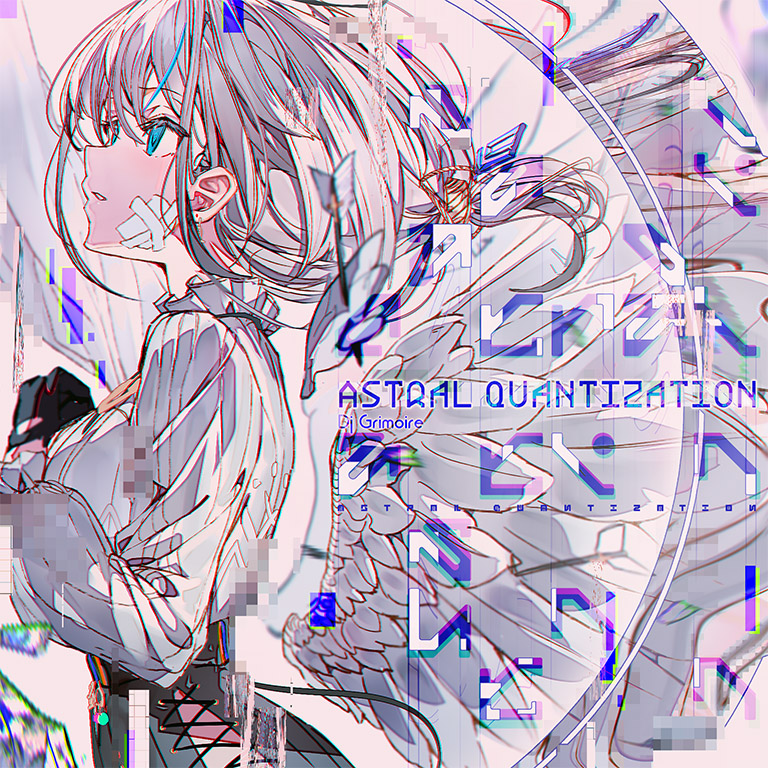

# Astral Quantization

> *▵aStral qVantization▿*

- **Astral Quantization 曲绘：**

- **曲师**：Dj Grimoire
- **时长**：02:35
- **曲包**：Lucent Historia
- **BPM**：185

### 谱面信息

| 难度 | Past | Present | Future |
| ------ | ------ | ------ | ------ |
| 等级 | 5 | 8 | 10 |
| Note 数量 | 782 | 943 | 1388 |
| 谱面设计 | Ψ | Ψ | Ψ |

- **背景**：lephon
- **更新时间**：移动版v6.0.0(2024/11/21)

---

## 解禁方法

解锁本曲前，在非世界模式、非Link Play、未封印所选用搭档的前提下游玩Designant.，中途会有红色引导线、红色天键、6格红色标志等额外的游玩效果。
保持红色标志不被清空，即漏击的红色天键数小于6个，则结算后会以普通回忆收集条进入本曲的初次游玩。游玩并结算后将解锁本曲的全部难度谱面。[^1]

---

## 曲目定数

| 难度 | 定数 |
| ------ | ------ |
| Past | 5.0 |
| Present | 8.1 |
| Future | 10.6 |

---

## 游玩效果

解锁时，将以普通回忆收集条开始本曲的首次游玩，期间回忆收集条和暂停键将会隐藏。

初次游玩结算后，显示`"Terminal Song Obtained"`（终末曲解锁）的解锁提示字样，同时解锁获取搭档哀寂（至高：第六探索者）的地图9-3。

---

## 游戏相关

- 本曲是主线故事第二幕中第一首被定义为终末曲(Terminal Song)的曲目。
- 结合参考官方动态，本曲谱师名义Ψ(psi)**可能**是Ψυχή(psyche)“灵魂”，或描述量子(quantum)态的波函数符号，又或对该曲目风格"Psy-Trance"的暗示。
- 本曲FTR难度谱面中出现了大量黑线表演，包括数字6、8，正弦波，方波，平行三线，三角形等。
  - 可以在关于哀寂（至高：第六探索者）的官方动态，以及解禁Designant.流程中的假地图内看到类似的三角形图案。
- 本曲与Arcahv有多处相似点：
  - 两首曲目在各自的曲包中均为第二首隐藏曲目，且难度均比第一首隐藏曲目低；
  - 两首曲目各自为主线故事第一幕、第二幕中的第一首终末曲；
  - 两首曲目的FTR难度谱面具有相似的卡顿变速段，但本曲FTR难度谱面的卡顿变速段比Arcahv[FTR]的时间跨度更长且更为极端（整体思路为Sightreading speed variation，即悬停变速），且排键更为复杂。
- 尽管本曲在多方面具有特殊性，但本曲使用的背景和Lucent Historia中普通曲目的背景相同。

---

## 攻略

此章节可能包含主观内容。

**Present 8**

- 本谱以后半段跨度较大的方形直角蛇为主要难点，对玩蛇位移有一定考验，此外185BPM下的长时间8分单点对稳定性有一定要求
- 525-604combo处为侧边单双押配置，但在上方高密度碎蛇和弓蛇的遮挡下略难读谱

**Future 10**

- 本谱难点基本在于16分三角和弓蛇
- 613-756combo处采音为丨xxx_丨xxx_丨xxx_丨xxx_丨，非丨x_xx丨x_xx丨x_xx丨x_xx丨
- 918-1033combo处采音为丨x_xx丨x_xx丨x_xx丨x_xx丨
- 1025-1027combo处的三个长条是采的三连音

---

## 试听

---

## 相关视频

---

## 注释

[^1]: 离线情况下亦可触发。如果是登录情况下推荐游玩时仅点击红键，结算页面断网即可保住潜力值，也可正常进入本曲游玩。
