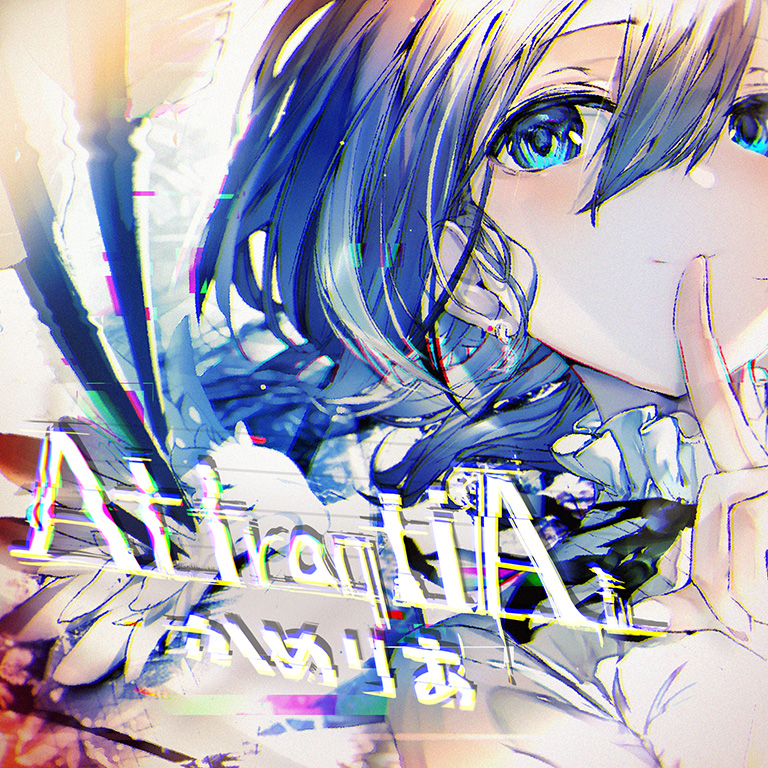

# AttraqtiA

> *好消息，你们不是唯一断手的了——かめりあ*

- **AttraqtiA 曲绘：**

- **曲师**：かめりあ
- **时长**：02:38
- **曲包**：Memory Archive
- **BPM**：202

### 谱面信息

| 难度 | Past | Present | Future |
| ------ | ------ | ------ | ------ |
| 等级 | 4 | 8 | 10 |
| Note 数量 | 732 | 1002 | 1433 |
| 谱面设计 | Toaster affected by 'CHUNITHM' | Toaster affected by 'CHUNITHM' | Toaster affected by 'CHUNITHM' |

- **背景**：rei
- **更新时间**：移动版v3.5.0(2021/01/21)

---

## 解禁方法

### 移动版
本曲各难度无需额外解禁

### Nintendo Switch版

- 前置条件：购买"Light of Salvation"DLC
• **Past**：35 残片
• **Present**：65 残片
• **Future**：100 残片

---

## 曲目定数

| 难度 | 定数 |
| ------ | ------ |
| Past | 4.0 |
| Present | 8.3 |
| Future | 10.6 |

• 本曲FTR难度谱面初出时的定数为10.4，在v4.0.0更新后改为10.6(+0.2)。
• 本曲PRS难度谱面初出时的定数为7.5，在v5.4.0更新后改为8.3(+0.8)。

---

## 游戏相关

- 在第三次CHUNITHM联动中作为原创曲与CHUNITHM同时收录。
  - 双方在同一日互相交换了发布的新曲，作为交换CHUNITHM供出了同日发布的全新新曲Last Celebration。
- 本曲在CHUNITHM中的MASTER难度谱面的谱师名义是“écologie affected by "Arcaea"”，两个游戏的谱师互相之间产生了影响。
  - 这也解释了本曲FTR难度谱面和CHUNITHM侧EXPERT谱面和MASTER难度谱面的部分相似配置。
  - 同理，Last Celebration在Arcaea名义为“Nitro affected by 'CHUNITHM'”。
  - 据écologie所述，CHUNITHM侧的EXPERT谱面和MASTER难度谱面是双方谱师团队互相参考对方谱面制作而成的。因此，CHUNITHM谱师团队可能也参与了本曲FTR难度谱面的制作。
- 本曲在Arcaea和CHUNITHM中使用了相同的背景rei。
- 本曲曲师かめりあ在本曲的YouTube试听(见下)置顶评论写道：
 Dear Arcaea players: I apologize for breaking your hands and wrists, in advance. My bad.

 Dear CHUNITHM players: Congratulations! You're not breaking your hands alone.

---

## 攻略

此章节可能包含主观内容。

**Future 10**

- 全程节奏杀注意，建议先听听曲子搞明白节奏
- 95combo的红色音弧可以反接
- 在130combo处的出张幅度很大，左手在地面4轨中央
- 随后(139combo)的16分3连，第一组为右起手，各组起手交替
  - 再往后的7组双押稳住，24分4连是地-地-地-天结构，各组起手相同
  - 此后也会出现几次此配置及其镜像，到时不再赘述
- 241\~271combo的音弧处理方法是一只手转圈，另一只手向侧下划然后返回
  - 每组共出现三次此配置，每次幅度越来越大
  - 同理，之后的相同/镜像配置不再重复说明
- 455\~460combo的蓝色音弧需要移动到天空判定线中央，注意不要位移过度
- 597\~618combo的地键采的是反拍音，节奏注意
- 784\~813combo的交互稳住
- 898\~939combo的音弧部分与开头相似配置有细微区别，单点采主音轨
- 1291\~1296combo是12分纵连
- 本谱没有尾杀，尾段稍微注意准度即可

---

## 试听

- · (YouTube) かめりあ - AttraqtiA

---

## 相关视频
