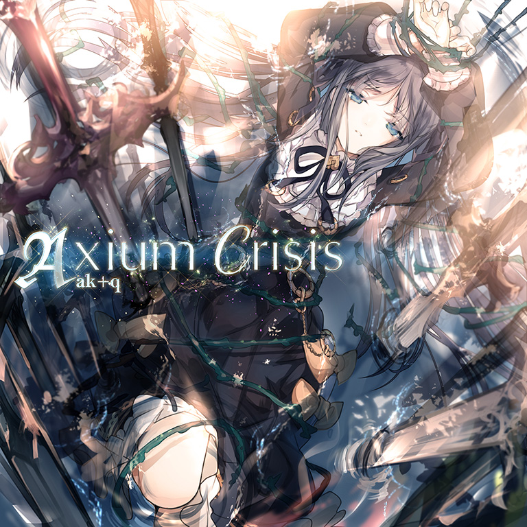

# Axium Crisis / Axium Divergence

> *反手…全是反手……*

- **Axium Crisis 曲绘：**

- **Axium Divergence 曲绘：**

- **曲师**：ak+q
- **时长**：02:30
- **曲包**：Vicious Labyrinth
- **BPM**：170

### 谱面信息

| 难度 | Past | Present | Future | Beyond (Axium Divergence) |
| ------ | ------ | ------ | ------ | ------ |
| 等级 | 5 | 8 | 10 | 11 |
| Note 数量 | 685 | 1065 | 1094 | 1682 |
| 谱面设计 | The Monolith | The Monolith | The Monolith | Monolith - Diverged |

- **背景**：axiumcrisis
- **更新时间**：移动版v1.5.0(2017/11/03)，Beyond追加于v6.13(2026/03/09)

---

## 解禁方法

### 移动版
- Beyond前置条件：在世界模式陷落第三章，获得
• **Past**：无
• **Present**：通关 conflict [PRS]；80 残片
• **Future**：通关 conflict [FTR]；180 残片
• **Beyond**：无

### Nintendo Switch版
- 前置条件：在世界模式第二章，地图NS2-1，第1个奖励获得
• **Past**：游玩 conflict PST；25 残片
• **Present**：游玩 conflict PRS；50 残片
• **Future**：以「AA」或以上成绩通关 conflict FTR；75 残片

---

## 曲目定数

| 难度 | 定数 |
| ------ | ------ |
| Past | 5.5 |
| Present | 8.5 |
| Future | 10.6 |
| Beyond | 11.3 |

• 本曲FTR难度谱面初出时的定数为10.6，在v3.0.0更新后改为10.9(+0.3)，又在v4.0.0更新后改为10.7(-0.2)，又在v6.0.0更新后改为10.6(-0.1)。
• 本曲PRS难度谱面初出时的定数为8.3，在v3.0.0更新后改为8.5(+0.2)。

---

## 游戏相关

- 在v3.0.0大幅改标等级之前，本曲为PST 5，PRS 8，FTR 9+。
- 本曲为Grievous Lady的前置解禁曲。
- 本曲中段的BPM逐渐从170降到132之后恢复到170，但选歌界面仍然显示BPM为170，而不是132-170。
  - BYD难度使用音源Axium Divergence同理，主体部分BPM为170，随着乐曲进行出现了多处BPM变化，实际BPM范围达到了90-180。
  - 本曲BYD难度谱面的部分hold物件有类似于Qualia -ideaesthesia-的BYD难度谱面中的hold物件的效果，在松手时会渐变褪色。
- 本曲是在PV预览中首个截取三段音频展示的曲目。
- 在v4.3.0更新前，本曲目的获取具有前置条件：在世界模式第一章，地图1-6，第11格处获得。
- 因联动收录至CHUNITHM、Cytus II和DJMAX RESPECT V。
- 为了解锁本曲BYD难度谱面，除了曲包Vicious Labyrinth本身以外，还需要购买曲包Adverse Prelude、单曲Be There和Heavenly caress，并且若没有通过世界模式解锁False Embellishment则还需要购入Extend Archive 1曲包，预计需要1800记忆源点。
  - 这使得本曲BYD难度成为了全游需要最多记忆源点解锁的11级谱面，但是解锁本难度所需的曲包Adverse Prelude与Extend Archive 1在另外三次Beyond Chain中也有需求，实际游玩时解锁全部Beyond Chain最终谱面所需的记忆源点数量不会非常多（截至目前版本，不考虑周年庆打折、五周年兑换券等官方福利的情况下，若Extend Archive 1中的所有曲目均未解锁，解锁四次Beyond Chain最终谱面共计需3100记忆源点）。

---

## 攻略

此章节可能包含主观内容。

**Beyond 11**

- 本谱面风格类似于第一次Beyond Chain的PRAGMATISM -RESURRECTION-，但是更为综合，对反手交互，硬扛16分子弹和位移精确度的考验更强。
- 52-150combo处的点蛇可根据个人情况进行部分反接，若执意选择正攻解决，务必牢记每两个小节的蛇色是一样的
  - 同时注意地键的定位，尤其是1轨和4轨的反手地键
- 194combo的3轨长条，正攻手法为使用右手拇指，但这样极度卡手。推荐根据游玩设备屏幕大小采用右手3/4/5指接住这个长条。镜像部分同理。
  - 此处开始BPM从170逐渐加速至180。
- 308combo的穿手天键，若屏幕太小，可以使用右手3/4指击打y=1.5处解决，镜像部分同理。由于加速的缘故，点击速度较开头段落稍快。
- 365combo开始出现了16夹24交互的配置，注意及时调整爆发时机。
- 400combo开始存在天键引导手序，前半为左手打天键，后半为右手打天键。
- 457combo开始地面天键位移较大，注意手指的位移幅度不要过小。这一段的蛇判定不严，中心放在单键上即可。
  - 注意此处BPM仍为180而不是170。
- 521/522，527/528，533/534combo的双押建议使用左手食指与拇指单手拍掉。镜像部分同理。
- 653combo处开始，有大量的反手轴交互配置，可以通过及时换手来进行逃课，此处思路与Lethal Voltage类似。
  - 也可以通过单指在开头位移硬扛两次的方式换成正手，但这样风险较大，需要一定的背板量。
  - 此处起，除了部分较明显的减速段落外，其余段落BPM回到170。
- 740combo开始出现了类似于qualia -ideaesthesia-的类似配置。长条只需点击头部即可。可以使用非惯用手来接蛇以减轻非惯用手的位移压力。
  - 此处需要同时注意蛇、长条头和天键的定位，节奏按照一手8分单点一手4分左右滑动即可。
- 865combo开始出现了类似于PRAGMATISM -RESURRECTION-的天键引导交互，加上变速有着更高的难度。
  - 若选择正攻，注意在880combo处有着左手的位移方向变换。此外，随着bpm降低，也可以在bpm足够低时硬扛解决。
- 考虑到尾杀对于硬扛，位移等配置的体力要求较大，可选择在1072combo结束后暂停休息片刻。
- 随后的休息段中有些332节奏型的单键，较难音押，建议直接记下节奏
- 注意1257combo开始的一处24分小爆发。
- 1292combo处开始有四处大位移轴交互，可选择采用反手起手或者中途硬扛进行逃课。
  - 正攻手法大致为一手沿黑线的方向点天键，另一手在地键和天键之间位移。OBLIVIONETR中有类似的慢速版配置，可以用来练习
  - 长交互后几个天键出张幅度较大，此处建议尽量将点这些天键的手向远处伸
- 从1542combo处开始的蛇建议使用拇指反接，以规避最后的天键卡手。
  - 最后的天键位置在Sky Input上方，目押时需注意

**Future 10**

- 前半段的三角蛇糊的难度较高，极其考验协调
- 之后是三组天地5连交互，每4次为一组，起手顺序分别为右左左右-左右右左-右左右左
- 40%左右的双押长条后不要松手，有两条闪现天地蛇，Heavensdoor的开头也有同样的配置
- 之后是四组（5个双押+7连天地交互）的配置，其中天地交互起手顺序为左右右左，容易被骗手
- 后半段有一手接蛇一手连续天地单点的配置，对定位要求较高
- 比较容易手癖，所以在确保自己有足够的实力之前建议不要尝试此谱面

**Present 8**

- 整体谱面风格与Shades of Light in a Transcendent Realm的FTR难度谱面相似
- 中段16分交互较多，其他部分以蛇为主、节奏很简单，掌握了交互之后比较容易PM

---

## 试听

- · (YouTube) Axium Crisis
- https://www.bilibili.com/video/BV1jiw1zVEkh

---

## 相关视频

- https://www.bilibili.com/video/av70210326
