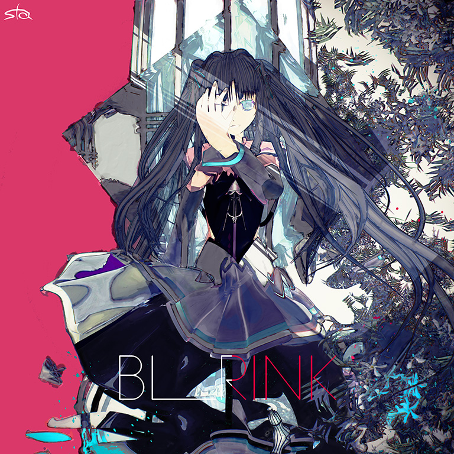

# BLRINK

> *逐渐消失的旋律*

- **BLRINK 曲绘：**

- **曲师**：Sta
- **时长**：02:43
- **曲包**：Adverse Prelude
- **BPM**：115

### 谱面信息

| 难度 | Past | Present | Future |
| ------ | ------ | ------ | ------ |
| 等级 | 3 | 7+ | 9+ |
| Note 数量 | 400 | 683 | 1015 |
| 谱面设计 | 過去の縁 | 現在の縁 | 未来の縁 |

- **背景**：prelude_conflict
- **更新时间**：移动版v2.5.3(2020/03/09)

---

## 解禁方法

### 移动版
- 前置条件：在世界模式第五章，地图5-2，第一个奖励获得
• **Past**：无
• **Present**：200 残片
• **Future**：500 残片

---

## 曲目定数

| 难度 | 定数 |
| ------ | ------ |
| Past | 3.5 |
| Present | 7.8 |
| Future | 9.7 |

• 本曲PRS难度谱面初出时的定数为7.4，在v3.0.0更新后改为7.5(+0.1)，又在v5.4.0更新后改为7.8(+0.3)。

---

## 游戏相关

- 在v3.0.0大幅改标等级之前，本曲为PST 3，PRS 7，FTR 9。
- 在v5.4.0大幅改标7级及8级的等级之前，本曲PRS难度的定级为7级。
- 本曲是Arcaea的三周年纪念曲，也是Arcaea中的第3首非实时更新曲包后期追加曲目。
- 本曲曲名BLRINK可推测为歌词中反复出现的二词「Brink」与「Blink」的结合。
- 本曲日文名为ブリンクブリンク(「Blink Brink」)。
- 在世界模式中，本曲所在地图的倒数第二格为115步，可视为对本曲BPM的neta。
- 本曲FTR难度谱面139-141combo、153-155combo等处含有无黑线引导的天键(实际上是黑线短到被天键遮住了)。

---

## 歌词

### 原文

My love Get a little closer
This was your chance to show me what you've got
A light, it's this feeling that's forever
My love Get a little closer

(廻り飾る二人独りふたつ)
時を　きざみ　きざむ　ひかり　ばかり
二つ　はかり　Brink　むこうへ
If you love me tender never let me go
If you gonna give it and feel it baby I already know
I know, I know
I know, I know
回る　混ざる　跳ねる　かわる　がわる
変わる　ふたり　blink blink brink,her
時を　きざみ　きざむ　ひかり　ばかり
二つ　はかり　I already know
You can take me home
A light, it's this feeling that's forever
My love Get a little closer
If you love me tender never let me go
If you gonna give it and feel it baby I already know
I know, I know
混ざる　跳ねる　かわる　がわる
変わる　ふたり　blink brink　むこうへ
混ざる　跳ねる　かわる　がわる
変わる　ふたり　blink blink brink,her
時を　きざみ　きざむ　ひかり　ばかり
二つ　はかり　brink
If you gonna give it;
I know
Never let me go
I know
Got to change Just one more time

### 参考翻译

此章节所记录的歌词/翻译的来源不具有官方性质，仅供参考。
- 译者：bilibili@C爆君

我的爱人，再靠近点吧
这便是你，向我诉说的机会
这光如你，就是永恒之直感
我的爱人，再靠近点吧
(二人相离各领华彩蔓延四处)
时过之间镌刻如一，在曦光中分解净化
二人在摇摆的世界中权衡，在无限的道路中通向彼方
倘若你温柔爱我对我不离不弃
若你抱有真情实感我早已知道
我知道的，我懂你的
我深知一切，我心知肚明
交织的一切在瞬息万变中轮回
变化的她们在一成不变中闪耀
在时间的镌刻中分解于曦光下
在命运的权衡中两人心知肚明
把我带回去吧
光，你便是我永恒的实感
再靠近一些吧，我的爱人
倘若你温柔爱我对我不离不弃
若你抱有真情实感我早已知道
我深知一切，我心知肚明
在混合交杂中迸发，在亘古不变中变化
不断变化着的二人在那闪耀中走向彼方
在混合交杂中迸发，在亘古不变中变化
不断变化着的她们，耀眼夺目
隔阂在时间的镌刻中分解于曦光下
二人在光与对立间闪耀
若有所舍
心知肚明
不离不弃
答案唯一
为你我会再次转变

---

## 攻略

此章节可能包含主观内容。

**Future 9+**

- 本谱以115BPM下的16分硬抗（地键16分楼梯、天地16分连点、交互接双押等）为主要难点，对底力有一定要求，在节奏上具有较多24分和32分混杂，但多数可以通过目押或音押处理，仅有尾杀对底力、节奏掌控较为进阶，整体难度位于9+等级的下位
- 注：本曲节奏为4/2拍，严格来说是以2分音符为一拍，但为方便理解，本攻略中均以4/4拍下的节奏进行讲解
- 前半段的部分天键位于地面上，若点击位置过于靠下则有概率lost
- 687-886combo在节奏上有较多16分和24分的来回切换，若爆far较多或想进一步控制准度，可以参考节奏谱或谱面预览，在24分交互即将到来时加重发力（其中除去该段落最末尾863-875combo的十二连24分交互外，其余的24分交互均为6个一组出现）
- 886combo开始的尾杀为本谱最难段，对手序分配、节奏转换要求较先前的段落更高
- 其中32分交互可等价于230BPM下的16分交互，24分交互可等价于172.5BPM下的16分交互
- 886-901、949-965combo一侧天键一侧地键的配置硬抗即可，902-910、965-973combo的配置则均位于2、3轨上，建议此处天键分别由右手、左手负责硬抗，也可根据自己的习惯进行硬抗分配，但均需熟练掌控手序否则较易手癖
- 940-949combo可等效为为230BPM下的9连16分交互，注意快速爆发，最后一个天键注意抬手
- 920-931、984-995combo的两段减速交互为32分四连+24分三连+16分四连（其排键均位于2、3轨上）
- 第二段减速交互结束后，仅有最开始的两颗为16分，997-1006combo为9连24分交互，1006combo以后为32分纯天键交互
- 注意此处纯天键交互后是右手接蛇，但较易误触

---

## 试听

- · (bilibili) 官方音源

---

## 相关视频

此章节尚无任何内容。

---

## 注释

- 见Sta的专辑预告动态
