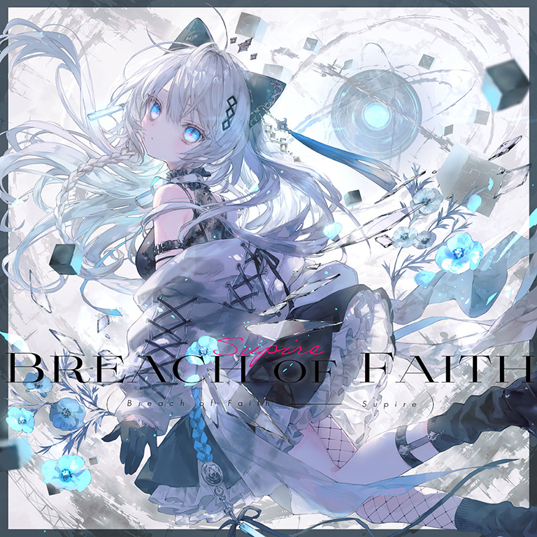

# Breach of Faith

> *凝视那神明的骸骨吧，少女，然后命令祂——*

- **Breach of Faith 曲绘：**

- **曲师**：Supire feat.eili
- **时长**：02:38
- **曲包**：Lucent Historia
- **BPM**：172

### 谱面信息

| 难度 | Past | Present | Future | Beyond |
| ------ | ------ | ------ | ------ | ------ |
| 等级 | 5 | 8 | 10 | 10+ |
| Note 数量 | 986 | 1171 | 1373 | 1448 |
| 谱面设计 | 夜浪「perfidulo」 | 夜浪「perfidulo」 | 夜浪「perfidulo」 | 夜浪「perfidulo」 |

- **背景**：lephon
- **更新时间**：移动版v6.0.0(2024/11/21)

---

## 解禁方法

• **Present**：50 残片
• **Future**：通关 Renegade FTR；通关 Rays of Remnant FTR；90 残片
• **Beyond**：通关 Renegade BYD；通关 Rays of Remnant BYD；以「EX+」或更高的成绩通关3次难度9的曲目；180 残片

---

## 曲目定数

| 难度 | 定数 |
| ------ | ------ |
| Past | 5.5 |
| Present | 8.4 |
| Future | 10.3 |
| Beyond | 10.9 |

---

## 游戏相关

- 根据谱师推文，本曲谱师名义的“perfidulo”是世界语“叛徒”的意思，亦即违背(Breach)信念(Faith)的人。
- 本曲BYD难度谱面出现了纵向超界的天键和音弧。
- 本曲FTR难度谱面出现了天键与音弧头部重合的配置。
  - 这是这种配置继PRIMITIVE LIGHTS之后第二次在FTR难度出现。

---

## 攻略

此章节可能包含主观内容。

**Beyond 10+**

- 本谱以大量手序设计严密的转圈交互、天1地3轴交互、“3+3+3”反正反交互等各类反手交互和轴交互为主要配置，由于对拆解手序要求严苛、失误后整体较易崩盘因而极易初见杀，整体对手序拆解、定位、超180度异步玩蛇均有很高要求因而个人差和玩家评价两极分化非常大
  - 其中部分反手配置可以尝试使用多指拆解或反接以减少难度
- 75cb处的超180度反手蛇可以通过反接逃课，记住左手要在右手下面，120cb处右手在左手下面
- 178cb开始的转圈交互有个特点，地上有黑线连接的两个地键，这两个键一定不是同手打的（可类比于Purple Verse BYD的反向引导）
  - 在354、456cb处的转圈交互也出现了这样的黑线
- 275、308cb处可通过反接规避后续反手交互，具体为：275cb处的蛇键双押中，仅以右手点击天键并蹭至蓝蛇所在位置，即可以正手接下后续交互
  - 377、410cb同理，但后续交互形态略有不同，略需注意
- 471-573cb的反手蛇注意定位，注意每组中有两处超180度的蛇，需要划到蛇顶点处
- 636cb可以提前正手，镜像同理
- 766cb处的17连纵连无引导，记住右手起手
- 870cb视为纵连，蛇有物量
- 950cb是右手为轴的轴交互（虽然右手也有位移），由于摆键关系很容易打成强左手的三连三角，后面三组配置同理
  - 此处可正攻，也可设计手法反接以优化手感，多指力足够可以使用轮指手法
- 1175cb开始的一段天键有持续的黑线连接，每一个天键都要换手打
- 1220cb注意高密度蛇定位
- 1282cb的交互为全天键起手的“3+3+7+3+3”交互，如果手顺不准可以考虑一手天一手地，天键每个都间隔八分
- 1340cb处无视中间的蛇，只点天键即可
  - 注意1354cb的双压要尽量点中间防止掉第一条碎蛇，正攻按照双单双单双拍下较易因机制导致红蛇，故更推荐直接拍成五个双押后不松手接碎蛇
- 1400cb的碎蛇可以全押通过

**Future 10**

- BYD难度谱面中的大量反手交互在本谱中被替换为了无反手、键型较为基础的换手交互、天1地3交互和交替起手的小交互等，部分交互在形态上略有一定出张因而需要熟悉键型手序，整体对玩蛇和手法略有一定要求，难度位于10级下位
- 266-328、372-430combo的交互均为**不需要交换天地**的天1地1小交互
- 603-647combo的小交互均为出张三角交互
- 663-686combo中的反手下拉蛇较易lost，注意反手定位
  - 若想规避此处反手，则可考虑在662combo处两蛇交汇结束时主动用左手去接红蛇，即可完成反接
- 800-832combo为**左手起**的32连16分交互，但因全天键排键、视野遮挡较易脑梗，建议对比谱面预览分析附近的天键配置
  - 该段的前一部分为左右手交替的一手下拉蛇一手天键单点，783-800combo为右手下拉蛇+**左手八次八分单点**，随后左手起手开始交互
  - 建议先行熟悉交互频率（BPM为172，中速），并且时刻注意左手对齐拍点
- 885-1061combo中，BYD难度谱面此处的“3+3+3”反正反交互在本谱中被替换为“5+5”的交互，每组前后的五连交互均为交换起手
  - 此处的音弧配置引导不充分，不熟悉的情况下较易接反，因而建议先行对比谱面预览熟悉手序
- 1110-1128combo为六组三连交互，每组交互均须交换起手
- 1193-1212combo中注意两段反手上拉蛇的定位（上拉到直线蛇的位置），第二段上拉蛇结束后立即还原为正手位击打右起五连交互
  - 此处也可设计手法反接一开始的红蛇，以完全规避后续的反手
- 1217-1235combo的六组三连交互和1110-1128combo节奏完全一致，但因多为天键排布因而略难读谱，注意每组交互同样需要交换起手
- 1260-1265combo的几颗交互为12分，也是全谱唯一的非16分交互

---

## 试听

- · (YouTube) 【Arcaea】Supire feat.eili - Breach of Faith

---

## 相关视频

- https://www.bilibili.com/video/BV194B2YsEAb
- https://www.bilibili.com/video/BV172zdY4EGJ
- https://www.bilibili.com/video/BV194B2YsEAb
