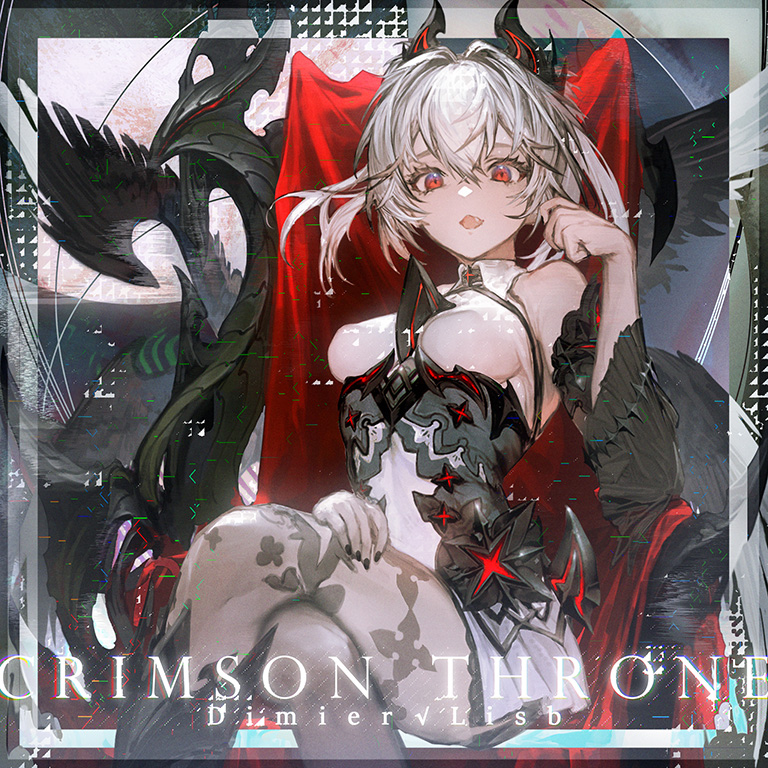

# Crimson Throne

> *绯红王座*

- **Crimson Throne 曲绘：**

- **曲师**：Dimier√Lisb
- **时长**：02:15
- **曲包**：Memory Archive
- **BPM**：210

### 谱面信息

| 难度 | Past | Present | Future |
| ------ | ------ | ------ | ------ |
| 等级 | 4 | 8 | 10 |
| Note 数量 | 727 | 1079 | 1313 |
| 谱面设计 | Toaster | Toaster | Toaster |

- **背景**：observer_conflict
- **更新时间**：移动版v4.3.0(2023/03/02)

---

## 解禁方法

本曲各难度无需额外解禁

---

## 曲目定数

| 难度 | 定数 |
| ------ | ------ |
| Past | 4.0 |
| Present | 8.0 |
| Future | 10.6 |

• 本曲FTR难度谱面初出时的定数为10.4，在v6.0.0更新后改为10.6(+0.2)。

---

## 游戏相关

- 本曲是Arcaea第3届公募大赛"Imagining After"的优胜曲目。
  - 但是本曲采用的游玩背景却是上届公募大赛对应公募曲包Esoteric Order的背景observer_conflict。
  - 可能的原因是本曲作为公募先行曲更新，而此时公募曲包Lasting Eden并未上线，因而只能采用其他背景。

---

## 试听

- · (YouTube) YouTube上的官方音源

---

## 相关视频

- https://www.bilibili.com/video/BV1464y1P7pk
