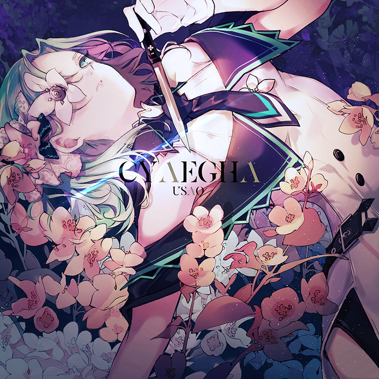

# Cyaegha

> *各式双押支配你的体力*

- **Cyaegha 曲绘：**

- **曲师**：USAO
- **时长**：02:21
- **曲包**：Absolute Reason
- **BPM**：200

### 谱面信息

| 难度 | Past | Present | Future |
| ------ | ------ | ------ | ------ |
| 等级 | 5 | 8 | 10+ |
| Note 数量 | 760 | 984 | 1368 |
| 谱面设计 | 夜浪、旧支配者 | 夜浪、旧支配者 | 夜浪、旧支配者 |

- **背景**：cyaegha
- **更新时间**：移动版v2.0.0(2019/03/21)

---

## 解禁方法

### 移动版
• **Present**：通关 Vicious Heroism PRS；80 残片
• **Future**：通关 Vicious Heroism FTR；180 残片

### Nintendo Switch版
• **Past**：游玩 Vicious Heroism PST；25 残片
• **Present**：游玩 Vicious Heroism PRS；50 残片
• **Future**：以「AA」或以上成绩通关 Vicious Heroism FTR；75 残片

---

## 曲目定数

| 难度 | 定数 |
| ------ | ------ |
| Past | 5.5 |
| Present | 8.4 |
| Future | 10.7 |

• 本曲FTR难度谱面初出时的定数为10.8，在v4.0.0更新后改为10.7(-0.1)。
• 本曲PRS难度谱面初出时的定数为8.1，在v3.0.0更新后改为8.4(+0.3)。

---

## 游戏相关

- 在v3.0.0大幅改标等级之前，本曲为PST 5，PRS 8，FTR 9+。
- 本曲是USAO的旧日支配者系列的三首曲目之一，另外两首是收录于REFLEC BEAT VOLZZA的Hastur和收录于Muse Dash的Cthugha。
- 本曲曲名Cyaegha是一位旧日支配者，代表了毁灭之眼，觊觎之暗。其真身为大量触手形成的巨型黑色团聚物，且在中心有一只绿色的眼睛，是象征“地”的存在。对应的，本曲曲绘角色咲弥的眼睛也是绿色。
- 本曲中出现了大量重复洗脑的女性人声采样片段，衍生出了很多空耳。但实际上这段人声采样是以KSHMR的采样包中一段女子歌唱的采样通过切片、移调等编辑处理而成，并没有带实际意义的歌词。
- 本曲于v2.0.0实装时，FTR难度谱面凭借高达10.8的定数成为了旧9+的定数冠军(Axium Crisis在本曲推出时定数仍为10.6)，然而在移动版v4.0.0中本曲FTR难度谱面的定数被修改为了10.7。
- 在2020年1月22日，本曲的重混版音源在HARDCORE TANO*C与另外四首联动曲目同时作为单曲发行。
- 曲目的加长版收录于SUPER RELEASE 21期间发行的专辑《XTREME》。
- 因联动收录至maimai、CHUNITHM、Muse Dash、O.N.G.E.K.I.和DJMAX RESPECT V。

---

## 攻略

此章节可能包含主观内容。

**Future 10+**

- 双押海段在双押中间其实有几个单键，初见一不注意就会由于过度位移而断连
- 全程天地单双键，极度体力考验，带天键的部分读谱难度较高
- 1051-1064combo、1076-1089combo和1115-1126combo为重复的一手长条/蛇一手2连点配置，注意读谱
- 结尾为12连双押
- 比较容易手癖，所以在确保自己有足够的实力之前建议不要尝试此谱面

**Present 8**

- 天键8分纵连较多，考验读谱和稳定性，但全程没有采16分音，节奏比较明显，PM难度较低
- 逐渐上升的黑线上的天键注意高度

---

## 试听

- · (YouTube) USAO - Cyaegha

---

## 相关视频
