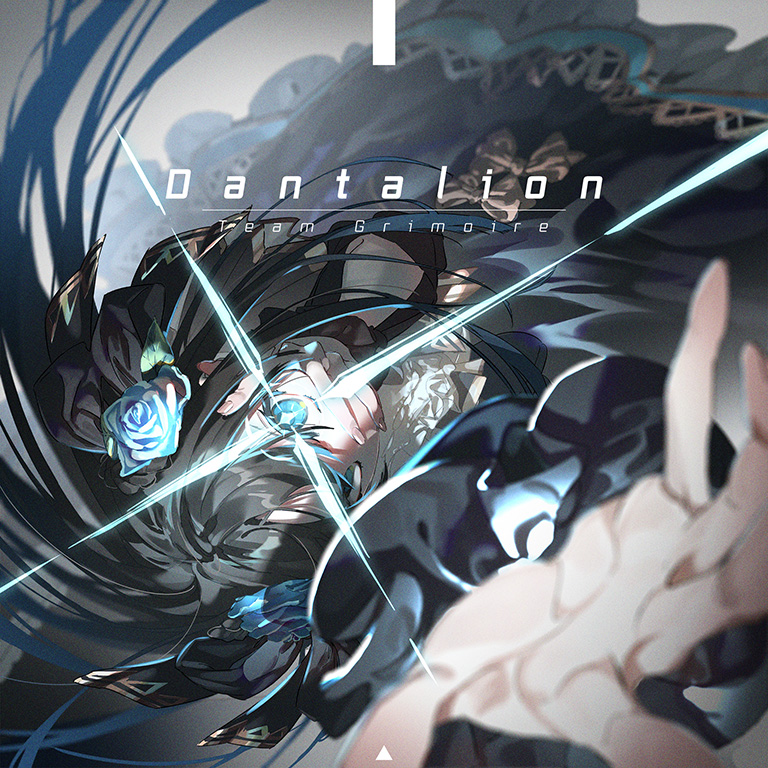

# Dantalion

> *[[Sheriruth]] v2*

- **Dantalion 曲绘：**

- **曲师**：Team Grimoire
- **时长**：02:32
- **曲包**：Black Fate
- **BPM**：186

### 谱面信息

| 难度 | Past | Present | Future |
| ------ | ------ | ------ | ------ |
| 等级 | 5 | 8 | 10+ |
| Note 数量 | 731 | 843 | 1476 |
| 谱面设计 | 夜浪 | 東星 | 夜浪 X 東星 "The Lost" |

- **背景**：vs_conflict
- **更新时间**：移动版v3.0.0(2020/05/27)

---

## 解禁方法

### 移动版
本曲各难度无需额外解禁

### Nintendo Switch版
• **Past**：游玩 Equilibrium PST；游玩 Antagonism PST；游玩 Lost Desire PST；10 残片
• **Present**：游玩 Equilibrium PRS；游玩 Antagonism PRS；游玩 Lost Desire PRS；20 残片
• **Future**：以「AA」或以上成绩通关 Equilibrium FTR；以「AA」或以上成绩通关 Antagonism FTR；以「AA」或以上成绩通关 Lost Desire FTR；30 残片

---

## 曲目定数

| 难度 | 定数 |
| ------ | ------ |
| Past | 5.0 |
| Present | 8.2 |
| Future | 10.8 |

• 本曲FTR难度谱面初出时的定数为10.8，在v4.0.0更新后改为10.9(+0.1)，又在v6.0.0更新后改为10.8(-0.1)。

---

## 游戏相关

- 本曲曲名意为“但他林”，是所罗门72柱魔神之一，排行第71。
- Team Grimoire所作的曲子中曲名同为72柱魔神的还有Eligos(收录于Orzmic)、Astaroth(收录于Lanota)、Bathin(收录于KALPA)、Glasya-Labolas(与siromaru合作曲，收录于专辑Monochrome Rainbow)等。
- 本曲是移动版中唯一一个不设任何解禁条件的10+。

---

## 攻略

此章节可能包含主观内容。

**Future 10+**

- 比Sheriruth更为密集的散点，大部分为16分天-地散点，混有少部分24分天-地散点，手法需要多多探索
- 停顿变速坑初见
- 358-529combo的部分16分二连在不使用多指的情况下需要单指硬扛
- 结尾的大出张交互要注意定位
  - 实在位移不了可以每两个单点用一根手指硬抗

---

## 试听

- · (YouTube) 官方音源
- · (QQ音乐) 试听

---

## 相关视频

- https://www.bilibili.com/video/www
