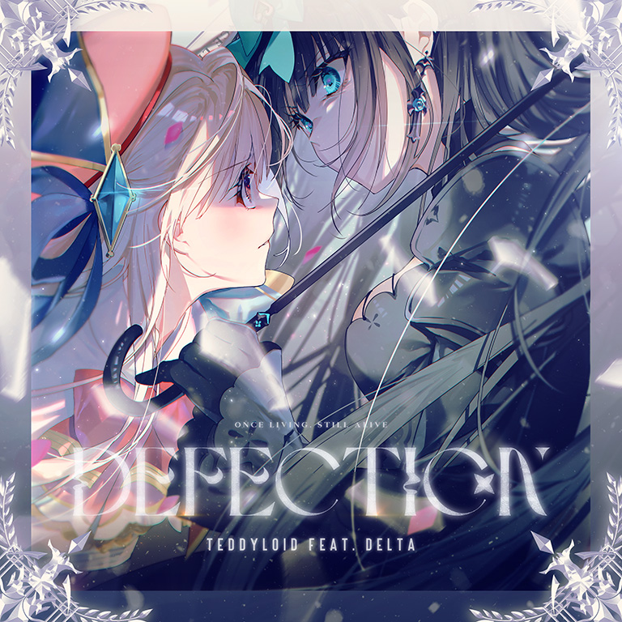

# Defection

> *背叛*

- **Defection 曲绘：**

- **曲师**：TeddyLoid feat. DELTA
- **时长**：02:30
- **曲包**：Final Verdict
- **BPM**：160

### 谱面信息

| 难度 | Past | Present | Future |
| ------ | ------ | ------ | ------ |
| 等级 | 3 | 6 | 9+ |
| Note 数量 | 588 | 800 | 1141 |
| 谱面设计 | Monolith Incarnate | Monolith Incarnate | Monolith Incarnate |

- **背景**：finale_light
- **更新时间**：移动版v4.0.0(2022/07/07)

---

## 解禁方法

本曲各难度无需额外解禁

---

## 曲目定数

| 难度 | 定数 |
| ------ | ------ |
| Past | 3.5 |
| Present | 6.5 |
| Future | 9.8 |

---

## 游戏相关

- 本曲是Final Verdict曲包的开门曲，也是该曲包内唯一无需挑战即可解锁的曲目。
- 本曲名义上是vocal曲，但是仅有两句vocal，听起来更像是人声采样。
- 曲绘上注有英文：`**ONCE LIVING STILL ALIVE**`

---

## 攻略

此章节可能包含主观内容。

**Future 9+**

- 0\~81combo处的反手蛇可以尝试反接
- 121\~125、521\~526combo的“X XX XX”节奏注意停顿
- 158、392、630combo处左右的蛇跨度较大
- 166combo开始双押夹交互，注意分辨
- 247\~262combo需要两只手轮流抗12分
- 265\~331combo的弓蛇起点与终点在一个位置，不要划太远
- 331\~361combo双押较多，注意位移
- 405\~450combo注意定位
- 473\~483combo的天地交互注意换手
- 636\~686combo注意协调
- 688\~718combo的蛇跨度从近到远，注意控制~~不要让设备漂移~~
- 726combo天地24分爆发
- 742combo开始尾杀：
  - 尾杀刚开始有一个24分四连交互，代替了第一个16分三连
  - 尾杀节奏为“XXX X X”，两个双押后接天地三连
- 870combo是第二个24分爆发，控制好节奏
- 882\~933combo同405combo
- 950\~967combo最后的天地16分，把控好节奏
- 967之后都是送分了，没有难点

---

## 试听

---

## 相关视频
