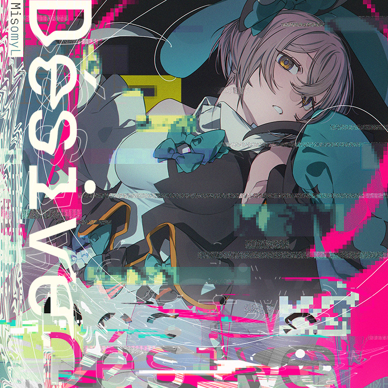

# Désive

> *是良方，还是奇迹？抑或是友谊？*

- **Désive 曲绘：**

- **曲师**：MisomyL
- **时长**：02:46
- **曲包**：Memory Archive
- **BPM**：180-230

### 谱面信息

| 难度 | Past | Present | Future | Eternal |
| ------ | ------ | ------ | ------ | ------ |
| 等级 | 5 | 8 | 9+ | 10+ |
| Note 数量 | 1007 | 1051 | 1273 | 1340 |
| 谱面设计 | Yearning Call | Yearning Call | Yearning Call | Yearning Call |

- **背景**：rei
- **更新时间**：移动版v5.6.0(2024/04/26)

---

## 解禁方法

- 前置条件：在世界模式第八章，地图8-3，第一个奖励获得
• **Past**：通关 Phantasia PST；通关 init() PST；通关 MAHOROBA PST；通关 Floating World PST；通关 Chromafill PST；20 残片
• **Present**：通关 Phantasia PRS；通关 init() PRS；通关 MAHOROBA PRS；通关 Floating World PRS；通关 Chromafill PRS；80 残片
• **Future**：以「A」或以上成绩通关 Phantasia FTR；以「A」或以上成绩通关 init() FTR；以「A」或以上成绩通关 MAHOROBA FTR；以「A」或以上成绩通关 Floating World FTR；以「A」或以上成绩通关 Chromafill FTR；360 残片
• **ETR解禁方法**：解锁 Désive FTR

---

## 曲目定数

| 难度 | 定数 |
| ------ | ------ |
| Past | 5.0 |
| Present | 8.0 |
| Future | 9.9 |
| Eternal | 10.8 |

---

## 游玩效果

进入谱面后，游戏会产生如下游玩效果：
- 在谱面约89.139~95.004秒处会出现类似于解锁Arcahv时出现的红线表演。
无论选择任何搭档、选择任何难度谱面、在线或离线均可触发。

---

## 游戏相关

- 本曲不遵循单曲通用计价规则。本曲无需购买，而是从世界模式获取。但由于对应地图需要其他付费单曲才能解锁，本曲被列为付费曲目。
  - 这与γuarδina和Acheron类似。
  - 付费单曲有Phantasia、MAHOROBA、init()、Floating World、Chromafill共5首，因此本曲正常情况下需要预计500记忆源点才可获取。
  - 本曲曾被官方列为免费曲目，出现在官网免费曲目排行榜中，现已修正。
- 本曲和同时更新的Distorted Fate是首批ETR 10+级曲目。

---

## 攻略

此章节可能包含主观内容。

**Future 9+**

- ETR谱面中的大量五连交互在本谱被替换为了大量四连交互，后段出现了一段16连16分长交互，整体对底力的要求较高，但对读谱玩蛇和协调的要求显著低于其余9+谱面
- 198-230combo的八组四连交互，每一组的结尾手为下一组的起手，注意发力紧张
- 342、409combo的天键会从慢速忽然加速，注意读谱
- 580combo处的反手蛇及蛇侧单点注意定位
- 616-650combo的八组四连交互中，前四组均为右手起手，后四组均为左手起手
- 1206-1214combo的两组侧边天2地2交互较难，均为地键起手，第一组的结尾手、第二组的起手均为左手，需要额外注意发力平衡

---

## 试听

- · (YouTube) 【Arcaea】Désive / MisomyL

---

## 相关视频

- https://www.bilibili.com/video/BV1U1sue8E92
- https://www.bilibili.com/video/BV1FH4y1P79S
