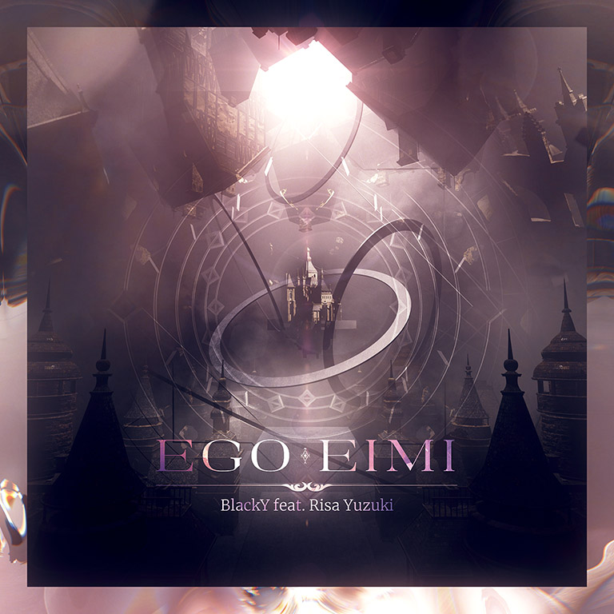

# Ego Eimi

> *Inscribe the name upon Ego Eimi*

- **Ego Eimi 曲绘：**

- **曲师**：BlackY feat. Risa Yuzuki
- **时长**：02:35
- **曲包**：Lasting Eden Chapter 2
- **BPM**：178

### 谱面信息

| 难度 | Past | Present | Future |
| ------ | ------ | ------ | ------ |
| 等级 | 5 | 8 | 10 |
| Note 数量 | 801 | 937 | 1223 |
| 谱面设计 | 東星 | 東星 | 東星 |

- **背景**：eden_append_conflict
- **更新时间**：移动版v5.0.0(2023/09/27)

---

## 解禁方法

### 移动版
• **Past**：无
• **Present**：50 残片
• **Future**：通关 Primeval Texture [FTR]；通关 Technicolour [FTR]；通关 Logos [FTR]；150 残片

---

## 曲目定数

| 难度 | 定数 |
| ------ | ------ |
| Past | 5.5 |
| Present | 8.6 |
| Future | 10.5 |

---

## 游戏相关

- 本曲是Arcaea第3届公募比赛"Imagining After"的优胜曲目。
  - 此前相同的曲师与Vocal组合还创作了Arcaea第2届公募比赛Arcaea Song Contest 2020的优胜曲目Löschen。
- <ruby>Ego eimi<rt>-{ἐγώ εἰμι}-</rt></ruby>在古希腊语中意为“我是”“我存在”。
- 因联动收录至Rotaeno。
  - 本曲也是Arcaea在联动时供出的第一首于5.0版本后更新的曲目。

---

## 歌词

### 原文

殻の世界　祈り宿した
真実を描いた定義　造り変えて

木魂する声
幸せはいつも姿を歪ませて
未知へ誘う
枝葉を伸ばし
可能性の刹那
旅立つだろう

運命の先で出会えるなら
生まれ変わればいい　夢を識る日まで
揺らぐ地平線　空に踊る
過去はもう辿らない
信じた私が私になる

何度　心手放したのだろう
何度　時を見失うとしても[^1]

遡航する眼と　響く心音
集積のその狭間で
今を問うなら
張り詰めた糸　解けていく
一羽の鳥が運んだ命
希望の種を蒔く
何を選んでも
生きる理由　求む場所は
そう此処に在る

羽ばたいた次の頁(ペイジ)へ
やがて明ける空に吹く風のように
産声あげたいつかの未来　集めたら

運命の先に何があっても
道はひとつじゃない
信じた私で越えてゆく

### 罗马字

Kara no sekai inori yadoshita
Shinjitsu wo egaita teigi tsukuri kaete

Kodama suru koe
Shiawase wa itsumo sugata wo hizumasete
Michi e izanau
Edaha wo nobashi
Kanousei no setsuna
Tabidatsu darou

Unmei no saki de deaeru nara
Umare kawareba ii yume wo shiru hi made
Yuragu chiheisen kuu ni odoru
Kako wa mou tadoranai
Shinjita watashi ga watashi ni naru

Nando kokoro tebanashita no darou
Nando toki wo miushinau toshite mo

Habataita tsugi no peeji e
Yagate akeru sora ni fuku kaze no you ni
Ubugoe ageta itsuka no mirai atsumetara

Unmei no saki ni nani ga atte mo
Michi wa hitotsu janai
Shinjita watashi de koete yuku

### 参考翻译

---

## 攻略

此章节可能包含主观内容。

**Future 10**

- 本谱以大量中速天地交互为主要配置，后半的反手12分交互为全谱最难段，部分含直蛇或Hold的交互手序不尽直观，熟悉读谱后即可较好应对
- 473-590combo为恒定的一手地一手天交互，建议熟悉天键手的位移（多为顺时针或逆时针画三角），否则可能手癖
- 617-649combo的长天键交互对稳定性要求较高，建议对齐拍点以稳定交互频率
- 723-729combo的碎蛇注意颜色
- 814combo开始的后半段出现的四组12分反手交互为本谱主要难点，但可通过适度硬抗以规避反手交互跨手定位的难点
  - 第一组反手交互（820-832combo）可以正攻
  - 第二组反手交互（842-854combo）建议左手提前位移至右边反接（正攻时结尾会出现反手双押）
  - 第三、第四组反手交互（986-1004、1032-1050combo）出现了类似LibertasBYD的跨手，可以通过硬抗交互相接处的一个键以规避反手
- 1008-1020combo的含蛇出张三角交互注意手序

---

## 试听

- https://www.bilibili.com/video/BV1H94y1Y72d

---

## 相关视频

---

## 注释

[^1]: 完整版中不存在这两句歌词，而是改为了下面的歌词
