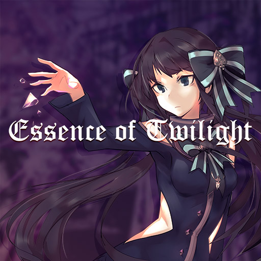

# Essence of Twilight

> *望魔王兴叹*

- **Essence of Twilight 曲绘：**

- **曲师**：ak+q
- **时长**：02:31
- **曲包**：Eternal Core
- **BPM**：164

### 谱面信息

| 难度 | Past | Present | Future |
| ------ | ------ | ------ | ------ |
| 等级 | 4 | 7 | 9 |
| Note 数量 | 556 | 767 | 1204 |
| 谱面设计 | Nitro | Nitro | Nitro |

- **背景**：base_conflict
- **更新时间**：移动版v1.0.5(2017/03/09)

---

## 解禁方法

### 移动版
• **Present**：50 残片
• **Future**：通关 cry of viyella FTR；通关 I've heard it said FTR；通关 memoryfactory.lzh FTR；通关 Relentless FTR；通关 Lumia FTR；150 残片

### Nintendo Switch版
- 前置条件：在世界模式第一章，地图NS1-3，第一个奖励获得
• **Past**：游玩 cry of viyella PST；游玩 Relentless PST；10 残片
• **Present**：游玩 cry of viyella PRS；游玩 Relentless PRS；20 残片
• **Future**：以「AA」或以上成绩通关 cry of viyella FTR；以「AA」或以上成绩通关 Relentless FTR；30 残片

---

## 曲目定数

| 难度 | 定数 |
| ------ | ------ |
| Past | 4.5 |
| Present | 7.0 |
| Future | 9.1 |

• 本曲FTR难度谱面初出时的定数为9.0，在v3.0.0更新后改为9.1(+0.1)。

---

## 游戏相关

- 本曲是Shades of Light in a Transcendent Realm的对应曲[^1]。
- 本曲的FTR难度谱面是Arcaea首个正式版本(v1.0.5)中物量最高的谱面(1204)。
- 因联动收录至Dynamix。
- 在v4.3.0更新前，本曲目的获取具有前置条件：在世界模式第一章，地图1-5，第16格处获得。

---

## 攻略

此章节可能包含主观内容。

**Future 9**

- 双蛇有可以在交叉点换手的bug，第二段双蛇甚至可能会因为bug在结尾红蛇导致lost
- 有几处单手16分2-3连点，考验爆发能力
- 结尾高潮段键盘比较迷，需要注意读谱

---

## 试听

- · (SoundCloud) 试听

---

## 相关视频

---

## 注释

[^1]: 出处(Twitter)
