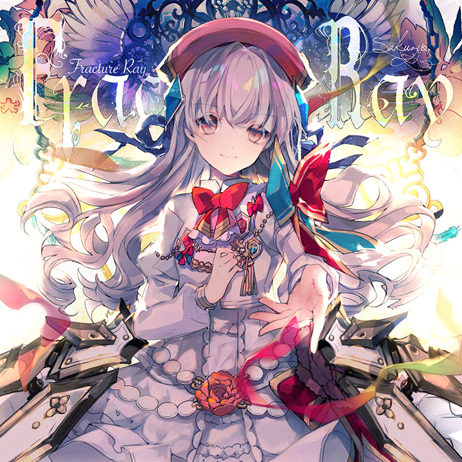
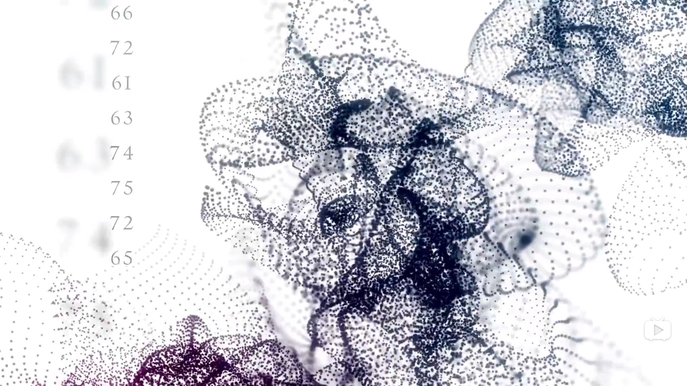

# Fracture Ray

> *骨折光*

- **Fracture Ray 曲绘：**

- **曲师**：Sakuzyo
- **时长**：02:33
- **曲包**：Luminous Sky
- **BPM**：200

### 谱面信息

| 难度 | Past | Present | Future |
| ------ | ------ | ------ | ------ |
| 等级 | 6 | 9 | 11 |
| Note 数量 | 983 | 1343 | 1279 |
| 谱面设计 | Volatile Paradox | Absolute Paradox | Paradox Zero |

- **背景**：fractureray
- **更新时间**：移动版v1.7.0(2018/07/16)

---

## 解禁方法

使用**技能封印**的光（Zero）游玩Ether Strike，游戏在曲目进行到 86.924s 到 87.199s 间[^1]会判定回忆率是否满足异象的触发条件。

- 离线(技能处于封印状态但是看不到封印锁标志)**或**搭档等级为1~5级时，需要全连在此之前所有音符（即无lost判定）。
- 搭档等级为6~10级时，回忆率应高于`130 - 6 &times; 等级`
- 搭档等级为11~20级时，回忆率应高于`120 - 5 &times; 等级`

即分等级解锁条件如下表：

| 等级 | 1-5 | 6 | 7 | 8 | 9 | 10 | 11 | 12 |
| ------ | ------ | ------ | ------ | ------ | ------ | ------ | ------ | ------ |
| 回忆率要求 | 全连 | 94 | 88 | 82 | 76 | 70 | 65 | 60 |
| 等级 | 13 | 14 | 15 | 16 | 17 | 18 | 19 | 20 |
| 回忆率要求 | 55 | 50 | 45 | 40 | 35 | 30 | 25 | 20 |

在6.0.0版本后，点击解锁条件不再显示为“？？？”而是“使用封印状态的光（Zero）游玩 Ether Strike 并获得更高的回忆率”

---

## 曲目定数

| 难度 | 定数 |
| ------ | ------ |
| Past | 6.0 |
| Present | 9.5 |
| Future | 11.1 |

• 本曲FTR难度谱面初出时的定数为11.1，在v3.0.0更新后改为11.2。
• 本曲PRS难度谱面初出时的定数为9.2，在v3.0.0更新后改为9.5。

---

## 游玩效果

本曲为异象曲（Anomaly Song）。当玩家触发异象时，游戏会产生如下一系列游玩效果：
- 触发异象时，Ether Strike谱面的地面轨道中间处会闪烁一个白色圆圈的特效，并且会出现与Overflow回忆条达到100后转换回忆条一致的音效。
- 暂停按钮将会变暗且无法点击，但是可以通过切换程序来强行暂停。
- 回忆收集条立刻转为红色，此时回忆率若低于50，会迅速涨至50。对音符的判定依然和Normal回忆收集条一致。
- 回忆收集条及分数等大部分UI界面会出现雾化效果，并且会因回忆率下降而导致泛白程度缓慢增加，也会因为回忆率回升而减轻。
- 当出现Lost导致回忆率低于0时，游戏结束，画面变成全白，转到结算界面且判定为Track Lost。
  - 该异象没有潜力值保护，因而Track Lost有可能会对潜力值造成影响。
- 谱面结束时回忆率未降至0以下即可通过异象，之后轨道将会向左或向右缓慢转动，播放追加音频并显示只含有长条的追加谱面[^2]。在进入追加谱面之后回忆率会突然增加10。
  - 该异象最后追加的长条在分数≥10000000后命中一个Note只会加1分。
  - FTR难度谱面追加的长条中，最后两个长条的判定区间仅为1ms，几乎仅能打出Lost判定。
  - 不击打追加谱面的note会导致回忆率下降，但是不会导致Track Lost。
  - 某版本（最晚是v3.6.3）之前，在追加谱面中击打长条则雾化状态会逐渐消失（若等级较高可以看见雾化突然出现并逐渐消失），回忆收集条以10为单位自动快速上涨。
- 进入本曲后，回忆收集条和暂停键将会隐藏。
  - 仍可以通过切换程序来强行暂停。
  - 虽然回忆收集条隐藏，但是回忆率仍按普通模式计算。因而曲目通关与否也会按普通模式判定，并在本地和服务器保存。
  - 无论曲目是否通关都能在游玩一次后解锁曲目。
  - 6.0.0版本前，游戏在进入本曲时将自动进入Hard模式。回忆收集条转为拥有100回忆率，Lost减少量遵循正常Hard模式规则，当回忆率降为0后，自动Track Lost。
    - 游玩结束时回忆率未归零即可解锁游玩的对应难度谱面，而Track Lost时则会积攒解锁进度，其计算方式请查看进度计算。

本曲异象可在世界模式中触发，演出特效均遵循正常异象触发现象，并以本曲成绩正常结算。

本曲异象可在失落章节中触发，触发后原本的challenge回忆条判定失效，转为失忆回忆条判定，并且在附加谱面时背景会被强制替换为etherstrike，演出特效均遵循正常异象触发现象。若成功通过异象，则以困难血条进入本曲的游玩，背景为fractureray，并以本曲成绩正常结算（此时没有Beyond Challenge加成）。

当玩家购买了Final Verdict曲包，完成了Axiom of the End的全部挑战并解锁Testify后，只要满足进入异象的全部条件就可以进入异象，通过挑战后可以进入本曲对应难度的谱面，无论本曲是否被解锁。

### 异象回忆率掉落计算
在游玩Ether Strike进入异象后1秒时开始第一次回忆率减少，随后若光（Zero）等级≤10，则每1秒执行一次回忆率减少；否则，每2秒执行一次回忆率减少。

每次执行回忆率减少时，回忆率减少量为：
 (回忆系数 &times; 剩余note数 + 100) &times; 搭档等级解锁条件值 &divide; 100 &divide; 剩余时间

其中，**搭档等级解锁条件值**与光（Zero）的等级相关，具体计算方式为：

| 等级 1~5 | 100 |
| ------ | ------ |
| 等级 6~10 | 130 - 6 &times; 等级 |
| 等级 11~20 | 120 - 5 &times; 等级 |

**剩余时间**为总时长减去进入异象时的时间，可能因设备性能和/或浮点误差而略有浮动，但可视为常量52。
- 通过这种情况扣除回忆率时，将至少保留回忆率为0.1，因此回忆率的自然减少不会导致异象过程中Track Lost。

---

## 游戏相关

> *预览视频1:49处截图*
- 在v3.0.0大幅改标等级之前，本曲的定级为PST 6，PRS 9，FTR 10。
- 本曲并没有直接出现在Luminous Sky曲包的预览视频中，但是视频使用了一小段音源，且出现了"66 72 61 63 74 75 72 65"的字样，即为"fracture"的十六进制ASCII码。
- 在使用搭档光（Fracture）游玩本曲的Future难度时，如果一直保持PM状态，将会在正好进入第二个高潮段时（807combo处）达成溢出并进入困难回忆收集条，可以看作一个剧情象征意义的彩蛋。
- 本曲FTR难度谱面于2019年7月17日被abeyuu达成首个理论值，为Arcaea存活时间最长的谱面（享年366天）。
  - 巧合的是，abeyuu达成本曲理论值是在Adverse Prelude曲包推出之前1天(2019.7.17)，后来h1r达成本曲理论值是在Black Fate曲包推出之前1天(2020.5.26)。
- 本曲的PRS难度谱面曾拥有9级谱面中最高的物量，后来在v5.10.0被epitaxy ETR取代，其Present谱面物量最高的地位也在v6.0.0被Designant. PRS取代。
- 收录于Tone Sphere的是Sta对本曲的remix版本，该版本削弱了花式分音的表现力，并在谱面上以节奏感更强的双押海代替。
- 本曲的FTR难度谱面拥有11级谱面中最低的物量。
- 因联动收录至CHUNITHM、Cytus II和DJMAX RESPECT V。
  - CHUNITHM很大程度上还原了Arcaea侧的谱面配置和黑线表演。
  - Cytus II亦还原了多处谱面演出，且CHAOS难度物量与FTR难度谱面相同(1279)。

---

## 攻略

此章节可能包含主观内容。

**Future 11**

- 本曲节奏相当难抓，5分、6分、7分、8分、10分、12分、14分、16分、20分、24分、32分“齐聚一堂”（还有未计入采音的28分），因而整体PM以及理论值难度都居于FTR难度谱面的最上位
  - 10分音可换算为125BPM的16分音或250BPM的8分音，12分音可换算为150BPM的16分音，14分音可换算为175BPM的16分音
- 117-129combo的6对双押速度较快，采的是倒计时（7-2）的采样，在note前有黑线提示，注意不要打晚爆far
- 之后是四组一手蛇一手单点的配置，在注意note的位置时也请注意蛇不要划太过漏掉
- 183-240combo的圈圈蛇注意划到位
- 中盘的反手蛇跨度极大，注意看好移动时机
- 1193combo出现了32分五连，请使用最快的速度击打

**Present 9**

- 和FTR一样也采了10分和14分音，同时有部分配置包含较大的位移，可以适当使用多指
- 结尾的长条和单键可视为16分交互

---

## 试听

- · (QQ音乐) 削除 (Sakuzyo) - Fracture Ray
- · (SoundCloud) Sakuzyo - Fracture Ray

---

## 相关视频

- https://www.bilibili.com/video/BV1Qz4y1z7iD
- https://www.bilibili.com/video/BV1dT4y1E7S6
- https://www.bilibili.com/video/BV154411t7n7
- https://www.bilibili.com/video/BV12b411a7HU
- https://www.bilibili.com/video/BV1y4411v7wc
- https://www.bilibili.com/video/BV1KZ421M7US

---

## 注释

[^1]: 即人声采样“My Guiding Star”第三次出现的位置
[^2]: 若使用某些方法（比如录屏）使延迟明显，则会发现追加音频会在正常谱面结束时播放，强制终止（淡化）正常音频
