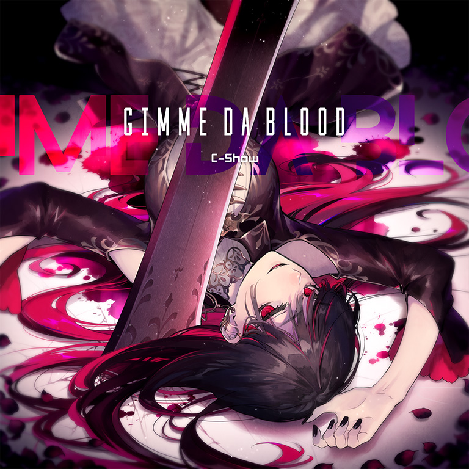

# GIMME DA BLOOD

> *[[ReviXy]] v2*

- **GIMME DA BLOOD 曲绘：**

- **曲师**：C-Show
- **时长**：02:13
- **曲包**：Memory Archive
- **BPM**：87-110

### 谱面信息

| 难度 | Past | Present | Future |
| ------ | ------ | ------ | ------ |
| 等级 | 3 | 7 | 10 |
| Note 数量 | 582 | 737 | 1093 |
| 谱面设计 | 夜浪 | 夜浪 | 夜浪 |

- **背景**：yugamu
- **更新时间**：移动版v3.5.2(2021/03/09)

---

## 解禁方法

### 移动版
本曲各难度无需额外解禁

### Nintendo Switch版
- 前置条件：在世界模式第五章，地图NS5-5，第二个奖励获得
本曲各难度无需额外解禁

---

## 曲目定数

| 难度 | 定数 |
| ------ | ------ |
| Past | 3.5 |
| Present | 7.5 |
| Future | 10.5 |

• 本曲FTR难度谱面初出时的定数为10.3，在v4.0.0更新后改为10.4(+0.1)，又在v6.0.0更新后改为10.5(+0.1)。

---

## 游戏相关

- 本曲是Arcaea的四周年纪念曲目。
- （移动版限定·本曲有其对应的世界模式限时活动地图限时：GIMME DA BLOOD及搭档迷尔，详情可查阅对应页面。）
  - 而在NS版中，解锁本曲的地图的最终奖励即是迷尔。
- 本曲的加长版收录于特典专辑Memories of Myth中。
- 本曲的说唱部分歌手为C-Show本人[^1]。
- 因联动收录至Muse Dash。

---

## 歌词

### 原文

差し出すな君のその首を
走り出して戻るなその道を
決して犯すな過ちを
振り返れば吸われる赤い血を
(こっちくるな)
止めるなこの息を
(こっちくるな)
染めるなその口を
Hey yo one for the blood two for the life
血が無き者には明日は無い
GIMME DA BLOOD

決して犯すな過ちを
振り返れば吸われる赤い血を
GIMME DA BLOOD

差し出すな君のその首を
走り出して戻るなその道を
決して犯すな過ちを
振り返れば吸われる赤い血を
GIMME DA BLOOD

夜の街に群がる黒い影
月の光に差す鋭い羽
追ってくるぜ裏の路地まで
迫ってくるぜ後ろは壁
(こっちくるな
こっちくるな
こっちくるな
こっちくるな
こっちくるな
こっちくるな
こっちくるな)

(Hey yo one for the blood two for the life)
Hey yo one for the blood two for the life
血が無き者には明日は無い
GIMME DA BLOOD!

### 参考翻译

此章节所记录的歌词/翻译的来源不具有官方性质，仅供参考。
- 译者：青雀_Chugaev

你的脆弱脖颈千万不要暴露
赶紧跑起来啊别走上回头路
谨小慎微不要犯下任何过错
一旦回头猩红鲜血会被吸走
（不要过来）
别让那静寂扼住了呼吸
（不要过来）
别让那唇齿沾染上脏污
Hey yo 先得鲜血 再谈生命
得不到鲜血的家伙没有明天
给我血！

谨小慎微不要犯下任何过错
一旦回头猩红鲜血会被吸走
给我血！

你的脆弱脖颈千万不要暴露
赶紧跑起来啊别走上回头路
谨小慎微不要犯下任何过错
一旦回头猩红鲜血会被吸走
给我血！

深夜街道群聚黑影蠢蠢欲动
月光之下锋锐羽翼冷厉刺出
追过来了 慌不择路深入后巷
逼近来了 身后墙壁无路可退
（别过来
别过来
别过来
别过来
别过来
别过来
别过来）

（Hey yo 先得鲜血 再谈生命）
Hey yo 先得鲜血 再谈生命
得不到鲜血的家伙没有明天
给我血！

[^2]

---

## 攻略

此章节可能包含主观内容。

**Future 10**

- 邪道技巧谱，反手出张配置占比很高
- 起始段的出张幅度相同
- 277～304combo之间的两段反手出张幅度相较起始段更小（开头39combo的起手蛇和出张蛇各位于2、3轨之间并轮流替换；而从277combo开始的两条音弧分别位于1、2轨，2、3轨的交界线处），推荐食指玩家使用从上方跨手的接法，以免造成卡手
- 四条波浪音弧判定较松
- 从596combo处开始谱面进入慢速段，其中运用了很多半螺旋蛇的配置（该曲目也因此被调侃为ReviXy的翻版），一定程度上考验读谱能力
- 最后一段配置基本照搬歌曲前中段

---

## 试听

- · (YouTube) 官方音源

---

## 相关视频

---

## 注释

[^1]: 可见于本条推特的评论区。
[^2]: 个人认为C爆的翻译和歌词原文偏离较多，于是重写了一版较为忠于原文的。C爆版气势和用词上堪称杰作，但的确有许多地方和原文意思偏离，还有完全忽略“差し出すな”“こっちくるな”等句中否定含义的问题。
