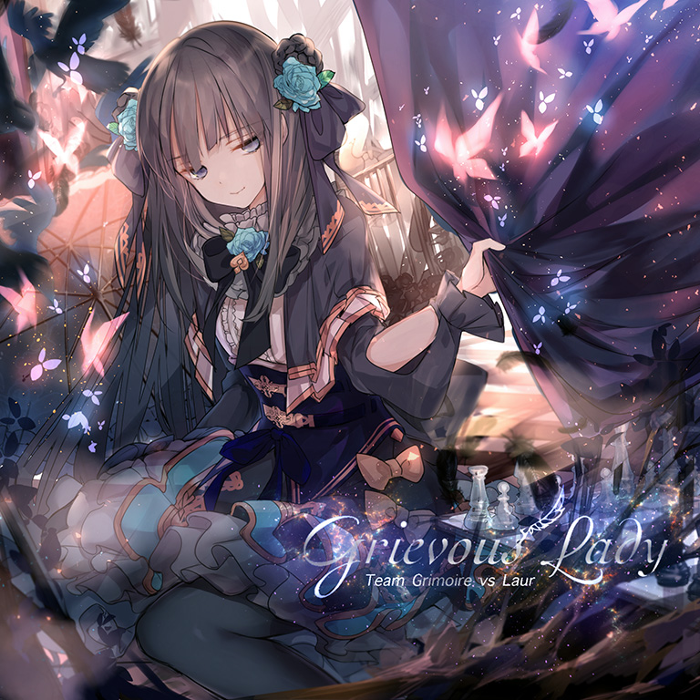
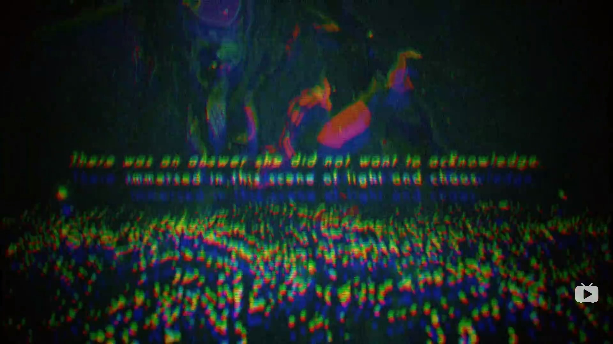

# Grievous Lady

> *Arcaea中最早的FTR11，是劲爆魔王曲。*

- **Grievous Lady 曲绘：**

- **曲师**：Team Grimoire vs Laur
- **时长**：02:20
- **曲包**：Vicious Labyrinth
- **BPM**：210

### 谱面信息

| 难度 | Past | Present | Future |
| ------ | ------ | ------ | ------ |
| 等级 | 6 | 9 | 11 |
| Note 数量 | 956 | 1194 | 1450 |
| 谱面设计 | 迷路第一層 | 迷路第二層 | 迷路深層 |

- **背景**：grievouslady
- **更新时间**：移动版v1.5.0(2017/11/03)

---

## 解禁方法

使用**技能未封印**的对立游玩Axium Crisis，游戏会在曲目进行到 85.701s 到 85.999s 间会判定回忆率是否满足异象的触发条件。
- **离线**或搭档等级为1~5级时，需要全连在此之前所有音符(即无lost判定)。
- 搭档等级为6~10级时，回忆率应高于`130 - 6 &times; 等级`
- 搭档等级为11~20级时，回忆率应高于`120 - 5 &times; 等级`
- 搭档等级高于20级时，按20级计算。

不同等级的对立对应的本曲解锁条件如下表：

| 等级 | 1-5 | 6 | 7 | 8 | 9 | 10 | 11 | 12 |
| ------ | ------ | ------ | ------ | ------ | ------ | ------ | ------ | ------ |
| 回忆率要求 | 全连 | 94 | 88 | 82 | 76 | 70 | 65 | 60 |
| 等级 | 13 | 14 | 15 | 16 | 17 | 18 | 19 | ≥20 |
| 回忆率要求 | 55 | 50 | 45 | 40 | 35 | 30 | 25 | 20 |

在v6.0.0更新后，点击解锁条件不再显示为“？？？”而是“使用对立游玩Axium Crisis并获得更高的回忆率”。

---

## 曲目定数

| 难度 | 定数 |
| ------ | ------ |
| Past | 6.5 |
| Present | 9.3 |
| Future | 11.1 |

• 本曲FTR难度谱面初出时的定数为11.2，在v3.0.0更新后改为11.3(+0.1)，又在v6.0.0更新后改为11.1(-0.2)。
• 本曲PRS难度谱面初出时的定数为9.1，在v3.0.0更新后改为9.3(+0.2)。

---

## 异象触发

当玩家触发异象时，游戏会产生如下一系列游玩效果：
- 异象触发时，Axium Crisis的背景破碎并晃动，播放追加音频，随即进入本曲。
  - 在当前版本中，触发异象时镜头将随机移动到左右两边，具体表现为轨道近处随机向右或向左偏转。
- 进入本曲后，回忆收集条和暂停键将会隐藏。游玩结束后无论是否达成Track Complete都会解锁曲目。
  - 仍可以通过切换程序来强行暂停。
  - 虽然回忆收集条隐藏，但是回忆率仍按普通模式计算。因而曲目通关与否也会按普通模式判定，并在本地和服务器保存。
  - v6.0.0更新前，游戏在进入本曲时将自动进入Hard模式。回忆收集条转为拥有100回忆率，Lost减少量遵循正常Hard模式规则，当回忆率降为0后，自动Track Lost。
    - 游玩结束时回忆率未归零即可解锁本曲；Track Lost则会积攒解锁进度，其计算请查看进度计算。

当玩家购买了Final Verdict曲包，完成了Axiom of the End的全部挑战并解锁Testify后，只要满足进入异象的全部条件就可以进入异象[^1]，通过挑战后可以进入本曲对应难度的谱面，无论本曲是否被解锁。
- 在世界模式下满足异象触发条件时，游玩Axium Crisis仍可触发异象。
  - 在Beyond章节游玩时，游戏并不会强制更换背景，而是在原有背景上进行错位操作（并且错位背景底板依旧是axiumcrisis）。

---

## 游戏相关

> *预览视频1:48处截图*
- 在v3.0.0大幅改标等级之前，本曲的定级为PST 6，PRS 9，FTR 10。
- 本曲是第一首被定义为异象曲（Anomaly Song）的曲目。
- 本曲并没有直接出现在Vicious Labyrinth曲包的预览视频中。但是视频使用了一小段笑声采样，且隐约出现了本曲曲绘(见右图)。
  - 该截图中的文字为摘自剧情2-5的一句话：**There was an answer she did not want to acknowledge, immersed in this scene of light and chaos.**然而，她有一个自己不愿面对且承认的，隐藏于光明与混乱之中的答案。
- 本曲的加长版收录于特典专辑Memories of Conflict中。
- 本曲的FTR难度谱面在上线103天后被h1r达成了首个理论值成绩。
- 因联动收录至CHUNITHM，Groove Coaster，O.N.G.E.K.I.，maimai、Cytus II和DJMAX RESPECT V。
  - CHUNITHM侧的EXPERT难度谱面部分还原了PRS难度谱面，MASTER难度谱面部分还原了FTR难度谱面。
  - 在maimai、CHUNITHM和O.N.G.E.K.I.中，本曲的MASTER难度谱师名义均为“Anomaly Labyrinth”。

---

## 攻略

此章节可能包含主观内容。

**Future 11**

- 注意开头的伪天地双押(间隔一个32分音，其中天键落在正拍上)
  - 事实上，如果打成双押,这两个音符都会获得Pure判定，但是会对冲击理论值有所影响(两个音符间隔约35.7ms)
- 最开始的地方包含和PRAGMATISM与Sheriruth类似部分，然而在210的BPM下表现出了比前二者更高的难度
- 中部有两个隐藏note(事实上不是隐藏，而是谱面通过变速折叠后note重叠的现象)，请养成1:35的双押note打两次的习惯
- 非常容易手癖，请确保自己有足够的实力之前不要轻易尝试解锁本谱面

**Present 9**

- 总体难度在9下位，很适合作为从8级到9级的过渡
- 大量双押和后半段的双押夹三连交互使本谱面比其他同难度的谱面更考验底力

---

## 试听

- · (YouTube) Grievous Lady

---

## 相关视频

- https://www.bilibili.com/video/BV1hU4y1J7RW
- https://www.bilibili.com/video/BV1ya411C7Y9
- https://www.bilibili.com/video/BV1W3411E7eB
- https://www.bilibili.com/video/BV1Vg411V7vk
- https://www.bilibili.com/video/BV1H2421F7hk

---

## 注释

[^1]: 实际上还需解锁剧情“最终之梦”以恢复被隐藏的初始对立
