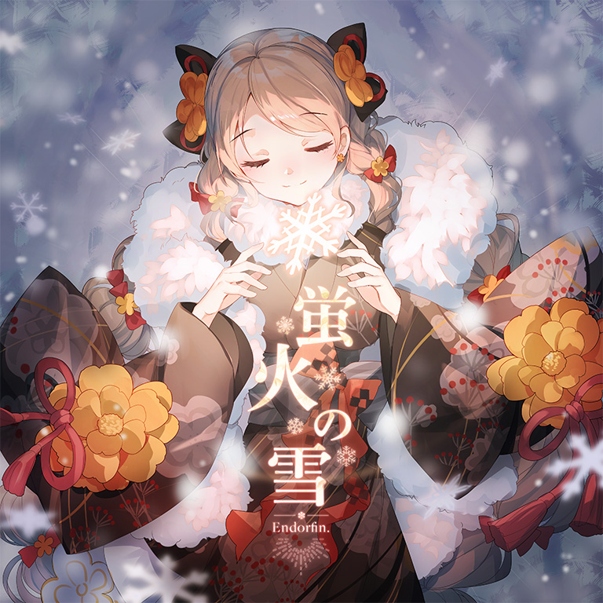

# Hotarubi no Yuki / 蛍火の雪

> *冬群愿*

- **Hotarubi no Yuki 曲绘：**

- **曲师**：Endorfin.
- **时长**：02:40
- **曲包**：Sunset Radiance
- **BPM**：159

### 谱面信息

| 难度 | Past | Present | Future |
| ------ | ------ | ------ | ------ |
| 等级 | 3 | 7 | 9+ |
| Note 数量 | 589 | 733 | 991 |
| 谱面设计 | 0°Nitro | 0°Nitro | 0°Nitro |

- **背景**：omatsuri_light
- **更新时间**：移动版v5.2.6(2024/01/12)

---

## 解禁方法

- 前置条件：在世界模式第八章，地图8-2，第一个奖励获得
• **Past**：游玩 A Wandering Melody of Love PST；10 残片
• **Present**：游玩 A Wandering Melody of Love PRS；80 残片
• **Future**：游玩 A Wandering Melody of Love FTR；280 残片

---

## 曲目定数

| 难度 | 定数 |
| ------ | ------ |
| Past | 3.5 |
| Present | 7.0 |
| Future | 9.7 |

---

## 游戏相关

- 本曲是Arcaea中的第7首非实时更新曲包后期追加曲目。
- 与Sunset Radiance曲包中其余歌曲不同，本曲并非Arcaea第1届公募比赛Arcaea Song Contest 2019的优胜曲目，而是单独约稿的独占曲。
  - 可能由于该原因，在本曲目实装后，Sunset Radiance的曲包介绍进行了修改，详情可见对应曲包页面。
- 大部分拥有日文名的曲目都会有一个被翻译的名字作为英文名，但本曲直接将日文名的罗马音作为英文名被推出。
  - 值得一提的是，这样处理下本曲的三个单词首字母为H、N、Y，与Happy New Year的首字母相同，而本曲也确实是2024年推出的第一首曲目
- 本曲后被收录至Endorfin.的专辑《COLOURS.04 “Yelling”》中，且有对应的MV。

---

## 歌词

肌刺す空気纏った　道の途中
呟く言葉は　白色に溶けた
冬空の先　見える未来も　見えない未来も
「わかってる」そう言い聞かせて

凍てつき増す　天つ風の中に
反射する世界は　揺れる心を映し出して
溢れた幾つもの記憶は　もう呪いじゃない
また前に進むための光

柔らかな灯りが染めた　淡雪は蛍火のように
道を照らす今　弱音にさよならをして
迷ってた足跡はもう　追風に掻き消えた
友待つ君の　紡ぐ願いを

天咲く花びら舞い散るように
淡い化粧のように　世界は儚く温かい
悴んだ指で包み込んだ　誰かの想いが
確かに今　心の奥に触れた

春を待つ光を纏って　淡雪は蛍火のように
道を照らす今　ほうき星が手招く先へ
迷ってた足跡はもう　追風に掻き消えた
友待つ君の　紡ぐ願いよ　嗚呼

叶え遠い空へ届くまで

---

## 攻略

此章节可能包含主观内容。

**Future 9+**

- 本谱的主要难点在于两段略缺乏引导的同轨换手配置，同时副歌段的配置和尾段的碎蛇也具有一定的难度，谱面对底力要求偏低，但对定位、出张和技巧有一定要求，部分配置需要对谱面有一定熟练度
- 153-223combo出现了较多五连交互，但因半高天键可能读谱略有一定难度
- 250-352combo的同轨换手配置引导较不充分，记住每接一次蛇后都需要换手，若不换手则天键需要出张较大才能击中，整体需要一定背谱，建议先行熟悉手序
- 354-357combo的为12分三连，双手拆解的情况下容易打快，底力好的玩家可以单手硬抗（近似于240BPM下的八分硬抗）
- 373-515combo为第一段副歌段，键型采音多为16分三连，部分出张和蛇较卡手，若失分较多建议在慢速练习中熟悉手感
  - 其中反手同步蛇可以尝试反接，具体为在429combo处的右手提前松开红蛇去接下蓝蛇，此后顺势反接即可
- 564-676combo同样出现了上述的同轨换手配置，参见上述
- 732-902combo为第二段副歌段，与第一段配置整体类似，但需要注意部分16分三连为出张形态，反手同步蛇同样可以反接
- 906combo后的碎蛇段较易Lost，注意**每三段碎蛇为一组，每组内的碎蛇均为斜向直线位移**，因而注意直线斜向上、下的方向后大致随着直线划动即可，观察好每组三段碎蛇的滑动方向是关键
  - 正攻手法下需要对碎蛇走向研究透彻，但此处也有“甩狙”通过的邪道手法，若正攻漏蛇较多可尝试该手法
  - 可在Vexaria BYD中初步找到滑动碎蛇的感觉
  - 其中906-929、929-951combo的四组蓝色、红色碎蛇的斜向趋势为下、上、上、下
  - 951-969、969-987combo两段的碎蛇斜向趋势为上、下、下、上，注意Hold结束后需要换手

---

## 试听

- · (YouTube) Endorfin. - 蛍火の雪 (Music Video)

---

## 相关视频

- https://www.bilibili.com/video/BV1ni4y1i7x7
