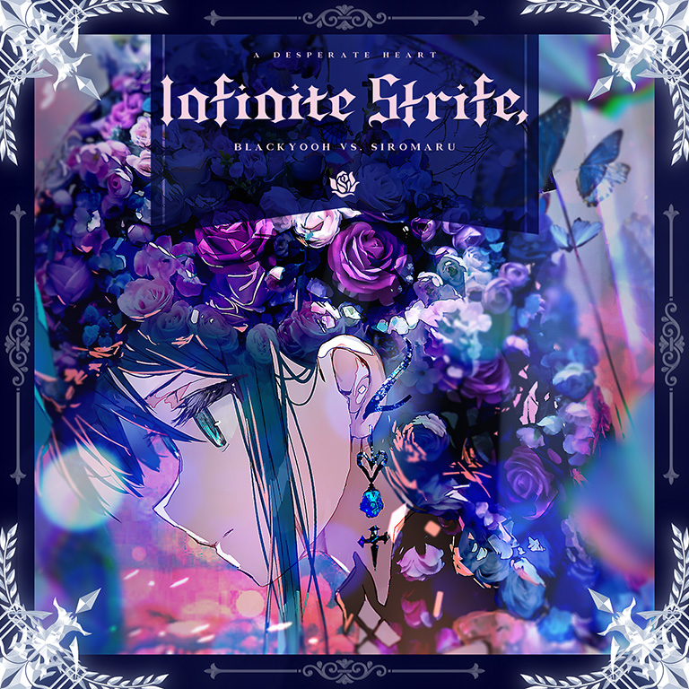

# Infinite Strife,

> *Tell Me What Scares You*

- **Infinite Strife, 曲绘：**

- **曲师**：BlackYooh vs. siromaru
- **时长**：02:50
- **曲包**：Final Verdict
- **BPM**：198

### 谱面信息

| 难度 | Past | Present | Future | Beyond |
| ------ | ------ | ------ | ------ | ------ |
| 等级 | 4 | 7 | 9+ | 10+ |
| Note 数量 | 888 | 1081 | 1511 | 1633 |
| 谱面设计 | Inner Labyrinth | Inner Labyrinth | Inner Labyrinth | Inner Labyrinth |

- **背景**：finale_conflict
- **更新时间**：移动版v4.0.0(2022/07/07)

---

## 解禁方法

进入Axiom of the End左上角的位置，共3项挑战需要解锁：
- I - 风暴降临：使用对立（Tempest）通关一首曲目
- II - 当下，正是终焉：通关Final Verdict的第一支曲目
  - 通关Defection。
- III - 战斗，再次开始：完成一首曲目后马上再次通关该首曲目
  - 游玩任意曲目，在结算界面重试进行第二次游玩并通关。
  - 你可以使用对立（Tempest）放置Defection后直接在结算界面重试并通关以一次性完成三个任务。

---

## 曲目定数

| 难度 | 定数 |
| ------ | ------ |
| Past | 4.0 |
| Present | 7.5 |
| Future | 9.9 |
| Beyond | 10.9 |

---

## 游戏相关

- 本曲与其他通过Axiom of the End解锁的曲目一样，在完成其解锁任务后点击曲绘，即会播放本曲的PV，并在曲绘再次出现时可以选择即将挑战的曲目难度。
  - v6.0.0更新后，使用封印的光（Fatalis）游玩本曲，在正式开始游玩前会再次触发该游玩效果。
    - 该游玩效果在世界模式中不会触发。
- 本曲谱面中有两个特殊的天键，外观为中间有一个立方体的粉紫色note，打击后会出现特殊音效（第一个是玻璃碎裂声，第二个为“Tell me what scares you?”的人声），并且特效也与普通note不同。
  - 使用光 & 对立（Reunion）的技能将本曲的背景转换为光芒侧后，这个天键会变成天蓝色note(中间的立方体仍然存在)。
  - 要想完成解锁Pentiment的挑战I，玩家需要无视它们 (或无视第一个之后Track Lost)。
  - 本曲的PST难度谱面同样出现了特殊天键和黑线。
- 本曲实际上为BlackY、Yooh与siromaru三个人的合作曲。
  - 值得一提的是，本曲内所有人声采样均由Risa Yuzuki提供。
- 曲绘上注有英文：**A DESPERATE HEART**

---

## 攻略

此章节可能包含主观内容。

**Future 9+**

- 本谱以大量排键清晰的交互和双押为主要配置，部分配置位移较大，在本曲BPM偏高、休息段较少的情况下对底力、耐力要求居于9+上位
- 158-201combo中的大跨度蛇注意划到最高处的顶点和尾部
- 303-373combo的蛇要尽力画圆
- 233/248combo的地面叠键注意不要漏掉
- 914combo处右手在接Hold后，左手先是需要点击一个天键，间隔八分后再开始一段左起手的16分纵连，注意左手发力紧绷
- 926combo处的12分纵连为全谱唯一需要研究手序的硬性配置，对手序要求较高，建议慢放熟悉拆解手序，底力好的玩家可考虑单指扛但不建议
  - 此处的交互等效为148.5BPM的16分交互，可拆解为：地面3轨右手起手的“地1天2地1”叠键+右手起的五纵
- 1005-1021combo的转圈双押每两组注意换手
- 1222-1251combo后半段的转圈天地交互注意定位
- 1335combo以后尾杀的交互带有出张，在高BPM下有一定概率手癖，建议先行熟悉交互手序
- 1367combo以后出现的弓形蛇注意划到位

**Beyond 10+**

- 全程交叉蛇泛滥，注意划到位
  - 418、428、440等有天/地键起手的交叉蛇只有1物量，可以通过点击一下后放置糊过去
- 214\~231的慢速段注意不要急
- 751\~769的天键考验换手能力，必要时可使用多指辅助
- 785\~800、878\~892的天地交互均为地键起手
- 990\~996的蛇+地键配置为右-左-右-左-右，**注意最后一个地键需反手打**
- 1445开始的段落是类似于奇点大会员的轴交互（但是有折返），很容易造成地键定位不准（特别是1555开始的那一组超长交互），实在打不准的可以考虑双指拍23轨跟另一只手组成交互
- 1575之后的蛇可以单指糊

---

## 试听

- · (YouTube) &#91;Official&#93; BlackYooh vs. siromaru - Infinite Strife, &#91;from Arcaea&#93;

---

## 相关视频

- https://www.bilibili.com/video/BV1pU4y1D73g
