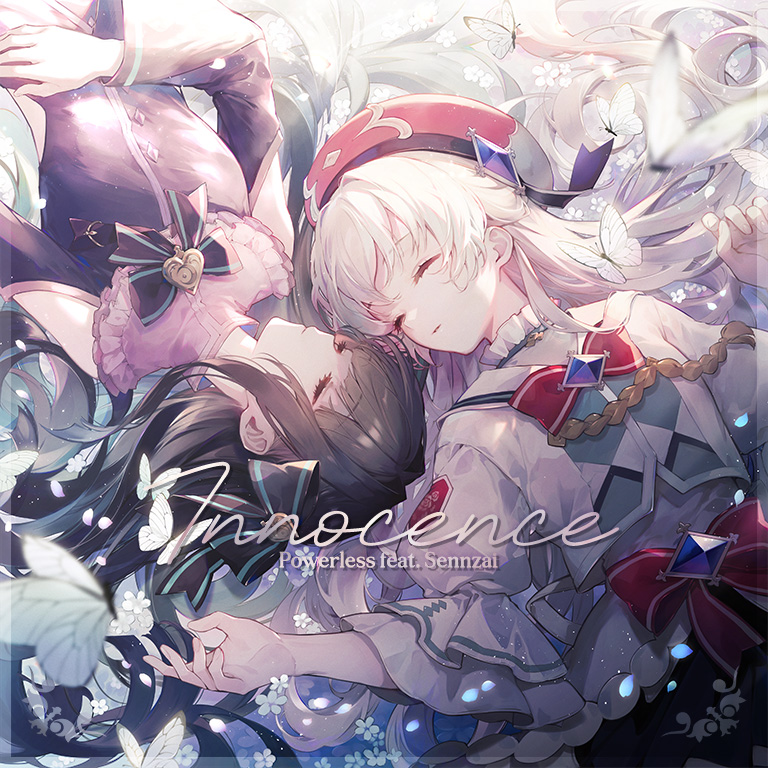

# Innocence

> *百合我只认光光和对立贴贴*

- **Innocence 曲绘：**

- **曲师**：Powerless feat. Sennzai
- **时长**：02:34
- **曲包**：Memory Archive
- **BPM**：190

### 谱面信息

| 难度 | Past | Present | Future | Eternal |
| ------ | ------ | ------ | ------ | ------ |
| 等级 | 3 | 6 | 8 | 9+ |
| Note 数量 | 734 | 811 | 1023 | 1157 |
| 谱面设计 | First Dawn | First Dawn | First Dawn | First Dawn |

- **背景**：vs_light
- **更新时间**：移动版v5.4.0(2024/03/08)

---

## 解禁方法

*本曲可在完成新手任务第四阶段后获得*

本曲各难度无需额外解禁

---

## 曲目定数

| 难度 | 定数 |
| ------ | ------ |
| Past | 3.0 |
| Present | 6.5 |
| Future | 8.5 |
| Eternal | 9.7 |

---

## 游戏相关

- 本曲是Memory Archive中唯一一首不消费记忆源点或回忆档案馆兑换券即可免费获得的曲目，且仅能通过完成新手任务解锁。
- 本曲结尾处的小提琴混入了Last的旋律。
- 本曲ETR难度谱面出现了多处类似Last &lsqb;BYD - Moment / BYD - Eternity&rsqb;、To the Furthest Dream和Solitary Dream的音弧和黑线配置，同时结尾也出现了类似前两者的背景表演黑线。
- 在2025年2月15日，Sennzai的首场个人演唱会"Moment of Bloom"中，本曲为昼场的开场曲。

---

## 歌词

### 原文

静寂　退廃　知らない朝が来た
問題　一体　此処はどこなのでしょう
休題　案外　悪くはないかもね
揺動　硝片　追いかけて

最果ての世界で
煌めきを求め歩いてく
何も知らない　何もわからない
只、導かれていく

知らなかった世界で空白を満たしてく
目に映った何もかも美しく見えて
キミはどんな記憶を見せてくれんだろう
痛みも暗闇も知らないまま
何にも染まる Innocence

（Wonder world, open her eyes.
She is blank canvas,
Untouched by the world’s plight.）

知らなかった世界で空白を満たしてく
そこにあった黒い影　暗闇の気配
キミはどんな記憶を見せてくれんだろう
灯も喜びも知らないまま
何にも染まる Innocence

（灰色の世界の中
回遊　探究　終わりはない）

### 参考翻译

此章节所记录的歌词/翻译的来源不具有官方性质，仅供参考。

- 译者：bilibili@梦旅人小屋

寂静 颓废 迎来仍是未知的晨光
问题 便是 身处此处究竟是何方
噤声 意外 并非是糟糕的状态
漂浮 碎片 前去远追

在最遥远的世界
要追求着那光芒而踏出脚步
一切都无从知晓 一切都无法理解
仅仅是跟随着前方指引

在素无所知的世界将空白填上光辉
映在双眼中 这里的一切 是如此美妙的景色
从你的口中究竟能诉说怎样的回忆
不曾知晓苦痛与黑暗存在的模样
能被一切染黑的单纯

（奇境中 睁开眼睛
她是洁白的画纸
未染世间苦痛）

在素无所知的世界将空白填上纷争
存在于彼处 漆黑的身影 是黑暗降临的征兆
从你的口中究竟能诉说怎样的回忆
不曾知晓明光与欢喜存在的模样
能被一切染白的单纯

（在灰色的世界中
游览 探索 永无止境）

---

## 攻略

此章节可能包含主观内容。

**Eternal 9+**

- 本谱整体主要难点在于部分跨度略大的蛇和出张，部分双押位移略大，少数配置需要注意节奏但并不难，整体难度位于9+最下位
- 284-332combo处具有3带2节奏（即六分混四分节奏），天键为四分节奏，地键为六分节奏，在打击感上可视为双押-12分三连交互-双押
  - 注意该节奏的配置仅有前两组是完整的，第三组并不完整，320combo后的配置为6组6分双押，注意歌曲旋律变化即可
- 698-896combo开始的间奏段的蛇侧单点出张幅度较大，需要额外注意定位

---

## 试听

- · (YouTube) 官方音源

---

## 相关视频
