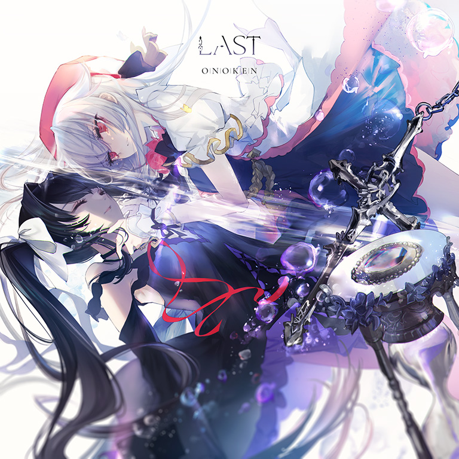
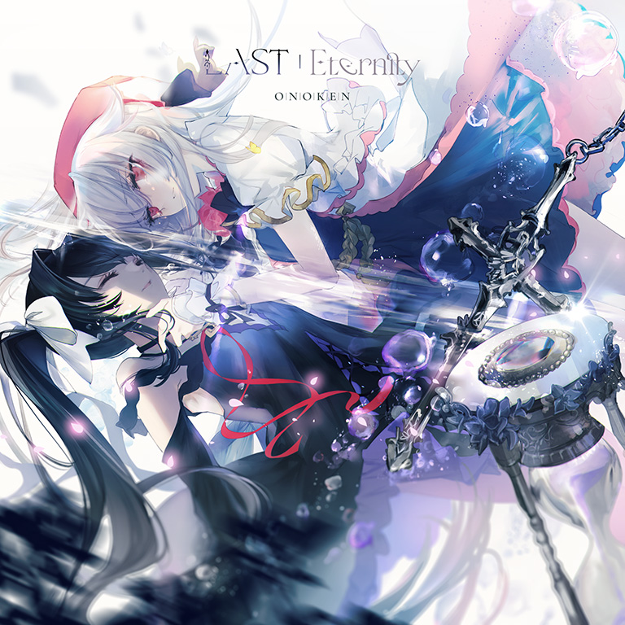

# Last

> *都结束了。*

**曲绘：**

**Beyond - Moment 曲绘：**

**Beyond - Eternity 曲绘：**

- **曲师**：onoken
- **曲包**：Final Verdict - Silent Answer
- **时长**：2:27
- **BPM**：175

### 谱面信息

| 难度 | 等级 | Note 数量 |
|------|------|-----------|
| Past | 4 | 680 |
| Present | 7 | 781 |
| Future | 9 | 831 |
| Beyond (Moment) | 9 | 888 |
| Beyond (Eternity) | 9+ | 790 |

- **谱面设计**：Arcaea
- **背景**：epilogue
- **更新时间**：移动版 v4.0.255(2022/07/13)

---

## 解禁方法

通关任何难度的Loveless Dress一次后，可在曲目列表中找到本曲的前三难度。
初次游玩本曲会进入一次特殊游玩(此次游玩开始前需联网)，暂停键隐藏（仍可以通过切换程序强行暂停），且不会因困难收集条回忆率归零而强制Track Lost。在该游玩的末尾，仅会浮现选项"拒绝命运的安排"以进入剧情。
可以通过使用封印技能的光（Fatalis）游玩多次触发剧情选项。此时若所有音符判定均为lost，则可以选择"拒绝命运的安排"或"接受Arcaea的一切"；若存在pure或far判定，则仅会出现"拒绝命运的安排"。

选择"拒绝命运的安排"进入并完成剧情后，游戏将自动重启。
获得搭档光 & 对立（Reunion），恢复所有此前因解锁Testify被隐藏的"对立"搭档
解锁本曲BYD难度的第一个版本：Last | Moment
解锁主线故事结局"最终之梦"

选择"接受Arcaea的一切"进入并完成剧情后，游戏将自动重启。
解锁Callima Karma
解锁本曲BYD难度的第二个版本：Last | Eternity
解锁主线故事结局"完美之愿"

如果初次游玩本曲时通过切换程序强行暂停后退出，则"最终之梦"结局会自动解锁，隐藏的"对立"搭档也会恢复。回到主界面后，将获得搭档光 & 对立（Reunion）。
在世界模式中游玩本曲时将不会触发剧情选项，会正常进行成绩结算。
两个BYD难度谱面均已解锁的情况下，仍需要不同的前置条件来进入它们。
使用光 & 对立（Reunion）并切换技能为"光芒 - 改写光芒与纷争的规则"时，将可以游玩Last | Eternity。
其他情况下，将可以游玩Last | Moment。
如果只解锁了Last | Moment，使用光 & 对立（Reunion）并切换技能为光芒仍会显示Last | Moment。
未登录状态下仅可游玩Last | Moment。

---

## 曲目定数

| 难度 | 定数 |
| ------ | ------ |
| Past | 4.0 |
| Present | 7.0 |
| Future | 9.0 |
| Beyond (Moment) | 9.6 |
| Beyond (Eternity) | 9.7 |

---

## 游戏相关

本曲为全游唯一拥有两个BYD难度谱面的曲目，也是唯一拥有3种不同音源的曲目(PST、PRS、FTR难度为一种，两个BYD难度各一种)。在本曲的两个BYD难度谱面都已经解锁的情况下，其中一个谱面处于显示状态时，另一个谱面将会处于隐藏状态且不会计入BYD难度下的曲目总数。
由于Last | Eternity必须使用光 & 对立（Reunion）且切换技能为"光芒 - 改写光芒与纷争的规则"才能进入游玩，而光 & 对立（Reunion）使用的是Normal回忆收集条，因此无法在本谱面中达成Easy Clear，Hard Clear也仅在6.0.0版本后可以通过少量方式达成。
截至v6.3.5为止，只有在世界模式遭到洞烛（至高：第八探索者）的侵入，或处在世界模式地图9-?的倒退区段，才有可能在使用光 & 对立（Reunion）的情况下以Hard回忆收集条进行游戏，从而在Last | Eternity中达成Hard Clear。
v4.0.255至v6.10.9期间，本曲曲封的一部分被作为Arcaea的应用图标。
本曲Beyond难度的两个音源Last | Moment和Last | Eternity均由木下珠子担当人声，它们之间有一些区别：

Last | Moment中：
- 人声声调更加高昂
- 相比通用曲绘，覆盖了一些白色的装饰物和光线，并且整体色调明显偏亮
- 红蓝音弧有较多的缠绕
- 结尾描画了两个方形黑线

Last | Eternity中：
- 开头和末尾音色逐渐失真，其他部分亦出现了零星的Glitch音效；与之对应的，谱面中开头和末尾的引导黑线不再是平滑的，而是断断续续的
- 相比通用曲绘，覆盖了一些黑色的"墨迹"，并且整体色调稍微偏暗
- 红蓝音弧几乎无交点、缠绕少、距离更远
- 结尾描画了一个方形黑线

---

## 歌词

本曲前三难度使用的音源Last无歌词，两个Beyond难度使用的音源Last | Moment和Last | Eternity分别具有不同的歌词。

### Last | Moment

#### 原文

終末の地へ降り注ぐ
今 永遠の摂理塗り替えるヒカリ

崩れ消えゆく記憶の世界
ただ一つの譲れない願い

追い求めたその先に
たとえ何を失うとしても
どんな運命も この手で砕いていく
また出会うため

誓いをただ ただ繰り返す
強い意志を力に換えて
星の道さえ違えてみせるから

その美しい瞳
もう傷つけるものはない
記憶も闇も
君の心苛む全て
さあ泣かないで
怯えずこの手を取って
ここから ふたり

#### 参考翻译

此章节所记录的歌词/翻译的来源不具有官方性质，仅供参考。
译者：现世的魔法少女

洒落降临这终末之地
如今光芒改写永恒 更替天理

崩解消散的回忆世界
唯余一份不让的心愿

追寻盼望着应有的前路
哪怕会因这执念而失去所有
也要亲手粉碎 那横在前方的命运
只为再度相会

不断将誓言吟诵践行
以坚定的意志化为此力
纵使横亘星途我也定予改变

你美丽的双瞳
已不再有事物能伤害
回忆与黑暗 无需苛责你心
抹去流下的泪水吧
放下胆怯携此双手

从此开始 我们二人

### Last | Eternity

#### 原文

きらめく空に背を向けて
今 祈りを捨て地に堕ちるヒカリ

めぐり流れる記憶の世界
永遠に続く無機質の視界

優しい時はもう戻らない
たとえ何に目覚めゆこうとも
どんな希望も あり得た未来さえ
むなしく消える

この全ての 始まりを知り
あがく指の無意味さを知る
美しいのは君の方だった

ユメニ ヤブレタ ヒトミ
モウ ナミダモ カレハテテ
セカイ ハ スベテ
コボレ オチル カケラ ノ ヨウニ
ドンナ カチモ ナク
ウツロ ニ クチハテテ イク
ココカラ ヒトリ

#### 参考翻译

此章节所记录的歌词/翻译的来源不具有官方性质，仅供参考。
译者：现世的魔法少女

背离耀眼眩目的天际
如今光芒舍弃祈望 堕入大地

流转往复的回忆世界
永恒延展的无机视界

温柔的时光已去不复返
哪怕因何物闪烁而得以醒转
不论何种希望 连应许存在的未来
皆数融作泡影

明晰这一切因何而始
亦晓了翻覆挣扎的不值
显得美丽的竟是另一侧的你

瞳中梦景幻灭
落下的泪亦干涸枯尽
见世界零落 宛如碎片散去
从未有任何的价值
空余虚渺衰败下去

从此开始 孑然一人

---

## 攻略

此章节可能包含主观内容。

**Future 9**
- 本谱面存在几处类似Rugie [FTR]的骗手蛇，请牢记左蓝右红，如果发现被骗手了可以迅速换过来，不过底力和出张力足够可以考虑硬接

**Beyond (Moment) 9**
- 本谱以玩蛇和较简单的天1地1小交互和三角交互为主要配置，整体难度并不高
- 168-178combo的出张八分单点注意定位
- 339-347combo的两组四连交互排键较为紧凑，注意分清
- 第二段副歌的第二段(670combo后)出现的交互均为12分三角交互

**Beyond (Eternity) 9**
- 本谱以大量大跨度反手蛇和出张为主要难点，对手法和定位均有不低要求，并且在现有的9+中物量排名倒数，因而整体容错率比较低
- 尤以开头42-120combo、第二段副歌的413-500combo、679-695combo为著
- 划好蛇的关键在于找好"匀速滑动"的感觉，类似的练习谱面有Vandalism [FTR]、MANTIS (Arcaea Ultra-Bloodrush VIP) [FTR]、ΟΔΥΣΣΕΙΑ [FTR]等
- 本谱有多处与Glitch音效对应的谱面卡顿、物件错位特效，如36combo的双押、285-294combo的十六分交互，375combo的天键双押，746combo的点锁等，比较容易初见杀，因而需要对谱面有一定熟练度
- 42-120combo的反手蛇要找到"同步向下位移"的感觉
- 110-118combo处的蓝蛇密度较大，注意划到底，不要提前松手
- 160-202combo的天地分层手序较易混淆
  - 前四组的配置为上层为蛇，下层为单点，第五、六组则相反，上层为单点，下层为蛇
  - 正攻手法较为繁琐，实际上一手天一手地的打法更为简单，只需要左手一直在下，右手一直在上，每一组之间双手整体平移即可，略注意第五组后单点和蛇的转换即可通过，建议慢放练习找到自己合适的拆分手法并熟练
- 202-218combo为八连八分位移双押，但较密集的天键会在消色测背景下可能读谱困难，建议慢放练习，注意位移方向以及手序
- 223combo开始为第一段副歌，蛇跨度较大但反手不多，注意一些蛇侧的出张单点即可
- 340combo处上方出现了表演用的假天键
- 413-500combo在大跨度反手蛇的基础上加有出张单点，注意蛇的轨迹要划到轨道边缘后收回
- 679-695combo具有大量跨Hold八分单点，可在Crystal Gravity [FTR]的开头段落进行练习

---

## 试听

- (bilibili) Last | Moment 【Arcaea | onoken official】
- (bilibili) Last | Eternity 【Arcaea | onoken official】

---

## 相关视频

- (bilibili) Last [BYD - Moment] 理论值手元 (Player:FLAME剑帝)
