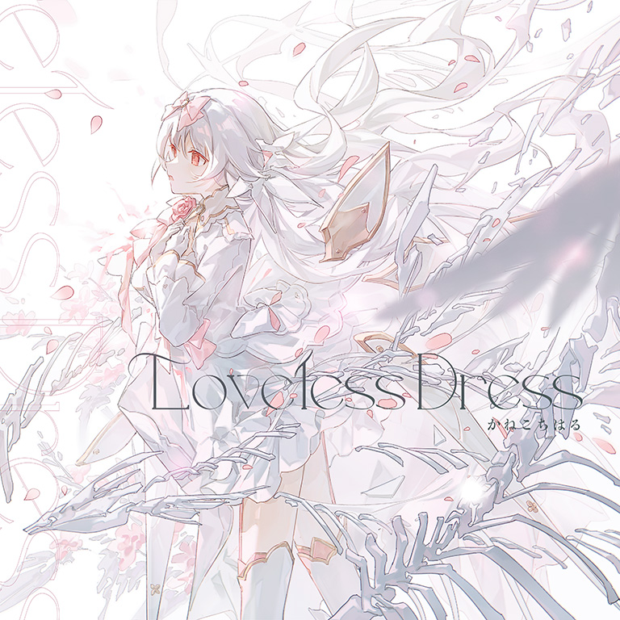

# Loveless Dress

> *无爱嫁衣*

- **Loveless Dress 曲绘：**

- **曲师**：かねこちはる
- **时长**：02:44
- **曲包**：Silent Answer
- **BPM**：99

### 谱面信息

| 难度 | Past | Present | Future |
| ------ | ------ | ------ | ------ |
| 等级 | 3 | 6 | 9+ |
| Note 数量 | 537 | 630 | 850 |
| 谱面设计 | Final Prayer | Final Prayer | Final Prayer |

- **背景**：epilogue
- **更新时间**：移动版v4.0.255(2022/07/13)

---

## 解禁方法

- 解锁Testify后，使用光（任意形态）游玩任意光芒侧曲目即可在曲目列表中找到本曲。
- 解锁对曲目成绩不作要求，放置亦可。

---

## 曲目定数

| 难度 | 定数 |
| ------ | ------ |
| Past | 3.5 |
| Present | 6.5 |
| Future | 9.7 |

• 本曲FTR难度谱面初出时的定数为9.6，在v6.0.0更新后改为9.7(+0.1)。

---

## 游戏相关

- 本曲与Silent Answer的其他曲目一样在解锁前为隐藏状态。

---

## 攻略

此章节可能包含主观内容。

**Future 9+**

- 本谱面以大量偏进阶的交互、反手和玩蛇配置为主要难点，尤以副歌段388-612combo处的反手出张单点而著称，612combo后的交互排键较为进阶，尾杀的减速24分交互对节奏亦有很大考验
  - 此外，由于本曲为消色侧曲目，无法换侧的情况下大量天键交互在白色背景下较难读谱，建议在慢放练习中先行熟悉键型，或可尝试在Beyond章节地图中游玩本谱以达到强行换背景的目的
  - 其中24分和32分交互可分别等价于148.5BPM、198BPM下的16分交互
- 363combo开始的交互为右起手的24分交互
- 388-612combo处的大跨度出张单点为本谱难点之一，对定位、玩蛇均有很高要求，大致可分为两段
  - 第一段中更侧重考察蛇侧的出张单点，其中390-441combo的音弧可以尝试反接
  - 488combo开始的第二段中的蛇多呈椭圆形状，516combo开始的天键单点的轨迹也呈圆形
    - 其中500combo处注意力可以集中在蓝音弧末尾段的定位上，515combo处的红音弧同理
- 633和654combo处的贴地天键离Hold较近因而较易吞判定，可以有意让击打位置稍微远离hold，但要保证点击位置仍在天键的判定范围内
  - 也可以略提前松开Hold两手一并拍下此处天键
- 804combo开始的交互为逐渐减速的24分交互，**每六个Note减一次速**，BPM变化为99-91-83-75-67-59，等效于148.5-136.5-124.5-112.5-100.5-88.5BPM下的十六分交互

---

## 试听

- · (YouTube) 【Arcaea】Loveless Dress - かねこちはる【official】

---

## 相关视频
