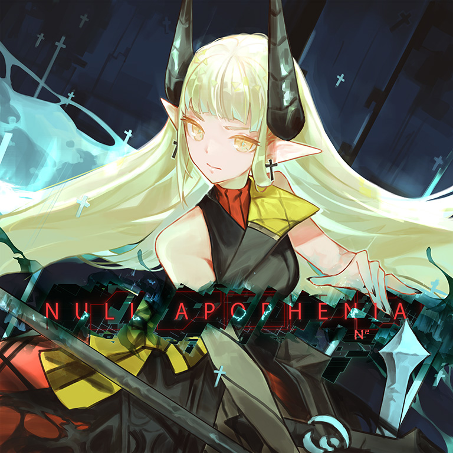

# NULL APOPHENIA

> *怪异节奏+反手交互{{=}}双重折磨*

- **NULL APOPHENIA 曲绘：**

- **曲师**：N²
- **时长**：03:03
- **曲包**：Memory Archive
- **BPM**：177

### 谱面信息

| 难度 | Past | Present | Future |
| ------ | ------ | ------ | ------ |
| 等级 | 4 | 8+ | 10+ |
| Note 数量 | 990 | 1098 | 1299 |
| 谱面设计 | 夜浪 | 夜浪 | 東星 vs 夜浪《APOPHÄNIE》 |

- **背景**：apophenia
- **更新时间**：移动版v4.2.0(2023/01/26)

---

## 解禁方法

• **Future**：通关1首10+难度曲目 **或** 通关10首10难度曲目；个人游玩潜力值 10.00 或以上；360 残片
- 本曲的FTR难度谱面的解锁条件系v6.0.0更新后追加，但更新前已有游玩记录的玩家无需额外解锁。

---

## 曲目定数

| 难度 | 定数 |
| ------ | ------ |
| Past | 4.5 |
| Present | 8.8 |
| Future | 10.7 |

• 本曲FTR难度谱面初出时的定数为10.6，在v6.0.0更新后改为10.7(+0.1)。
• 本曲PRS难度谱面初出时的定数为7.5，在v5.4.0更新后改为8.8(+1.3)。

---

## 游戏相关

- 本曲曲名中的Apophenia意为“幻想性错觉，数据真理妄想，图形模式妄想症”。
  - FTR谱师名义中的Apophänie即为该词在德语中的词源。
- 本曲FTR谱面中出现了致敬corps-sans-organesFTR的配置。
- 虽然本曲位于Memory Archive曲包，但是谱面两侧没有随谱面流动的流线装饰。
- 本曲有其对应的世界模式地图7-9[^1]及搭档忘却（Apophenia），详情可查阅对应页面。

---

## 攻略

此章节可能包含主观内容。

**Past 4**

- 637~772combo出现了PST难度谱面中少有的反手配置，且出张较大，注意手指定位

**Present 8+**

- 大量“332”(8分附点+8分附点+8分)节奏贯穿了整张谱面，并且有少量的不规则节奏，极其考验准度；一部分音弧配置也较为复杂
- 175-250combo的碎蛇段可以把黑线视为手指位置参考
- 682-795combo的节奏段如果不在意小P的话建议目押

**Future 10+**

- 60combo以前的蛇都可以反接
- 之间的慢速天键是3个一组的8分音
- 109~145combo的大出张蛇可参考corps-sans-organes
- 148~197combo的加速地键毫秒级采音，每一个note均会提速，没有办法用简要的节奏类型概括，只能多加练习
- 432~450combo的配置可参考AMAZING MIGHTYYYY!!!!
- 528~615combo的天地大交互可参考LAMIA的三角交互
- **小心822、838combo处的谱面减速!**
- 1042~1175combo出现了反手交互，可参考同样出现反手交互的Stasis、GENOCIDER或Heavensdoor BYD
- 从1079combo处开始反手或多指接音弧可以有效降低难度
- 1185~1215combo注意反手天键
- 1216combo之后没有难点，稳住即可

---

## 试听

- · (YouTube) 官方音源
- · (SoundCloud) 官方音源

---

## 相关视频

- https://www.bilibili.com/video/BV1zuCnYzEM4

---

## 注释

[^1]: 该地图还同时需求曲包Ambivalent Vision。
