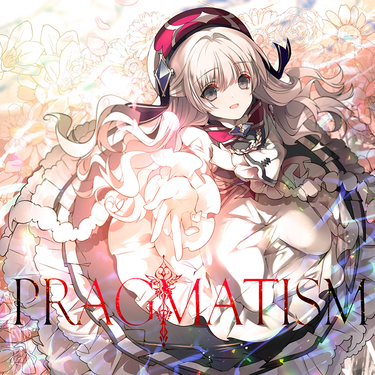
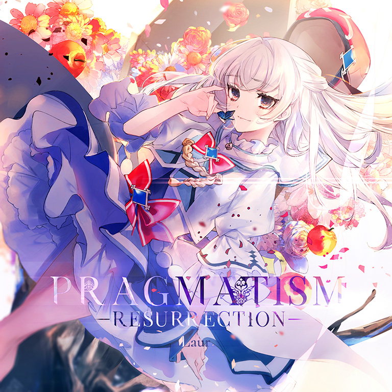

# PRAGMATISM / -RESURRECTION-

> *你的名字叫“光”。*

- **PRAGMATISM 曲绘：**

- **-RESURRECTION- 曲绘：**

- **曲师**：Laur
- **曲包**：Eternal Core
- **时长**：02:00 / Beyond (PRAGMATISM -RESURRECTION-) 02:38
- **BPM**：174

### 谱面信息

| 难度 | Past | Present | Future | Beyond (-RESURRECTION-) |
| ------ | ------ | ------ | ------ | ------ |
| 等级 | 4 | 8 | 10 | 11 |
| 谱面设计 | 東星 | 東星 | 東星 | THE LAST DREAM |

- **更新时间**：移动版v1.0(2017/03/09)，Beyond追加于v3.10(2021/12/09)
- **背景**：pragmatism

---

## 解禁方法

### 移动版
- Beyond前置条件：在世界模式失落章，地图BYD曲目地图获得

| 难度 | Past | Present | Future | Beyond |
| ------ | ------ | ------ | ------ | ------ |
| 解禁方法 | 无 | 通关 Essence of Twilight [PRS] 80 残片 | 以「A」或以上成绩通关 Essence of Twilight [FTR] 180 残片 | 无 |

### Nintendo Switch版
- 前置条件：在世界模式第一章，地图NS1-2，第二个奖励获得

---

## 曲目定数

| 难度 | 定数 |
| ------ | ------ |
| Past | 4.5 |
| Present | 8.6 |
| Future | 10.1 |
| Beyond | 11.2 |

• 本曲PRS难度谱面初出时的定数为8.2，在v3.0.0更新后改为8.6。
• 本曲BYD难度谱面初出时的定数为11.0，在v6.0.0更新后改为11.2。

---

## 游戏相关

- 在v3.0.0大幅改标等级之前，本曲为PST 4，PRS 8，FTR 9+。
- 本曲的FTR难度谱面曾具有所有10级谱面中最低的物量(942)，后于v3.11.0更新后被Medusa(931)超越。
- v3.0.0更新前，本曲前三难度曲绘的一部分被作为Arcaea的应用图标。
- 本曲于v3.10.0追加了BYD难度谱面（使用了重混音源**PRAGMATISM -RESURRECTION-**），其BYD难度谱面位于Beyond Chain的最后一环，在发布56小时后即被abeyuu取得了首个理论值成绩[^1]。
- 本曲的BYD难度谱面中出现了全游的第二个全地键四押配置。
- 本曲的BYD难度谱面拥有全游戏持续时间第二长的多押段（最长的为Ether Strike FTR）。
- 本曲的BYD难度谱面的解锁预计需要1400记忆源点[^2]，与解锁[[Vicious_Heroism|Vicious [ANTi] Heroism]] BYD[^3]需要花费的记忆源点数相同（均按照原价计算）。
- [某一版本前]，选择搭档天音或摩耶（处于第一技能状态）后，查看本曲的Beyond地图从350%开始到结束的随机曲目区域，可以发现其中Grievous Lady、Fracture Ray、SAIKYO STRONGER和Aegleseeker均占有5个位置，而本曲仅占1个位置。即为在不使用天音技能、以上歌曲的FTR难度全部解锁的情况下，仅有1/21的概率随机到本曲。
  - 在以上歌曲的FTR难度均未解锁的情况下，只会随机到本曲；目前版本重复位置不再显示但概率不变。
- 因联动收录至CHUNITHM和Phigros。
  - 收录时均使用Beyond难度音源**PRAGMATISM -RESURRECTION-**。
- 在v4.3.0更新前，本曲目的获取具有前置条件：在世界模式第一章，地图1-5，第51格处获得。

---

## 攻略

此章节可能包含主观内容。

**Beyond 11**

- 本谱以大量极度考验反手与技巧的配置而著称，如前半段的弓蛇和反直觉的大反手蛇、中段的单手双蛇和后半段的大量引导式交互，尤以前半段的反直觉大反手蛇在玩家社群中最具争议性，但其底力要求显著低于其余11级谱面，仅有大量16分二纵和一处24分交互爆发需要底力，因而具有极大的个人差
- 开头的慢速段可以尝试上隐以减小读谱压力，注意混有的几处32分二连，建议参考节奏谱
- 90-93、141-144combo的红蓝蛇可以中途换手以避免卡手
- 153combo处的红蛇建议以左手反接规避后续卡手
- 192-250combo的弓蛇段需额外注意地键定位，可以尝试部分反接以减少卡手，推荐以左*左*左右 左右*右左*的手序接下
- 294-496combo的大反手蛇配置实际上均可理解为：蛇头天键和其余单键构成了地键起手的五连交互（除去最后两段为天键起手的五连交互），注意蛇头天键点下后就不应松手，此处实际上不存在任何双押，建议结合音押熟悉排键逻辑
  - 此处的蛇手序极为反直觉，并不符合一手红蛇一手蓝蛇的常规思路，因而建议通过大量的慢速练习以适应手序
  - 此外由于五连交互和音弧多位于接近垂直的挡手位，因而可在Filament中进行类似配置的下位练习
- 496-511combo点锁处的蓝蛇极易红蛇，注意三纵中右手打完第二个键即迅速抬起，以避免判定到蛇，左手打完第三个键后保持不松手
- 521combo的慢速段开头处为右起的32分二连而非双押
- 590-632combo处的蛇头天键较易因判定吸附至Hold上导致lost，建议略提前松开Hold双指拍下或者多指拍
- 632-658combo为四组八分单双+四组八分双押，后续的叠键交互为地433天2地221的8连叠键，后接右起手的24分爆发13连（注意右手的起手天键是超界天键）
- 679-937combo的单手双蛇段注意跨手点击避免撞手，798combo后的双蛇会从上下关系变为左右关系，注意食指划到地面上后再双手上提
- 937-982combo的纯地键慢速段较为卡手，但双指可以全拆，若想保持稳定性可以尝试纯双指拆解
- 982-996combo的两条蛇出张幅度很大，最远要划到BYD边界处再收回
- 1020-1036combo的反手交互可以考虑反接以规避卡手
- 1036-1260combo的配置以大量天键引导的引导式交互为主，部分交互的排键为跨手或楼梯形态，建议先行熟悉手序以及出张键的位置
  - 1114-1145combo为五组地4天2交互，其中地键逐渐转为楼梯形态
  - 1146-1199combo的交互形态较先前有所改变，变为了地面3k+天键的形态，负责天键的手只需上下位移，注意力放在地键手的出张上
- 1260-1320、1339-1399combo为高密度蛇，左手和右手出张最远处均需划到BYD界限所在的位置再收回，第一处在拐角处后即可缓慢上划（注意不可过快），第二组在拐角即将到来后以中等速度上划
  - 此处蛇在出张遮挡下较易出现定位偏移，建议多通过录屏自检触点定位
- 两段高密度蛇后的二纵叠键均建议前四组拆解后六组硬抗，若全拆的话对协调和位移要求较高，需注意位移幅度逐渐增大

**Future 10**

- 本谱以带有早期谱面特色的出张、双押和交互为主要配置，去掉变速外整体配置仅有9+中上位的难度；但其中有两段慢速段的流速为原速的50%，尤其是间奏段的第二段慢速段（473-571combo）天地配置较多，读谱难度很高，对已适应高速的玩家而言为最主要的难点，在物量较低的加持下整体容错率较低
- 267-269combo的双押速度为原速的200%，容易初见杀，注意背谱
- 第一段副歌主要为一手蛇一手出张单点的配置，较考验出张定位，注意“12343212”类型的地面轨道八分单点略易手癖
- 473-571combo的慢速段为全谱最难段，建议先行在慢速练习中熟悉手序后再在原谱中进行尝试
  - 该段由于采音基本为八分音，因而全押的邪道手法在此处基本适用（松手打交互后即可继续全押），若正攻较难通过的情况下可参考相关全押手元尝试全押手法
  - 492-493combo的天键和地键并非双押，而是间隔32分音，其中地键落在正拍上
  - 517combo开始的天键右起手天地5连交互为全谱最难点，极度考验读谱与协调
- 572-645combo的流速较先前有所提高（为原速的75%）
- 第二段副歌开始出现大量天地3、5连，极易被骗手，其中部分还涉及出张，建议游玩前先观看一遍谱面熟悉手序
- 最后的两段天地交互中天键高度有变化，注意定位
- 结尾的加速双押（940-942combo）同样注意背谱

**Present 8**

- 本谱中出现了很多其他8级谱面中很少出现或没有出现的配置，包括单手16分二连、伪双押、Dreadnought式出张交互、大宇宙位移交互等(可在Snow White FTR中进行练习)，整体难度位于8级上位
- 242-243combo的加速双押容易初见杀，注意背谱
- 尾杀的大宇宙位移交互结束后有三连16分Hold交互和两个八分Hold，若有lost则需要注意此处节奏，不要过早松手

---

## 试听

- · (QQ音乐) Laur - PRAGMATISM
- · (SoundCloud) Laur - PRAGMATISM
- · (YouTube) Laur - PRAGMATISM -RESURRECTION- &lsqb;from Arcaea&rsqb;

---

## 相关视频

- https://www.bilibili.com/video/BV1fSQmYvEA6
- https://www.bilibili.com/video/BV1JM4y1x7y4
- https://www.bilibili.com/video/BV1E34y1L7qY
- https://www.bilibili.com/video/BV13Y4y1G7Mz
- https://www.bilibili.com/video/BV1Hb411N7Ld

## 注释

---

## 注释

[^1]: abeyuu的推文
[^2]: 即曲包Eternal Core、Adverse Prelude和Absolute Reason
[^3]: 需求的付费内容为曲包Absolute Reason、Extend Archive 1（按照700源点计算）、单曲Libertas和Einherjar Joker
