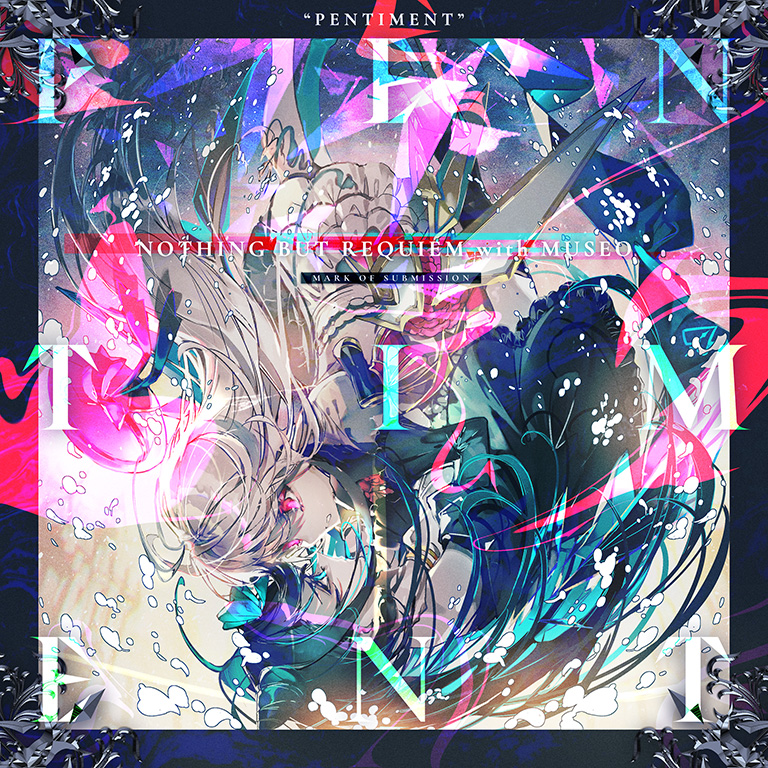

# Pentiment

> *6K+Camera入侵警告*

- **Pentiment 曲绘：**

- **曲师**：Nothing But Requiem with Museo
- **时长**：02:43
- **曲包**：Final Verdict
- **BPM**：200-222

### 谱面信息

| 难度 | Past | Present | Future | Beyond |
| ------ | ------ | ------ | ------ | ------ |
| 等级 | 7 | 8+ | 10 | 11 |
| Note 数量 | 911 | 1055 | 1345 | 1741 |
| 谱面设计 | Paradox Blight | Paradox Blight | Paradox Blight | Paradox Blight |

- **背景**：pentiment
- **更新时间**：移动版v4.0.0(2022/07/07)

---

## 解禁方法

- 前置条件：解锁任意难度的Infinite Strife,和World Ender
- 进入Axiom of the End左下角的位置，共3项任务需解锁：
  - I - 在寂若死灰中屈服：通关Infinite Strife,并漏掉其中的两个特殊键
    - 游玩Infinite Strife,，期间漏掉谱面中的两个特殊天键。[^1]
  - II - 在飘忽不定中屈服：使用曲目随机功能，游玩并通关一首曲目
    - 进行全曲随机游玩，通关并结算。
    - 全曲随机可以随机多次直到选到合适的曲目，所以可以尝试反复随机直到选中Infinite Strife,从而一次性完成两个任务。(请注意，在游玩Infinite Strife,时如果使用的是无视第一个之后Track Lost的方法，无法同时完成两个任务，因为任务II需要达到通关并结算条件)
  - III - 在功亏一篑中屈服：在曲目即将结束时退出游玩
    - 游玩任意曲目，在总量的98%以上的Note完成判定后暂停并退出游玩[^2]

---

## 曲目定数

| 难度 | 定数 |
| ------ | ------ |
| Past | 7.0 |
| Present | 8.7 |
| Future | 10.4 |
| Beyond | 11.5 |

• 本曲BYD难度谱面初出时的定数为11.4，在v6.0.0更新后改为11.5(+0.1)。
• 本曲FTR难度谱面初出时的定数为10.3，在v6.0.0更新后改为10.4(+0.1)。
• 本曲PRS难度谱面初出时的定数为8.4，在v5.4.0更新后改为8.7(+0.3)。
• 本曲PST难度谱面初出时的定数为6.0，在v5.4.0更新后改为7.0(+1.0)。

---

## 游戏相关

- 本曲与其他通过Axiom of the End解锁的曲目一样，在完成其解锁任务后点击曲绘，即会播放本曲的PV，并在曲绘再次出现时可以选择即将挑战的曲目难度。
  - 6.0.0版本更新后，使用封印的光（Fatalis）游玩本曲，在正式开始游玩前会再次触发该游玩效果。
    - 该游玩效果在世界模式中不会触发。
- 本曲的各难度谱面出现了与Arcana Eden和Testify相同的事件：曲目进行到某一时刻时，镜头会慢慢拉远，并在面板左右两侧生成两条透明的轨道，同时Sky input相对于地面判定线略微拉高。
- 关于本曲的BYD难度谱面:
  - 617-640及1585-1605combo(四押结束)间的地键周围有黑线描边，并且第一个Note到达地面判定线后会将所有地键在视觉上全部隐藏。

    - 玩家可以使用足够低的音符流速(例如1.0)看到地键隐形的过程，也可以通过在隐形地键前使用Hard收集条Track Lost不使事件触发看到完整的地键运行轨迹。
  - 122combo处出现了纵向超界蛇，同样出现纵向超界蛇的谱面还有Tempestissimo BYD和Arcana Eden BYD。
  - 372combo处出现了超越BYD难度谱面界限的横向超界蛇(甚至快要达到屏幕以外)。
- 本曲是Nothing But Requiem第一首无Vocal的曲目。
- 曲绘上注有英文：MARK OF SUBMISSION。

---

## 攻略

此章节可能包含主观内容。

**Future 10**

- BYD谱面中的大量连续八分双押和长16分交互在本谱中被替换为了八分单双和16分三连交互，主要难点在于前半段的八分单双和交替下拉蛇，后半的16分小交互和单双在底力到位后反而难度较为简单，整体在底力外主要考察玩蛇、位移协调和6k段的定位(尤其是对于使用手机等设备屏幕较小的玩家而言)
  - 需要特别注意的是，部分未专门提及的八分单双押也需熟悉并规划适合的手序（如281-287、452-470、846-854combo），否则在高BPM下可能手癖
- 148-229combo的八分单双正攻手法由于换手位移频繁，因而需要较强的位移协调力
  - 可采用一手天一手地的方式（即天键来回出张、地键手四连点保持不动）以减小位移和协调要求
- 229-262combo的三组八分单双只需在第四、五次点击时换手一次即可，也可不换手至最后以反手双押结束
- 310-380combo的交替下拉蛇较考验玩蛇、换手能力和蛇尾定位，其中每条下拉蛇具有2个物量，但只点击上蛇尾的直线部分也可全部判定上，因而衍生出两种逃课手法:
  - 一种为正攻下拉蛇的前两条，但划到底后不要松手，直至下拉蛇完全结束后再正攻后续配置
  - 另一种为单手跟随节奏点击下拉蛇蛇尾所处位置（注意后半段点击速率为八分三连点）
  - 无论采用何种手法，**均需注意蛇尾均处在2、3轨的正中间**，由于下拉蛇蛇头有助于蛇尾定位，因而更建议采用正攻或第一种方法，后一种手法对蛇尾定位要求较高
  - 该划地弓形蛇可与Moonheart BYD的类似配置互相参考，同时部分考验换手能力的下位谱也可进行练习，如IMPACTFTR（396-429、1076-1109combo）、ascentFTR（332-363、900-925combo）、Rays of RemnantFTR（570-627combo）
- 452-470combo的八分单双同样建议一手天一手地解决，左手依次打击1、3、2、4轨
- 698-843combo为3个一组的恒16分交互，前半段排键清晰因而难度较低，后半段变为三角交互但节奏并未发生改变，**不要打成12分交互**
- 926-1082combo的第一段6K段中，注意后半段出现了12分长交互，可等价为166.5BPM下的十六分交互
- 1295-1345combo的第二段6K段中，所有大出张蛇只有1物量，点到即可

**Beyond 11**

- 狂暴拍砖谱，极度考验底力
- 665开始的反手地键建议使用多指
- 753开始的蛇挡地键为：蛇与第一个地键同时按，第1\~7个地键均为4分，后两个为8分
  - 776开始则为：第1\~5个地键为4分，第6、7个为8分
- 862开始的大量16分交互在222BPM下极度考验底力
  - 1029\~1041的叠键同样可拆成16分交互
- 1342的四押注意在内侧，不要按错位置
- 1482开始的直角蛇不能用双指糊
  - 左右两侧的地键如果位移能力不足，可以采辅助指-食指来回点
- 尾杀的对拍前半段全部为右起手，后半段全部为左起手
  - 结尾的四押为8分接12分
  - 短蛇+短Hold可视为天地双押
- 第二个6k段最后的五押是假的

---

## 试听

- · (YouTube) Nothing But Requiem with Museo - Pentiment

---

## 相关视频

- https://www.bilibili.com/video/BV1dM411Q7do
- https://www.bilibili.com/video/BV1Db4y137cg
- https://www.bilibili.com/video/BV1FN4y1M7nG
- https://www.bilibili.com/video/BV1nD4y1V77e
- https://www.bilibili.com/video/BV1LU4y1D7JX

---

## 注释

[^1]: 只漏掉一个然后立即Track Lost也能满足条件
[^2]: 不包含98%本数，并且不能进入结算界面。
