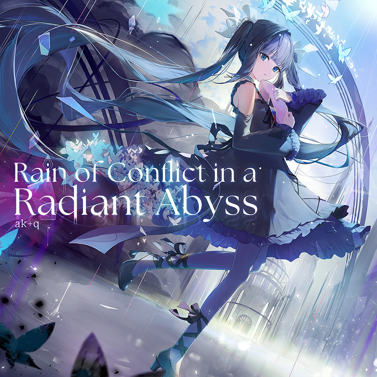

# Rain of Conflict in a Radiant Abyss

> *[[Shades of Light in a Transcendent Realm]] v2*

- **Rain of Conflict in a Radiant Abyss 曲绘：**

- **曲师**：ak+q
- **时长**：02:30
- **曲包**：Memory Archive
- **BPM**：195

### 谱面信息

| 难度 | Past | Present | Future | Eternal |
| ------ | ------ | ------ | ------ | ------ |
| 等级 | 5 | 7+ | 9 | 10 |
| Note 数量 | 831 | 934 | 1164 | 1247 |
| 谱面设计 | Nitro “v20170309” | Nitro “v20170309” | Nitro “v20170309” | Nitro meets Toaster “v20170309” |

- **背景**：finale_conflict
- **更新时间**：移动版v5.10.2(2024/09/12)

---

## 解禁方法

本曲各难度无需额外解禁

---

## 曲目定数

| 难度 | 定数 |
| ------ | ------ |
| Past | 5.0 |
| Present | 7.8 |
| Future | 9.5 |
| Eternal | 10.5 |

---

## 游戏相关

- ak+q曾担任Arcaea的游戏背景音乐与音效设计，从2021年下半年起不再活跃。本曲是其沉寂多年后发布的第一首曲目。
- 在2024/9/26 23:00前，持有Eternal Core的玩家可在世界模式游玩限时地图获取本曲，期间无法使用记忆源点直接购买。
  - 目前地图已关闭，本曲恢复单曲计价规则，可在Memory Archive中直接使用记忆源点购买。
  - 解锁本曲的限时地图中，各区段分别对应一个版本及此版本中ak+q所参与制作的曲目，详见下表。
- 本曲被认为是Shades of Light in a Transcendent Realm的续作，原因如下：
  - 本曲世界模式限时地图最后额外出现了仅限后者的限制格。
  - 本曲谱面对后者的致敬。
  - 本曲曲绘、背景具有多个Final Verdict相关元素，与后者的Arcaea及初始光元素有着跨时代的对应关系。
- 谱师名义中的“20170309”为Arcaea首个正式版本v1.0.5[^1]发布的日期。
- 根据Nitro的推文，本曲各难度谱面**除了致敬Shades of Light in a Transcendent Realm FTR外**，还还原了ak+q其它曲目的谱面配置：
  - PST：Tutorial
  - PRS：Vexaria FTR、Vivid Theory FTR
  - FTR：Essence of Twilight FTR、Ignotus FTR
  - ETR：Axium Crisis FTR、nέο κόsmo FTR
- 本曲实装之初在Memory Archive中的分类隶属于“搭档”，但在下一次版本更新(v5.10.4)后即被移入“原创”分类。

解锁本曲的限时地图各区段对应的版本及此版本中ak+q所参与制作的曲目

- 第1~5格：
限制格限制范围为v1.0.5(首个正式版本)时已实装的有ak+q参与制作的曲目(Vexaria、Shades of Light in a Transcendent Realm和Essence of Twilight)
各级步数分别为20-17-3-9-0，代表该版本实装的日期2017年3月9日
最终奖励105残片，对应版本号
- 第6~10格：
限制格限制范围为v1.1.3时已实装的有ak+q参与制作的曲目(+Ignotus)
各级步数分别为20-17-7-18-0，代表该版本实装的日期2017年7月18日
最终奖励113残片，对应版本号
- 第11~15格：
限制格限制范围为v1.5.0时已实装的有ak+q参与制作的曲目(+Axium Crisis)
各级步数分别为20-17-11-3-0，代表该版本实装的日期2017年11月3日
最终奖励150残片，对应版本号
- 第16~20格：
限制格限制范围为v1.9.3时已实装的有ak+q参与制作的曲目(+Solitary Dream)
各级步数分别为20-19-3-9-0，代表该版本实装的日期2019年3月9日
最终奖励193残片，对应版本号
- 第21~25格：
限制格限制范围为v3.0.0时已实装的有ak+q参与制作的曲目(+Vivid Theory)
各级步数分别为20-20-5-27-0，代表该版本实装的日期2020年5月27日
最终奖励300残片，对应版本号
- 第26~41格：
所有限制格和随机格限制范围均为v3.10.0时已实装的有ak+q参与制作的曲目，经过的步数和奖励如下：
- 26~30格：
各级步数分别为20-21-5-18-0，代表Arcaea NS版 v1.0.0发布的日期2021年5月18日，该版本先于移动版实装了有ak+q参与制作的曲目nέο κόsmo
最终奖励100残片，对应版本号
- 31~35格：
各级步数分别为20-21-12-9-0，代表v3.10.0版本实装的日期2021年12月9日，该版本更新后移动版首次实装了nέο κόsmo所在的曲包Divided Heart
最终奖励310残片，对应版本号
- 36~41格：
第36级和第41级为随机格
各级步数分别为20-22-0-20-23-0，代表2022~2023，这是ak+q沉寂的两年
第38级和第41级各奖励以太之滴×1
- 第42~46格：
限制格限制范围为v5.10.2版本(本曲实装版本)更新时已实装的已实装的ak+q所参与制作的曲目(不含本曲)
各级步数分别为20-24-9-12-0，代表该版本实装的日期2024年9月12日
最终奖励**Rain of Conflict in a Radiant Abyss**

---

## 攻略

此章节可能包含主观内容。

**Future 9**

- 本谱以后半段的大量出张八分单点和两段有间隔的纯天键交互为难点，对底力、出张力和交互拆解功底均有考察
- 634-816combo为长时间的一手蛇一手八分单点，在195的BPM下略吃底力，且前半段出张较多，对出张有一定考察
  - 可在Dynitikós中进行下位练习
- 822-838和844-862combo的两段全天键交互为本谱最难点，由于纯天键排键因而读谱难度较大，注意交互频率均为16分，每组交互之间的间隔时值为八分
  - 第一段为右起交互三连+左起交互三连+右起交互七连+左起交互三连
  - 第二段为左手单点+右起交互十连+右起交互三连+左起交互三连

---

## 试听

- · (YouTube) 【Arcaea】ak+q - Rain of Conflict in a Radiant Abyss

---

## 相关视频

- https://www.bilibili.com/video/BV1xN4JexEXi

---

## 注释

[^1]: 本词条涉及大量版本更新相关内容，具体对应版本信息可在版本更新日志中找到。
