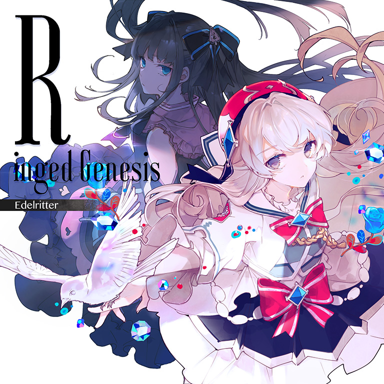

# Ringed Genesis

> *三纵极限*

- **Ringed Genesis 曲绘：**

- **曲师**：Edelritter
- **时长**：02:13
- **曲包**：Adverse Prelude
- **BPM**：160

### 谱面信息

| 难度 | Past | Present | Future |
| ------ | ------ | ------ | ------ |
| 等级 | 5 | 8 | 10+ |
| Note 数量 | 672 | 860 | 1146 |
| 谱面设计 | 夜浪 vs Nitro | 夜浪 vs Nitro | 夜浪 vs Nitro |

- **背景**：ringedgenesis
- **更新时间**：移动版v2.2.0(2019/07/18)

---

## 解禁方法

### 移动版
• **Present**：通关 Heavensdoor PRS；80 残片
• **Future**：通关 Heavensdoor FTR；180 残片

### Nintendo Switch版
• **Past**：游玩 Heavensdoor PST；25 残片
• **Present**：游玩 Heavensdoor PRS；50 残片
• **Future**：以「AA」或以上成绩通关 Heavensdoor FTR；75 残片

---

## 曲目定数

| 难度 | 定数 |
| ------ | ------ |
| Past | 5.5 |
| Present | 8.4 |
| Future | 10.8 |

• 本曲PRS难度谱面初出时的定数为8.5，在v3.0.0更新后改为8.4(-0.1)。
• 本曲FTR难度谱面初出时的定数为10.7，在v3.0.0更新后改为10.8(+0.1)。

---

## 游戏相关

- 在v3.0.0大幅改标等级之前，本曲为PST 5，PRS 8，FTR 9+。
- 本曲FTR谱面初出时，205combo处的天地双押由于距离过近，判定区域重合因而极易导致游玩时出现Lost，在v6.0.0的更新后此处谱面进行了修改，对此处双押的间距进行了调整。
- 因联动收录至CHUNITHM。

---

## 攻略

此章节可能包含主观内容。

**Future 10+**

- 本谱以大量16分二纵三纵、16分同侧出张单单双、高潮段的16分三纵双押和尾杀的大位移12分单双为难点，尤以高潮段的16分三纵双押而著称，对爆发、底力考验均较高，同时部分反手定位和大位移弓蛇对定位也有一定要求（160BPM的16分相当于320BPM的8分）
  - 需要注意的是，由于该谱对读谱能力要求显著低于其余10+，即底力到位的情况下可以应对本谱大部分底力配置，但单单双、反手定位等配置仍可能手癖，因而不推荐玩家过早游玩该谱面，建议充分慢速练习、熟悉单单双和交互接双押等发力细节和定位后再上手该谱面
  - 其中本谱的16分单单双配置可尝试在cocoro*cosmeticFTR(146BPM)中找到下位练习
- 46combo处的蓝蛇可用刚松开红蛇的右手接下避免出张单点，后续的蛇可继续反接（建议参考相关手元避免卡手）也可恢复正攻
- 205combo处的天地双押距离较近，定位上略需注意（在v6.0.0后此双押的间距已调整）
- 295、350combo为蛇侧反手单点，其中蛇可在最后两个单点前松手以避免卡手
- 699combo的大反手蛇可在顺势反接
- 725combo段开始进入高潮段，大量三纵双押出现的同时也出现了大量单单双，对底力要求极高，此处列出其他部分细节：
  - 779-793、915-929combo为天1地3出张交互，最后存在交互接双押
  - 注意805-808、941-944combo的地键三连楼梯硬抗
- 978-985combo为M型正三角交互
- 1082-1096combo为引导式的全换交互（最后出现了4K地键全换楼梯），最后的楼梯结束后接的双押同样为交互接双押
- 最后的大反手蛇需要拉到轨道最边缘

---

## 试听

- · (QQ音乐) 试听

---

## 相关视频

- https://www.bilibili.com/video/BV1VV411K7XC
- https://www.bilibili.com/video/BV1VV411K7XC
- https://www.bilibili.com/video/BV1Lg4y1F7mN
